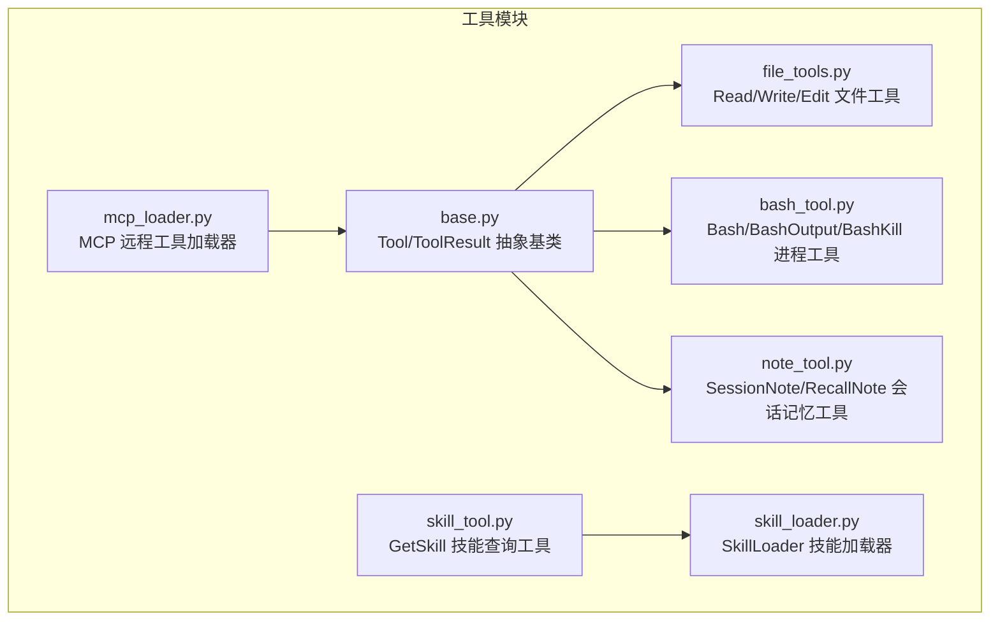
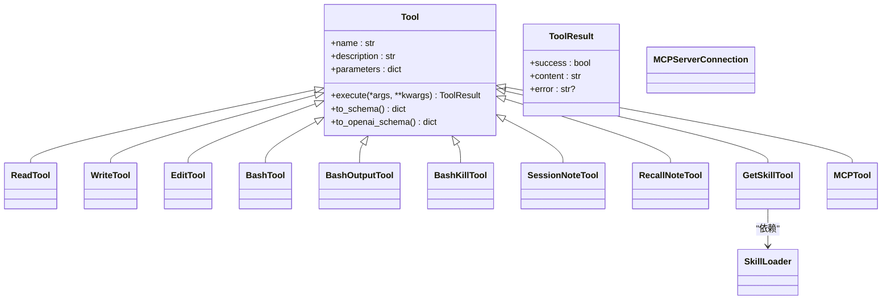
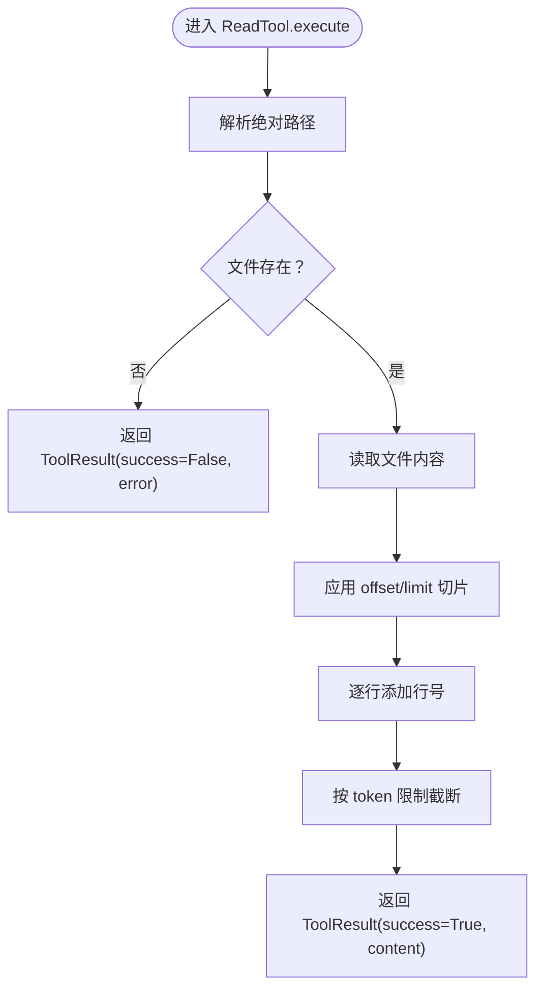
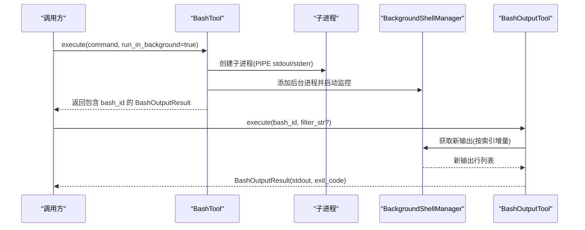
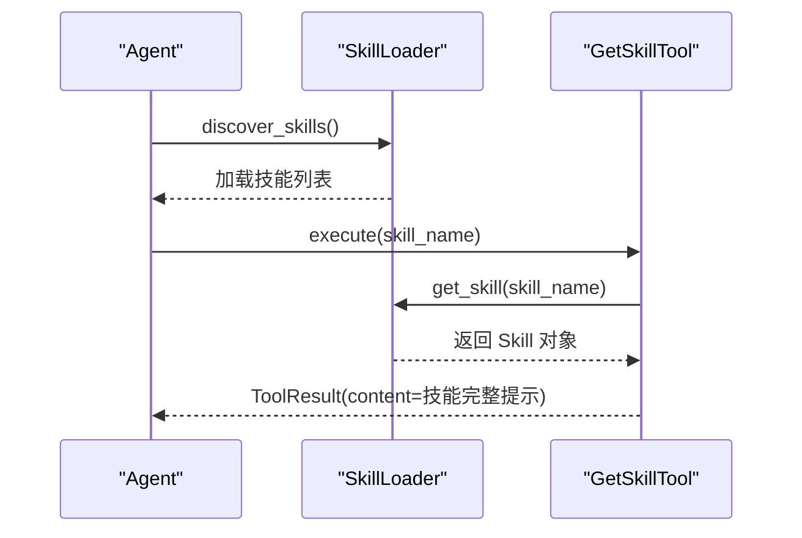
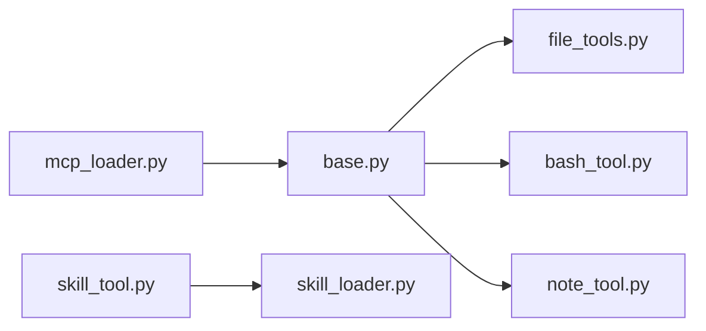

# 工具系统架构

<cite>
**本文档引用的文件**
- [mini_agent/tools/base.py](file://mini_agent/tools/base.py)
- [mini_agent/tools/__init__.py](file://mini_agent/tools/__init__.py)
- [mini_agent/tools/bash_tool.py](file://mini_agent/tools/bash_tool.py)
- [mini_agent/tools/file_tools.py](file://mini_agent/tools/file_tools.py)
- [mini_agent/tools/note_tool.py](file://mini_agent/tools/note_tool.py)
- [mini_agent/tools/skill_tool.py](file://mini_agent/tools/skill_tool.py)
- [mini_agent/tools/skill_loader.py](file://mini_agent/tools/skill_loader.py)
- [mini_agent/tools/mcp_loader.py](file://mini_agent/tools/mcp_loader.py)
- [examples/01_basic_tools.py](file://examples/01_basic_tools.py)
- [examples/06_tool_schema_demo.py](file://examples/06_tool_schema_demo.py)
- [tests/test_tools.py](file://tests/test_tools.py)
- [tests/test_tool_schema.py](file://tests/test_tool_schema.py)
</cite>

## 目录
1. [简介](#简介)
2. [项目结构](#项目结构)
3. [核心组件](#核心组件)
4. [架构总览](#架构总览)
5. [详细组件分析](#详细组件分析)
6. [依赖关系分析](#依赖关系分析)
7. [性能考虑](#性能考虑)
8. [故障排查指南](#故障排查指南)
9. [结论](#结论)
10. [附录：开发与使用指南](#附录开发与使用指南)

## 简介
本文件系统性梳理 MiniAgent 的工具系统架构，重点覆盖：
- Base Tool 抽象类的设计模式与工具注册机制
- 工具系统的分层架构（工具基类、具体工具实现、工具管理器）
- 工具生命周期（创建、注册到执行）的完整流程
- 工具参数验证、错误处理与结果标准化机制
- 工具开发指南（自定义工具与第三方工具集成）
- 内置工具功能与使用示例（文件操作、Shell 命令执行、技能工具集成）

## 项目结构
工具系统位于 mini_agent/tools 目录下，采用“按功能模块划分”的组织方式：
- base.py：抽象基类与通用结果模型
- 具体工具：bash_tool.py、file_tools.py、note_tool.py、skill_tool.py、mcp_loader.py
- __init__.py：统一导出入口，便于外部按需导入

图表来源
- [mini_agent/tools/base.py:1-56](file://mini_agent/tools/base.py#L1-L56)
- [mini_agent/tools/file_tools.py:1-286](file://mini_agent/tools/file_tools.py#L1-L286)
- [mini_agent/tools/bash_tool.py:1-618](file://mini_agent/tools/bash_tool.py#L1-L618)
- [mini_agent/tools/note_tool.py:1-214](file://mini_agent/tools/note_tool.py#L1-L214)
- [mini_agent/tools/skill_tool.py:1-85](file://mini_agent/tools/skill_tool.py#L1-L85)
- [mini_agent/tools/skill_loader.py:1-257](file://mini_agent/tools/skill_loader.py#L1-L257)
- [mini_agent/tools/mcp_loader.py:1-434](file://mini_agent/tools/mcp_loader.py#L1-L434)

章节来源
- [mini_agent/tools/__init__.py:1-18](file://mini_agent/tools/__init__.py#L1-L18)

## 核心组件
- Tool 抽象基类：定义工具名称、描述、参数模式与执行接口，并提供 Anthropic/OpenAI 两种工具模式的 schema 转换方法。
- ToolResult 结果模型：统一返回 success/content/error 字段，确保结果标准化。
- 具体工具：文件读写编辑、Shell 命令执行（含后台进程管理）、会话记忆、技能加载、MCP 远程工具等。

章节来源
- [mini_agent/tools/base.py:8-56](file://mini_agent/tools/base.py#L8-L56)

## 架构总览
工具系统采用“抽象基类 + 多种具体实现 + 统一导出”的分层设计：
- 顶层：工具使用者通过 Tool 接口调用任意具体工具
- 中层：具体工具实现各自业务逻辑（如文件读写、命令执行、技能加载）
- 底层：通用能力（结果标准化、schema 转换、后台进程管理、MCP 连接）

图表来源
- [mini_agent/tools/base.py:16-56](file://mini_agent/tools/base.py#L16-L56)
- [mini_agent/tools/file_tools.py:63-286](file://mini_agent/tools/file_tools.py#L63-L286)
- [mini_agent/tools/bash_tool.py:217-618](file://mini_agent/tools/bash_tool.py#L217-L618)
- [mini_agent/tools/note_tool.py:17-214](file://mini_agent/tools/note_tool.py#L17-L214)
- [mini_agent/tools/skill_tool.py:13-85](file://mini_agent/tools/skill_tool.py#L13-L85)
- [mini_agent/tools/skill_loader.py:47-257](file://mini_agent/tools/skill_loader.py#L47-L257)
- [mini_agent/tools/mcp_loader.py:60-434](file://mini_agent/tools/mcp_loader.py#L60-L434)

## 详细组件分析

### Base Tool 抽象类与工具注册机制
- 设计要点
  - 使用属性 property 暴露 name/description/parameters，强制子类实现
  - execute 支持可变参数，返回 ToolResult，保证结果一致性
  - 提供 to_schema/to_openai_schema，适配不同 LLM Provider 的函数调用协议
- 注册机制
  - 通过 __all__ 在模块导出中显式声明公开工具类，便于外部按需导入
  - 工具实例化后直接作为工具集合传入 LLM 客户端，无需额外注册表

章节来源
- [mini_agent/tools/base.py:16-56](file://mini_agent/tools/base.py#L16-L56)
- [mini_agent/tools/__init__.py:8-18](file://mini_agent/tools/__init__.py#L8-L18)

### 文件工具（Read/Write/Edit）
- 功能特性
  - ReadTool：支持行号格式化输出、偏移与限制读取、大文本智能截断
  - WriteTool：自动创建父目录、完全覆盖写入
  - EditTool：精确字符串替换，要求旧字符串唯一出现
- 参数验证与错误处理
  - 路径解析：相对路径基于工作目录解析；不存在时返回错误
  - 截断策略：基于 token 计数，保留首尾并插入截断提示
  - 异常捕获：统一包装为 ToolResult.success=False 并携带 error

图表来源
- [mini_agent/tools/file_tools.py:108-153](file://mini_agent/tools/file_tools.py#L108-L153)

章节来源
- [mini_agent/tools/file_tools.py:63-286](file://mini_agent/tools/file_tools.py#L63-L286)

### Shell 工具（Bash/BashOutput/BashKill）
- 功能特性
  - BashTool：前台/后台命令执行，自动检测平台选择 shell，支持超时控制
  - BashOutputTool：按 bash_id 获取新输出，支持正则过滤
  - BashKillTool：优雅终止后台进程，清理资源
- 后台进程管理
  - BackgroundShell：封装单个后台进程的状态、输出缓冲与退出码
  - BackgroundShellManager：全局管理后台进程，监控输出、终止与清理
- 参数验证与错误处理
  - 超时范围校验与默认值设置
  - 异常捕获与统一 ToolResult 返回
  - bash_id 不存在时返回可用列表

图表来源
- [mini_agent/tools/bash_tool.py:309-439](file://mini_agent/tools/bash_tool.py#L309-L439)
- [mini_agent/tools/bash_tool.py:485-533](file://mini_agent/tools/bash_tool.py#L485-L533)

章节来源
- [mini_agent/tools/bash_tool.py:217-618](file://mini_agent/tools/bash_tool.py#L217-L618)

### 会话记忆工具（SessionNote/RecallNote）
- 功能特性
  - SessionNoteTool：记录带时间戳与分类的笔记，懒初始化存储文件
  - RecallNoteTool：按分类筛选或全部召回，格式化输出
- 数据持久化
  - JSON 文件存储，首次写入时创建目录
  - 异常安全：读写失败返回错误，不中断主流程

章节来源
- [mini_agent/tools/note_tool.py:17-214](file://mini_agent/tools/note_tool.py#L17-L214)

### 技能工具与加载器（GetSkill/SkillLoader）
- 设计理念
  - Progressive Disclosure（渐进披露）：仅在需要时加载技能完整内容
  - 通过 SkillLoader 发现与加载 SKILL.md，提取元数据与正文
- 工具行为
  - GetSkillTool：按名称检索技能，返回完整提示内容
  - create_skill_tools：创建工具与加载器，打印发现数量
- 路径处理
  - 将相对路径转换为绝对路径，便于跨工作目录访问

图表来源
- [mini_agent/tools/skill_loader.py:194-236](file://mini_agent/tools/skill_loader.py#L194-L236)
- [mini_agent/tools/skill_tool.py:40-55](file://mini_agent/tools/skill_tool.py#L40-L55)

章节来源
- [mini_agent/tools/skill_tool.py:13-85](file://mini_agent/tools/skill_tool.py#L13-L85)
- [mini_agent/tools/skill_loader.py:47-257](file://mini_agent/tools/skill_loader.py#L47-L257)

### MCP 工具加载器（远程工具集成）
- 功能特性
  - 支持 STDIO、SSE、HTTP/Streamable HTTP 三种连接类型
  - 统一超时配置（连接、执行、SSE 读取），可全局或按服务器覆盖
  - 自动发现远端工具并封装为 Tool 实例
- 生命周期
  - 连接建立 → 初始化 → 列举工具 → 包装为 MCPTool → 断开连接
- 错误处理
  - 超时与异常均返回 ToolResult.success=False，携带错误信息

章节来源
- [mini_agent/tools/mcp_loader.py:330-434](file://mini_agent/tools/mcp_loader.py#L330-L434)

## 依赖关系分析
- 模块内聚与耦合
  - base.py 仅依赖标准库与 pydantic，低耦合
  - 具体工具对 base.py 的依赖清晰，彼此独立
  - MCP 工具加载器依赖 mcp 客户端库，提供远程工具桥接
- 导出与使用
  - __all__ 明确列出公开工具，避免意外暴露内部实现
  - 示例与测试通过模块导出直接使用工具类

图表来源
- [mini_agent/tools/__init__.py:3-17](file://mini_agent/tools/__init__.py#L3-L17)
- [mini_agent/tools/base.py:3-5](file://mini_agent/tools/base.py#L3-L5)
- [mini_agent/tools/mcp_loader.py:10-15](file://mini_agent/tools/mcp_loader.py#L10-L15)

章节来源
- [mini_agent/tools/__init__.py:1-18](file://mini_agent/tools/__init__.py#L1-L18)

## 性能考虑
- 文件工具
  - 大文件读取建议使用 offset/limit 分段读取，避免一次性加载
  - token 截断采用“头尾 + 中间省略”策略，兼顾上下文完整性
- Shell 工具
  - 后台进程采用增量输出收集，避免阻塞与内存膨胀
  - 超时控制防止长时间挂起
- 技能加载
  - 渐进披露减少不必要的内容加载，提升响应速度
- MCP 工具
  - 可配置超时，避免远端服务慢导致整体阻塞

## 故障排查指南
- 工具执行失败
  - 检查 ToolResult.success 与 error 字段，定位具体原因
  - 对于 Shell 工具，确认命令是否正确、权限是否足够
- 路径问题
  - 文件工具使用相对路径时，确认工作目录设置
  - 技能工具注意 SKILL.md 的 YAML frontmatter 是否完整
- MCP 连接失败
  - 检查配置文件路径与连接类型，确认远端服务可达
  - 调整超时参数以适应网络环境

章节来源
- [tests/test_tools.py:12-112](file://tests/test_tools.py#L12-L112)
- [tests/test_tool_schema.py:137-258](file://tests/test_tool_schema.py#L137-L258)

## 结论
MiniAgent 的工具系统以 Tool 抽象基类为核心，通过统一的结果模型与 schema 转换，实现了多形态工具的一致化接入。分层架构使扩展新工具变得简单，同时内置的参数验证、错误处理与结果标准化保障了稳定性。结合文件操作、Shell 执行、会话记忆、技能加载与 MCP 远程工具集成，形成了完整的工具生态。

## 附录：开发与使用指南

### 工具生命周期（创建—注册—执行）
- 创建：继承 Tool，实现 name/description/parameters/execute
- 注册：通过模块导出或直接传入 LLM 客户端工具集合
- 执行：LLM 生成调用参数，工具执行并返回 ToolResult

章节来源
- [examples/06_tool_schema_demo.py:24-151](file://examples/06_tool_schema_demo.py#L24-L151)

### 自定义工具开发步骤
- 定义参数模式：遵循 JSON Schema 规范，明确必填字段与约束
- 实现 execute：处理输入参数、执行业务逻辑、返回 ToolResult
- 输出 schema：使用 to_schema/to_openai_schema 验证与 LLM 协作
- 测试与验证：参考测试用例与示例脚本进行单元与集成测试

章节来源
- [examples/06_tool_schema_demo.py:24-151](file://examples/06_tool_schema_demo.py#L24-L151)
- [tests/test_tool_schema.py:137-258](file://tests/test_tool_schema.py#L137-L258)

### 第三方工具集成（MCP）
- 配置：在 mcp.json 中声明服务器（STDIO/URL），可设置超时参数
- 加载：调用 load_mcp_tools_async，自动发现并包装为 Tool
- 使用：与本地工具一致，LLM 可直接调用远端工具

章节来源
- [mini_agent/tools/mcp_loader.py:330-434](file://mini_agent/tools/mcp_loader.py#L330-L434)

### 内置工具使用示例
- 文件操作：ReadTool/WriteTool/EditTool 的基本用法与边界场景
- Shell 命令：前台执行与后台执行、输出监控与终止
- 技能工具：通过 GetSkill 获取技能完整内容，配合渐进披露策略

章节来源
- [examples/01_basic_tools.py:19-138](file://examples/01_basic_tools.py#L19-L138)
- [tests/test_tools.py:12-112](file://tests/test_tools.py#L12-L112)