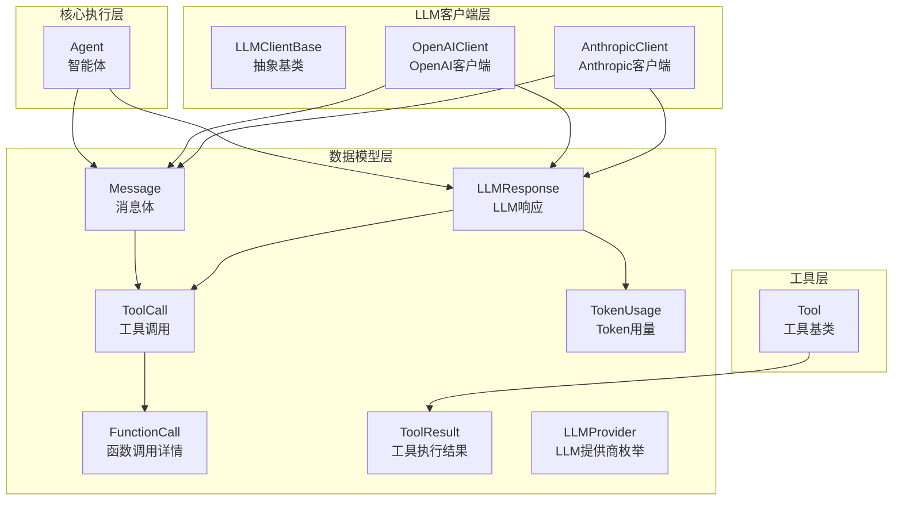
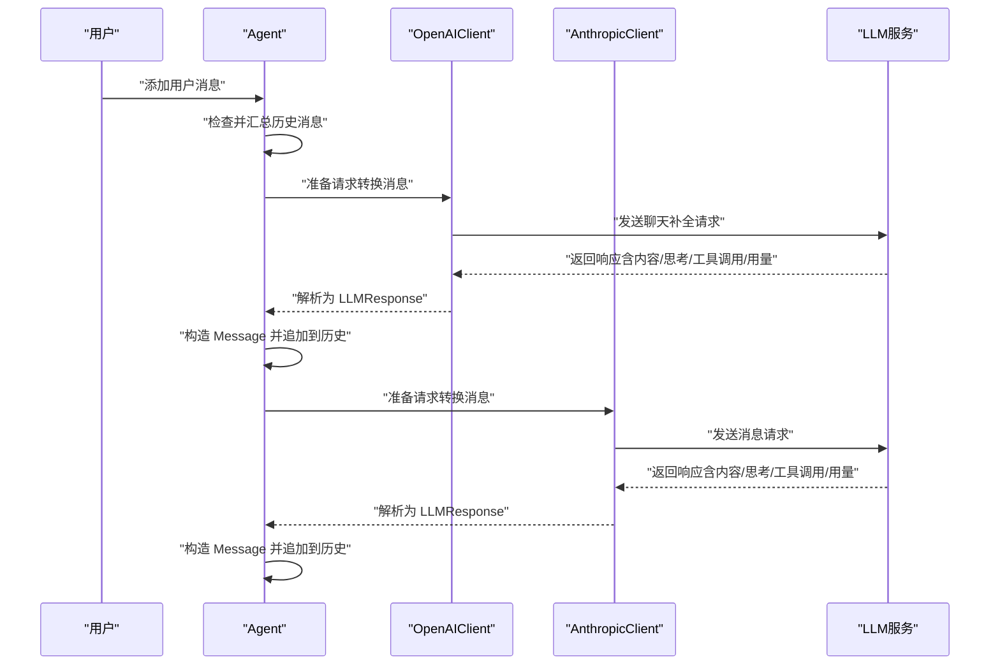
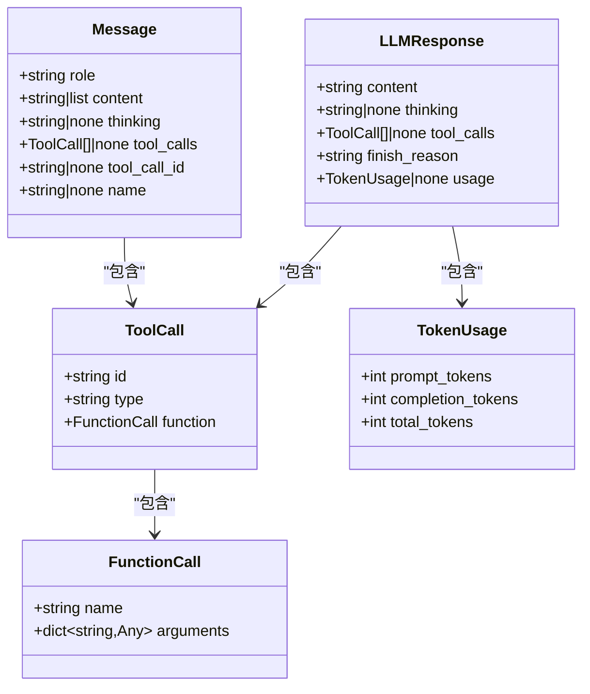
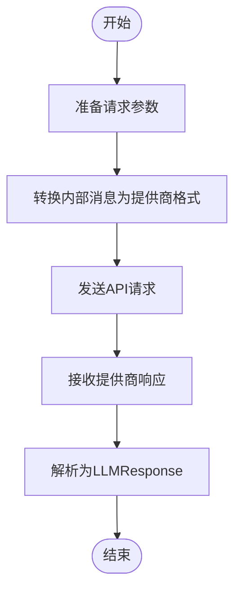
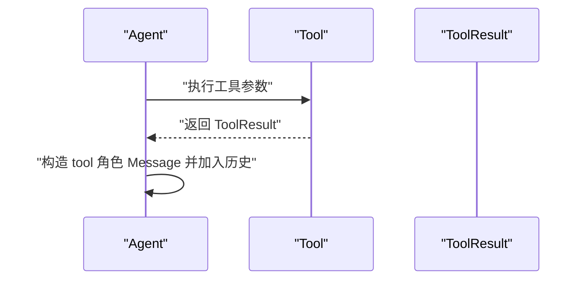
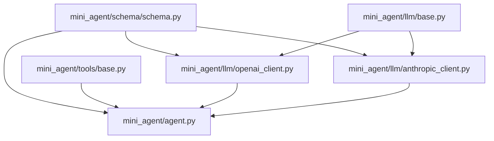

# 数据模型设计

<cite>
**本文档引用的文件**
- [schema.py](file://mini_agent/schema/schema.py)
- [base.py](file://mini_agent/tools/base.py)
- [agent.py](file://mini_agent/agent.py)
- [base.py](file://mini_agent/llm/base.py)
- [openai_client.py](file://mini_agent/llm/openai_client.py)
- [anthropic_client.py](file://mini_agent/llm/anthropic_client.py)
- [__init__.py](file://mini_agent/schema/__init__.py)
- [config.py](file://mini_agent/config.py)
- [02_simple_agent.py](file://examples/02_simple_agent.py)
- [01_basic_tools.py](file://examples/01_basic_tools.py)
- [test_tool_schema.py](file://tests/test_tool_schema.py)
- [test_agent.py](file://tests/test_agent.py)
</cite>

## 目录
1. [简介](#简介)
2. [项目结构](#项目结构)
3. [核心组件](#核心组件)
4. [架构总览](#架构总览)
5. [详细组件分析](#详细组件分析)
6. [依赖分析](#依赖分析)
7. [性能考虑](#性能考虑)
8. [故障排除指南](#故障排除指南)
9. [结论](#结论)
10. [附录](#附录)

## 简介
本文件系统性梳理 MiniAgent 的数据模型设计，重点覆盖以下内容：
- 核心数据结构：Message、ToolResult、FunctionCall、ToolCall、LLMResponse、TokenUsage 及枚举类型 LLMProvider 的设计理念与实现细节
- Pydantic 模型的验证机制与序列化/反序列化流程
- 数据模型之间的关系与约束条件
- 消息格式的标准化与扩展机制
- 使用示例与最佳实践
- 扩展数据模型以支持新功能的方法
- 数据模型在组件间传递与转换的过程

## 项目结构
MiniAgent 的数据模型主要集中在 schema 子模块中，并通过 LLM 客户端与 Agent 协作完成消息的生成、解析与工具调用结果的封装。

**图表来源**
- [schema.py:14-56](file://mini_agent/schema/schema.py#L14-L56)
- [base.py:8-56](file://mini_agent/tools/base.py#L8-L56)
- [base.py:10-85](file://mini_agent/llm/base.py#L10-L85)
- [openai_client.py:16-296](file://mini_agent/llm/openai_client.py#L16-L296)
- [anthropic_client.py:15-294](file://mini_agent/llm/anthropic_client.py#L15-L294)
- [agent.py:45-524](file://mini_agent/agent.py#L45-L524)

**章节来源**
- [schema.py:1-56](file://mini_agent/schema/schema.py#L1-L56)
- [__init__.py:1-19](file://mini_agent/schema/__init__.py#L1-L19)

## 核心组件
本节对核心数据模型进行深入剖析，涵盖字段语义、类型约束、默认值策略以及与外部系统的交互方式。

- Message（消息体）
  - 角色 role：支持 system、user、assistant、tool 四种角色，用于区分消息来源
  - 内容 content：可为字符串或内容块列表，便于多模态扩展
  - 思考内容 thinking：扩展的思维链内容，仅在特定 LLM 提供商可用
  - 工具调用 tool_calls：assistant 发出的工具调用列表
  - 工具调用标识 tool_call_id：tool 消息与对应 assistant 调用的关联标识
  - 名称 name：tool 角色的消息名称，便于识别工具身份
  - 设计要点：统一的消息载体，支持思考内容与工具调用的内嵌表达；content 的多形态设计便于未来扩展图像/音频等非文本内容

- ToolResult（工具执行结果）
  - 成功标志 success：布尔值，指示工具执行是否成功
  - 结果内容 content：字符串，承载工具返回的文本或结构化信息
  - 错误信息 error：可选字符串，失败时携带错误详情
  - 设计要点：简洁明确的结果封装，便于 Agent 在后续对话中消费工具输出

- FunctionCall（函数调用详情）
  - 函数名 name：调用的目标函数
  - 参数字典 arguments：以键值对形式传递的参数集合
  - 设计要点：与 ToolCall 配合，形成标准的函数式调用描述

- ToolCall（工具调用）
  - 唯一标识 id：调用的唯一 ID，用于消息历史中的关联
  - 类型 type：固定为 "function"，表示调用类型
  - 函数详情 function：包含函数名与参数的 FunctionCall 对象
  - 设计要点：标准化的工具调用结构，确保不同 LLM 提供商的兼容性

- LLMResponse（LLM 响应）
  - 文本内容 content：主响应文本
  - 思考内容 thinking：可选的思维链内容
  - 工具调用 tool_calls：可选的工具调用列表
  - 结束原因 finish_reason：响应结束的原因（如 stop）
  - 用量 usage：可选的 TokenUsage，记录提示词、补全与总计 Token 数
  - 设计要点：统一的响应载体，便于上层 Agent 解析并决定下一步动作

- TokenUsage（Token 用量）
  - 提示词令牌 prompt_tokens、补全令牌 completion_tokens、总计令牌 total_tokens
  - 设计要点：跨提供商的统一统计接口，便于成本控制与上下文管理

- LLMProvider（LLM 提供商枚举）
  - 支持 ANTHROPIC 与 OPENAI 两种提供商
  - 设计要点：通过枚举限定提供商范围，避免运行期歧义

**章节来源**
- [schema.py:7-56](file://mini_agent/schema/schema.py#L7-L56)
- [base.py:8-14](file://mini_agent/tools/base.py#L8-L14)

## 架构总览
下图展示了数据模型在系统中的流转路径：Agent 维护消息历史，LLM 客户端负责将内部消息转换为 API 请求格式并解析响应，最终将 LLMResponse 转换回内部 Message 并写入历史。

**图表来源**
- [agent.py:321-520](file://mini_agent/agent.py#L321-L520)
- [openai_client.py:114-296](file://mini_agent/llm/openai_client.py#L114-L296)
- [anthropic_client.py:114-294](file://mini_agent/llm/anthropic_client.py#L114-L294)

## 详细组件分析

### 消息模型与工具调用关系
Message 与 ToolCall/FunctionCall 的关系是消息驱动工具调用的核心纽带。Agent 在收到 LLMResponse 后，会将 content、thinking、tool_calls 封装为 Message 并加入历史；当存在 tool_calls 时，Agent 会逐个执行工具并将 ToolResult 转换为 tool 角色的 Message。

**图表来源**
- [schema.py:29-56](file://mini_agent/schema/schema.py#L29-L56)

**章节来源**
- [schema.py:14-56](file://mini_agent/schema/schema.py#L14-L56)
- [agent.py:397-501](file://mini_agent/agent.py#L397-L501)

### LLM 客户端与消息转换
不同 LLM 提供商对消息格式有差异，LLMClientBase 抽象了统一接口，具体客户端负责将内部 Message 转换为提供商要求的格式，并在响应后解析回 LLMResponse。

**图表来源**
- [base.py:40-85](file://mini_agent/llm/base.py#L40-L85)
- [openai_client.py:114-202](file://mini_agent/llm/openai_client.py#L114-L202)
- [anthropic_client.py:114-202](file://mini_agent/llm/anthropic_client.py#L114-L202)

**章节来源**
- [base.py:10-85](file://mini_agent/llm/base.py#L10-L85)
- [openai_client.py:114-296](file://mini_agent/llm/openai_client.py#L114-L296)
- [anthropic_client.py:114-294](file://mini_agent/llm/anthropic_client.py#L114-L294)

### 工具与工具结果
ToolResult 作为工具执行的统一结果载体，被 Agent 在工具调用后转换为 tool 角色的 Message，从而保持消息历史的一致性。

**图表来源**
- [agent.py:454-501](file://mini_agent/agent.py#L454-L501)
- [base.py:8-14](file://mini_agent/tools/base.py#L8-L14)

**章节来源**
- [base.py:8-56](file://mini_agent/tools/base.py#L8-L56)
- [agent.py:454-501](file://mini_agent/agent.py#L454-L501)

## 依赖分析
数据模型之间的依赖关系如下：

**图表来源**
- [schema.py:1-56](file://mini_agent/schema/schema.py#L1-L56)
- [base.py:1-56](file://mini_agent/tools/base.py#L1-L56)
- [base.py:1-85](file://mini_agent/llm/base.py#L1-L85)
- [openai_client.py:1-296](file://mini_agent/llm/openai_client.py#L1-L296)
- [anthropic_client.py:1-294](file://mini_agent/llm/anthropic_client.py#L1-L294)
- [agent.py:1-524](file://mini_agent/agent.py#L1-L524)

**章节来源**
- [__init__.py:1-19](file://mini_agent/schema/__init__.py#L1-L19)

## 性能考虑
- Token 估算与上下文管理
  - Agent 使用本地估算方法计算消息历史的 Token 数量，超过阈值时触发摘要机制，减少上下文长度，提高响应效率
  - Token 估算采用 cl100k_base 编码器，若不可用则回退到字符估算策略
- 工具调用与消息一致性
  - 在取消执行时清理不完整的 assistant 消息与对应的 tool 结果，避免消息历史不一致导致的额外开销
- LLM 响应解析
  - 客户端在解析响应时，按需提取 content、thinking、tool_calls 与 usage，避免不必要的数据处理

**章节来源**
- [agent.py:123-178](file://mini_agent/agent.py#L123-L178)
- [agent.py:180-260](file://mini_agent/agent.py#L180-L260)
- [agent.py:100-122](file://mini_agent/agent.py#L100-L122)

## 故障排除指南
- 验证失败与类型不匹配
  - 若传入的工具参数不符合 Tool.parameters 的 JSON Schema，建议在工具实现中补充更严格的参数校验
- LLM 响应解析异常
  - 不同提供商的响应字段可能存在差异，客户端已针对 OpenAI 的 reasoning_details 与 Anthropic 的 thinking/content blocks 进行适配；若出现解析错误，请检查响应字段是否存在
- 工具执行异常
  - 工具执行抛出的异常会被捕获并封装为 ToolResult.error，便于上层统一处理；建议在工具内部增加日志以便定位问题

**章节来源**
- [openai_client.py:203-259](file://mini_agent/llm/openai_client.py#L203-L259)
- [anthropic_client.py:202-255](file://mini_agent/llm/anthropic_client.py#L202-L255)
- [agent.py:464-474](file://mini_agent/agent.py#L464-L474)

## 结论
MiniAgent 的数据模型以 Pydantic 为基础，围绕 Message、ToolResult、ToolCall/FunctionCall、LLMResponse、TokenUsage 与 LLMProvider 构建了统一且可扩展的消息与工具调用体系。通过 LLMClientBase 抽象与具体客户端的适配，实现了跨提供商的标准化消息格式与响应解析。Agent 在其中承担了消息历史维护、上下文管理与工具调用编排的角色。整体设计兼顾了类型安全、扩展性与运行效率。

## 附录

### 使用示例与最佳实践
- 创建与运行简单代理
  - 示例展示了如何加载配置、初始化 LLM 客户端与工具、创建 Agent 并提交任务
  - 参考路径：[02_simple_agent.py:19-113](file://examples/02_simple_agent.py#L19-L113)
- 直接使用基础工具
  - 示例展示了如何直接调用 ReadTool、WriteTool、EditTool、BashTool 并获取 ToolResult
  - 参考路径：[01_basic_tools.py:19-138](file://examples/01_basic_tools.py#L19-L138)
- 测试工具 Schema 转换
  - 测试用例验证了 Tool.to_schema 与 Tool.to_openai_schema 的正确性与一致性
  - 参考路径：[test_tool_schema.py:137-243](file://tests/test_tool_schema.py#L137-L243)
- 集成测试：Agent 行为验证
  - 测试用例验证了 Agent 在文件操作与 Bash 命令场景下的行为
  - 参考路径：[test_agent.py:15-188](file://tests/test_agent.py#L15-L188)

### 扩展数据模型的最佳实践
- 新增字段时遵循以下原则：
  - 明确字段语义与默认值，避免运行期歧义
  - 为可选字段提供合理的默认值，确保序列化/反序列化稳定
  - 如需新增消息角色或工具类型，优先通过枚举或受限字符串约束，保证跨组件一致性
- 扩展消息格式：
  - content 支持列表形态，可用于扩展图像/音频等非文本内容；新增类型时需同步更新 LLM 客户端的转换逻辑
- 扩展工具 Schema：
  - 在 Tool.parameters 中定义清晰的 JSON Schema，确保 LLM 能正确理解工具输入；同时提供 to_schema 与 to_openai_schema 以兼容不同提供商
- 跨提供商适配：
  - 新增 LLM 客户端时，需实现 _convert_messages 与 _parse_response，并在 generate 中应用重试逻辑

### 数据模型在组件间的传递与转换
- Agent → LLM 客户端
  - Agent 将内部 Message 列表转换为提供商所需的请求格式（系统消息分离、思考内容与工具调用的嵌入），并传递工具列表
- LLM 客户端 → Agent
  - 客户端解析提供商响应，生成 LLMResponse，并将其映射回内部 Message（包含 content、thinking、tool_calls、usage）
- 工具执行
  - Agent 执行工具后，将 ToolResult 转换为 tool 角色的 Message，写入历史，保持对话连贯性

**章节来源**
- [agent.py:361-520](file://mini_agent/agent.py#L361-L520)
- [openai_client.py:114-296](file://mini_agent/llm/openai_client.py#L114-L296)
- [anthropic_client.py:114-294](file://mini_agent/llm/anthropic_client.py#L114-L294)
- [base.py:38-56](file://mini_agent/tools/base.py#L38-L56)