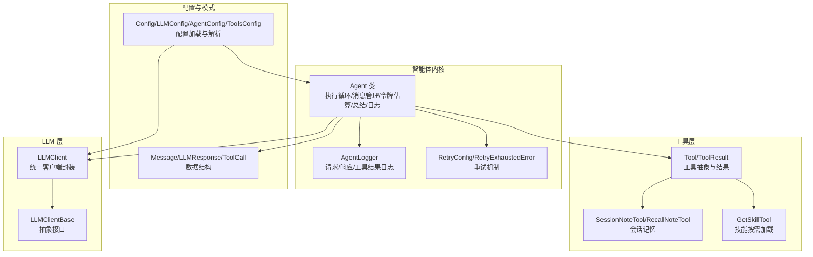
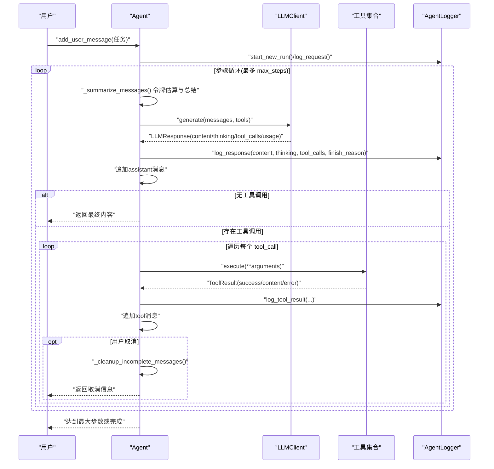
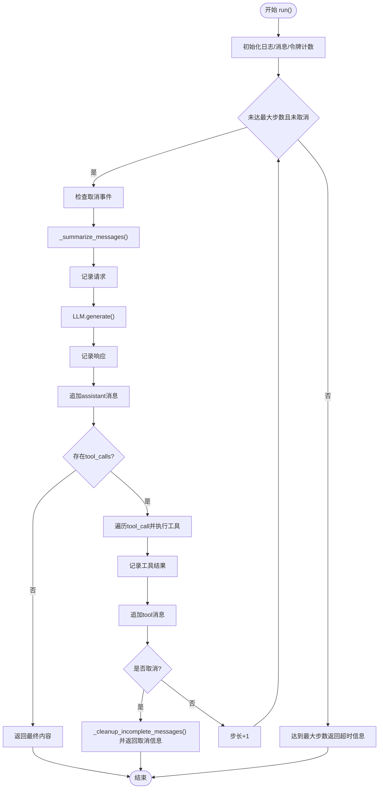
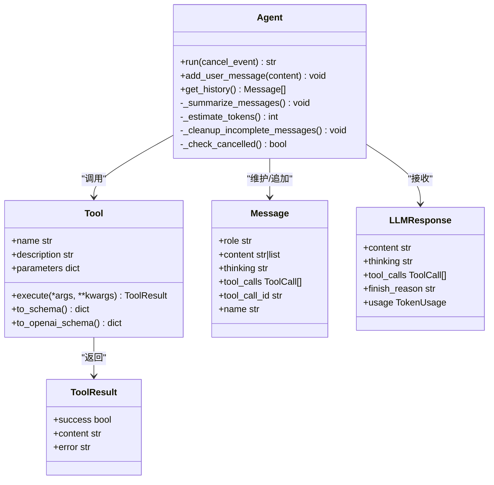
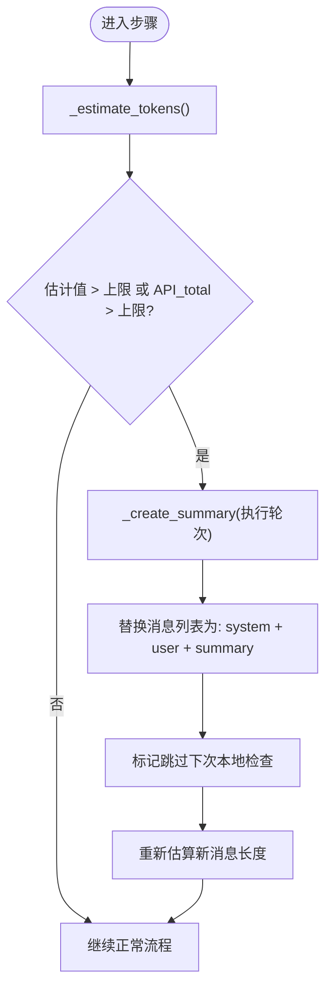
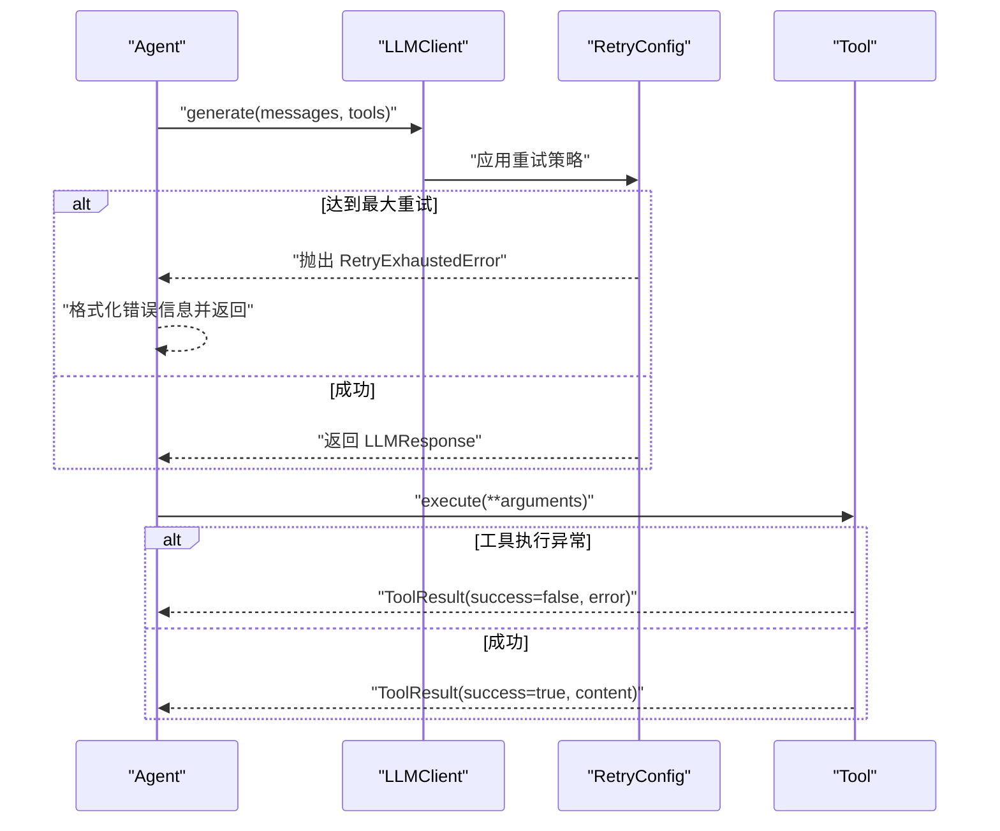
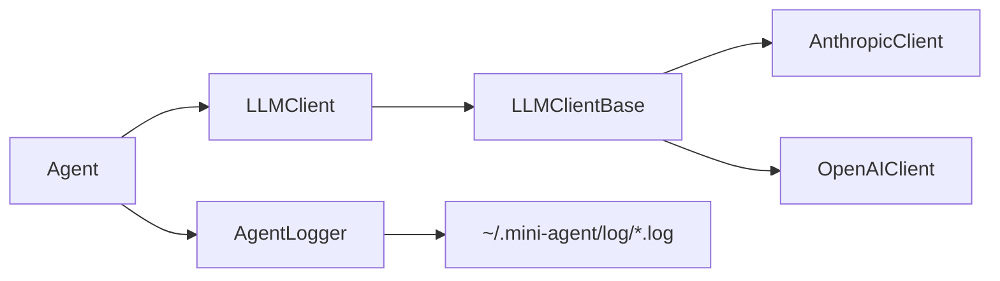
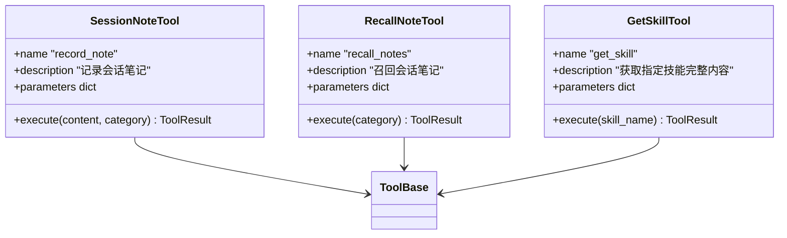
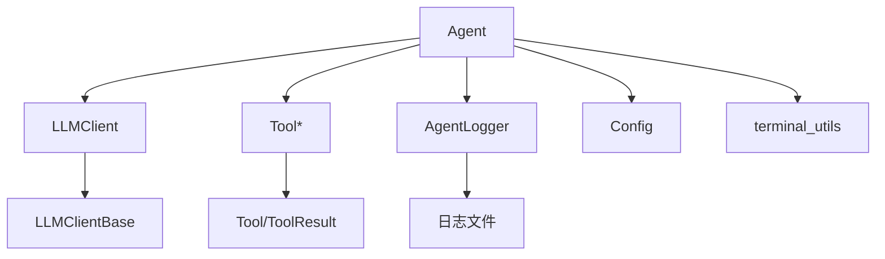

# 智能体执行引擎

<cite>
**本文引用的文件**
- [agent.py](file://mini_agent/agent.py)
- [__init__.py](file://mini_agent/__init__.py)
- [config.py](file://mini_agent/config.py)
- [logger.py](file://mini_agent/logger.py)
- [retry.py](file://mini_agent/retry.py)
- [schema.py](file://mini_agent/schema/schema.py)
- [base.py](file://mini_agent/tools/base.py)
- [llm_wrapper.py](file://mini_agent/llm/llm_wrapper.py)
- [base.py](file://mini_agent/llm/base.py)
- [note_tool.py](file://mini_agent/tools/note_tool.py)
- [skill_tool.py](file://mini_agent/tools/skill_tool.py)
- [terminal_utils.py](file://mini_agent/utils/terminal_utils.py)
- [config-example.yaml](file://mini_agent/config/config-example.yaml)
- [02_simple_agent.py](file://examples/02_simple_agent.py)
- [01_basic_tools.py](file://examples/01_basic_tools.py)
</cite>

## 目录
1. [简介](#简介)
2. [项目结构](#项目结构)
3. [核心组件](#核心组件)
4. [架构总览](#架构总览)
5. [详细组件分析](#详细组件分析)
6. [依赖分析](#依赖分析)
7. [性能考虑](#性能考虑)
8. [故障排查指南](#故障排查指南)
9. [结论](#结论)
10. [附录](#附录)

## 简介
本文件面向 MiniAgent 的智能体执行引擎，系统性阐述 Agent 类的设计理念、执行循环机制、消息管理、工具调用流程、取消机制与生命周期；解释令牌估算与消息历史总结策略以避免上下文溢出；说明异步执行模型与错误处理；并提供可直接参考的示例路径，帮助读者快速上手创建与运行智能体，理解与 LLM 客户端的交互模式及日志记录机制。

## 项目结构
- 核心执行引擎位于 mini_agent/agent.py，包含 Agent 类及其执行循环、消息管理、令牌估算与总结、日志记录与错误处理等。
- 配置管理位于 mini_agent/config.py，定义 LLM、Agent、Tools、MCP 等配置结构与加载逻辑。
- 日志模块位于 mini_agent/logger.py，负责单次运行的日志记录与输出。
- 工具基类与结果类型位于 mini_agent/tools/base.py，统一工具接口与返回格式。
- LLM 客户端封装位于 mini_agent/llm/llm_wrapper.py，支持多提供商（Anthropic/OpenAI）统一接口。
- 终端显示工具位于 mini_agent/utils/terminal_utils.py，用于正确计算终端宽度与对齐。
- 示例位于 examples/，包含基础工具演示与简单智能体使用示例。

**图表来源**
- [agent.py:45-524](file://mini_agent/agent.py#L45-L524)
- [logger.py:11-179](file://mini_agent/logger.py#L11-L179)
- [retry.py:23-139](file://mini_agent/retry.py#L23-L139)
- [config.py:66-221](file://mini_agent/config.py#L66-L221)
- [schema.py:7-56](file://mini_agent/schema/schema.py#L7-L56)
- [base.py:8-56](file://mini_agent/tools/base.py#L8-L56)
- [llm_wrapper.py:18-128](file://mini_agent/llm/llm_wrapper.py#L18-L128)
- [base.py:10-85](file://mini_agent/llm/base.py#L10-L85)
- [note_tool.py:17-214](file://mini_agent/tools/note_tool.py#L17-L214)
- [skill_tool.py:13-85](file://mini_agent/tools/skill_tool.py#L13-L85)

**章节来源**
- [agent.py:45-524](file://mini_agent/agent.py#L45-L524)
- [config.py:66-221](file://mini_agent/config.py#L66-L221)

## 核心组件
- Agent：单智能体执行引擎，负责消息历史维护、LLM 调用、工具调用、令牌估算与消息总结、取消与清理、日志记录与错误处理。
- LLMClient：统一的 LLM 客户端封装，自动根据提供商选择底层实现，并处理 MiniMax API 的端点后缀。
- AgentLogger：单次运行日志记录器，分别记录 LLM 请求、响应与工具执行结果。
- Retry 机制：指数退避重试配置与耗尽异常，用于 LLM 调用失败时的恢复。
- 工具体系：Tool/ToolResult 抽象，SessionNoteTool/RecallNoteTool 提供会话记忆，SkillTool 支持按需加载技能。
- 数据结构：Message、LLMResponse、ToolCall、FunctionCall 等，确保消息与工具调用的标准化。

**章节来源**
- [agent.py:45-524](file://mini_agent/agent.py#L45-L524)
- [llm_wrapper.py:18-128](file://mini_agent/llm/llm_wrapper.py#L18-L128)
- [logger.py:11-179](file://mini_agent/logger.py#L11-L179)
- [retry.py:23-139](file://mini_agent/retry.py#L23-L139)
- [base.py:8-56](file://mini_agent/tools/base.py#L8-L56)
- [schema.py:7-56](file://mini_agent/schema/schema.py#L7-L56)

## 架构总览
下图展示了智能体执行引擎在一次完整运行中的关键交互：Agent 初始化与配置注入、消息历史构建、LLM 生成、工具调用、消息总结与日志记录。

**图表来源**
- [agent.py:321-520](file://mini_agent/agent.py#L321-L520)
- [llm_wrapper.py:113-128](file://mini_agent/llm/llm_wrapper.py#L113-L128)
- [logger.py:43-157](file://mini_agent/logger.py#L43-L157)

## 详细组件分析

### Agent 执行循环与生命周期
- 初始化阶段
  - 注入 LLM 客户端、工具列表、系统提示、工作区目录与令牌上限。
  - 自动向系统提示注入当前工作区信息，确保工具路径解析一致。
  - 初始化消息历史（仅包含 system），初始化日志器与令牌统计。
- 运行阶段
  - 每一步开始前检查取消事件；若设置则清理不完整消息并返回取消信息。
  - 触发消息总结（当本地估算或 API 报告的 token 超过阈值时）。
  - 记录本次请求（消息与可用工具名），调用 LLM 生成响应。
  - 解析响应：更新 API 总 token 使用量；记录响应；追加 assistant 消息。
  - 若无工具调用，返回最终内容；否则遍历工具调用：
    - 校验工具名是否存在；不存在则构造失败结果。
    - 异步执行工具，捕获异常并转换为 ToolResult。
    - 记录工具执行结果；追加 tool 消息；再次检查取消事件。
  - 每步结束打印耗时；超过最大步数返回超时信息。
- 结束阶段
  - 返回最终响应或错误/取消信息；日志文件保存在用户主目录下的日志目录中。

**图表来源**
- [agent.py:321-520](file://mini_agent/agent.py#L321-L520)

**章节来源**
- [agent.py:48-524](file://mini_agent/agent.py#L48-L524)

### 消息管理与工具调用流程
- 消息结构
  - Message 支持字符串或内容块列表，可携带 thinking、tool_calls、tool_call_id、name 等扩展字段。
  - LLMResponse 包含 content、thinking、tool_calls、finish_reason 与 usage。
- 工具调用
  - Agent 将工具列表直接传递给 LLM；LLM 在响应中返回 ToolCall 列表。
  - Agent 根据函数名查找工具并异步执行，捕获异常转为 ToolResult。
  - 工具结果作为 tool 角色消息加入历史，保证上下文连贯。
- 取消机制
  - 通过 asyncio.Event 实现外部取消；在每步开始、工具执行前后检查。
  - 清理不完整消息（最后一个 assistant 及其后续 tool 消息），保持历史一致性。

**图表来源**
- [agent.py:45-524](file://mini_agent/agent.py#L45-L524)
- [base.py:8-56](file://mini_agent/tools/base.py#L8-L56)
- [schema.py:29-56](file://mini_agent/schema/schema.py#L29-L56)

**章节来源**
- [agent.py:86-524](file://mini_agent/agent.py#L86-L524)
- [base.py:8-56](file://mini_agent/tools/base.py#L8-L56)
- [schema.py:14-56](file://mini_agent/schema/schema.py#L14-L56)

### 令牌估算与消息历史总结策略
- 令牌估算
  - 使用 cl100k_base 编码器进行精确估算；若失败则回退为字符数/2.5 的粗略估算。
  - 对文本、thinking、tool_calls 均计入；每条消息额外计入约 4 token 的元数据开销。
- 总结触发条件
  - 本地估算超过阈值，或 API 返回 total_tokens 超过阈值。
  - 总结完成后跳过下一次本地检查，等待下一次 LLM 调用更新 API 报告的 token 数。
- 总结策略（Agent 模式）
  - 保留所有 user 消息（用户意图），对相邻 user 之间的执行过程进行摘要。
  - 最后一轮若仍在执行（存在 assistant/tool 消息但无下一个 user），同样进行摘要。
  - 替换消息列表，减少上下文长度，避免超出模型上下文限制。

**图表来源**
- [agent.py:123-261](file://mini_agent/agent.py#L123-L261)

**章节来源**
- [agent.py:123-261](file://mini_agent/agent.py#L123-L261)

### 异步执行模型与错误处理
- 异步执行
  - Agent.run 与工具 execute 均为异步；LLM.generate 由具体客户端实现。
  - 每步内部严格在安全检查点之间执行，确保取消时消息一致性。
- 错误处理
  - LLM 调用异常：捕获 RetryExhaustedError 并返回带重试次数与最后错误的提示；其他异常返回通用错误信息。
  - 工具执行异常：捕获所有异常并转换为 ToolResult(success=false)，同时记录详细错误与堆栈。
  - 取消：在多个检查点返回取消信息，随后清理不完整消息。
- 重试机制
  - RetryConfig 支持启用/最大重试次数/初始延迟/最大延迟/指数基数/可重试异常类型。
  - RetryExhaustedError 记录最后一次异常与尝试次数，便于诊断。

**图表来源**
- [agent.py:371-383](file://mini_agent/agent.py#L371-L383)
- [retry.py:64-139](file://mini_agent/retry.py#L64-L139)
- [base.py:34-36](file://mini_agent/tools/base.py#L34-L36)

**章节来源**
- [agent.py:371-508](file://mini_agent/agent.py#L371-L508)
- [retry.py:23-139](file://mini_agent/retry.py#L23-L139)

### 与 LLM 客户端的交互模式与日志记录
- 交互模式
  - LLMClient 统一接口，内部根据 provider 选择 AnthropicClient 或 OpenAIClient。
  - 对 MiniMax API 自动根据提供商附加 /anthropic 或 /v1 后缀；第三方 API 直接使用 api_base。
  - Agent 将当前消息与工具列表传入 generate，接收标准化的 LLMResponse。
- 日志记录
  - AgentLogger 按请求/响应/工具结果三类记录，包含时间戳与索引编号。
  - 日志文件位于用户主目录的 .mini-agent/log/ 下，每次 run() 创建新的日志文件。

**图表来源**
- [llm_wrapper.py:18-128](file://mini_agent/llm/llm_wrapper.py#L18-L128)
- [base.py:10-85](file://mini_agent/llm/base.py#L10-L85)
- [logger.py:11-179](file://mini_agent/logger.py#L11-L179)

**章节来源**
- [llm_wrapper.py:18-128](file://mini_agent/llm/llm_wrapper.py#L18-L128)
- [logger.py:30-179](file://mini_agent/logger.py#L30-L179)

### 会话记忆与技能按需加载
- 会话记忆
  - SessionNoteTool：记录带时间戳与分类的笔记；RecallNoteTool：按类别召回。
  - 使用 JSON 文件持久化，首次写入时创建目录与文件。
- 技能按需加载
  - GetSkillTool：仅暴露按名称检索技能详情的能力；实际技能发现与加载由 SkillLoader 完成。
  - 采用“渐进披露”策略，先在系统提示中声明可用技能，再在需要时加载完整技能内容。

**图表来源**
- [note_tool.py:17-214](file://mini_agent/tools/note_tool.py#L17-L214)
- [skill_tool.py:13-85](file://mini_agent/tools/skill_tool.py#L13-L85)
- [base.py:16-56](file://mini_agent/tools/base.py#L16-L56)

**章节来源**
- [note_tool.py:17-214](file://mini_agent/tools/note_tool.py#L17-L214)
- [skill_tool.py:13-85](file://mini_agent/tools/skill_tool.py#L13-L85)

## 依赖分析
- Agent 与 LLM 客户端
  - 通过 LLMClient 统一接口交互；具体实现由 LLMClientBase 抽象，AnthropicClient/OpenAIClient 分别实现。
- Agent 与工具
  - 工具集合以字典形式注册，按名称匹配；工具执行返回 ToolResult。
- Agent 与日志
  - 每次 run() 开始时创建新日志文件；分别记录请求、响应与工具结果。
- Agent 与配置
  - Config 提供 LLM、Agent、Tools、MCP 等配置；Agent 初始化时注入系统提示与工作区信息。
- Agent 与终端显示
  - 使用 terminal_utils 计算显示宽度，确保跨平台终端对齐与美观。

**图表来源**
- [agent.py:45-524](file://mini_agent/agent.py#L45-L524)
- [llm_wrapper.py:18-128](file://mini_agent/llm/llm_wrapper.py#L18-L128)
- [base.py:8-56](file://mini_agent/tools/base.py#L8-L56)
- [logger.py:11-179](file://mini_agent/logger.py#L11-L179)
- [config.py:66-221](file://mini_agent/config.py#L66-L221)
- [terminal_utils.py:18-157](file://mini_agent/utils/terminal_utils.py#L18-L157)

**章节来源**
- [agent.py:45-524](file://mini_agent/agent.py#L45-L524)
- [llm_wrapper.py:18-128](file://mini_agent/llm/llm_wrapper.py#L18-L128)
- [base.py:8-56](file://mini_agent/tools/base.py#L8-L56)
- [logger.py:11-179](file://mini_agent/logger.py#L11-L179)
- [config.py:66-221](file://mini_agent/config.py#L66-L221)
- [terminal_utils.py:18-157](file://mini_agent/utils/terminal_utils.py#L18-L157)

## 性能考虑
- 令牌估算与总结
  - 使用 cl100k_base 编码器进行精确估算；在总结后跳过一次本地检查，等待 API 更新 token 数，避免频繁总结。
  - 总结策略仅对执行轮次进行摘要，保留用户意图，降低上下文长度。
- 异步与并发
  - 工具执行为异步；在工具执行前后检查取消，保证消息一致性的同时尽量减少阻塞。
- 日志与 IO
  - 日志文件按运行创建，避免频繁打开关闭；建议在生产环境控制日志级别与大小。
- 终端显示
  - 使用终端宽度计算工具，避免因 ANSI/Emoji/East Asian 字符导致的显示错位。

[本节为通用指导，无需特定文件引用]

## 故障排查指南
- LLM 调用失败
  - 若出现 RetryExhaustedError，查看最后一次异常与重试次数，确认网络与配额状态。
  - 检查配置中的 api_key、api_base、model、provider 是否正确。
- 工具执行失败
  - 查看工具返回的 ToolResult.error 与 Traceback；确认参数类型与权限。
- 取消无效
  - 确认在外部设置 asyncio.Event；Agent 会在每步开始、工具执行前后检查。
- 上下文溢出
  - 检查 token_limit 设置；观察日志中的令牌估算与总结提示；必要时缩短系统提示或减少工具描述。
- 日志未生成
  - 确认 ~/.mini-agent/log/ 目录可写；检查 AgentLogger.start_new_run() 是否被调用。

**章节来源**
- [agent.py:371-383](file://mini_agent/agent.py#L371-L383)
- [retry.py:64-139](file://mini_agent/retry.py#L64-L139)
- [logger.py:30-42](file://mini_agent/logger.py#L30-L42)

## 结论
MiniAgent 的智能体执行引擎以 Agent 为核心，围绕异步执行、消息管理、工具调用、令牌估算与总结、取消机制与日志记录构建了完整的执行闭环。通过统一的 LLM 客户端封装与可插拔的工具体系，实现了跨提供商的兼容与灵活扩展。配合会话记忆与技能按需加载，进一步增强了智能体在复杂任务中的表现力与可控性。

[本节为总结，无需特定文件引用]

## 附录

### 快速上手：创建与运行智能体
- 基础工具使用
  - 参考示例：[01_basic_tools.py:1-138](file://examples/01_basic_tools.py#L1-L138)
  - 展示 WriteTool、ReadTool、EditTool、BashTool 的直接调用方式。
- 简单智能体运行
  - 参考示例：[02_simple_agent.py:1-213](file://examples/02_simple_agent.py#L1-L213)
  - 加载配置、初始化 LLM 客户端与工具、创建 Agent、添加用户消息并运行。
- 配置文件
  - 参考示例配置：[config-example.yaml:1-61](file://mini_agent/config/config-example.yaml#L1-L61)
  - 包含 LLM、重试、Agent、Tools、MCP 等配置项与优先级说明。

**章节来源**
- [01_basic_tools.py:1-138](file://examples/01_basic_tools.py#L1-L138)
- [02_simple_agent.py:19-113](file://examples/02_simple_agent.py#L19-L113)
- [config-example.yaml:13-61](file://mini_agent/config/config-example.yaml#L13-L61)

### 关键 API 与数据结构参考
- Agent
  - 初始化参数：llm_client、system_prompt、tools、max_steps、workspace_dir、token_limit
  - 方法：add_user_message、run、get_history
  - 参考：[agent.py:48-524](file://mini_agent/agent.py#L48-L524)
- LLM 客户端
  - LLMClient：根据 provider 选择底层实现；自动处理 MiniMax API 后缀
  - 参考：[llm_wrapper.py:18-128](file://mini_agent/llm/llm_wrapper.py#L18-L128)
- 数据结构
  - Message、LLMResponse、ToolCall、FunctionCall、TokenUsage
  - 参考：[schema.py:7-56](file://mini_agent/schema/schema.py#L7-L56)
- 工具基类
  - Tool、ToolResult、to_schema、to_openai_schema
  - 参考：[base.py:8-56](file://mini_agent/tools/base.py#L8-L56)
- 日志
  - AgentLogger：start_new_run、log_request、log_response、log_tool_result
  - 参考：[logger.py:11-179](file://mini_agent/logger.py#L11-L179)
- 配置
  - Config、LLMConfig、AgentConfig、ToolsConfig、MCPConfig
  - 参考：[config.py:66-221](file://mini_agent/config.py#L66-L221)

**章节来源**
- [agent.py:48-524](file://mini_agent/agent.py#L48-L524)
- [llm_wrapper.py:18-128](file://mini_agent/llm/llm_wrapper.py#L18-L128)
- [schema.py:7-56](file://mini_agent/schema/schema.py#L7-L56)
- [base.py:8-56](file://mini_agent/tools/base.py#L8-L56)
- [logger.py:11-179](file://mini_agent/logger.py#L11-L179)
- [config.py:66-221](file://mini_agent/config.py#L66-L221)