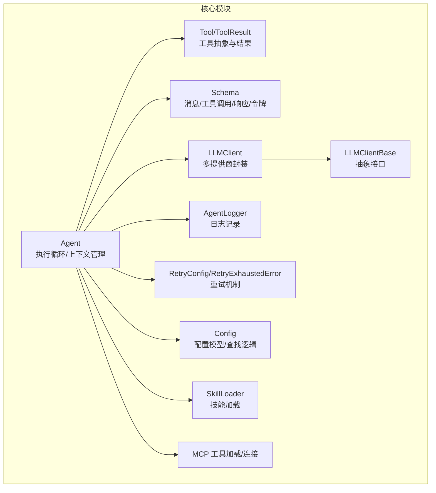
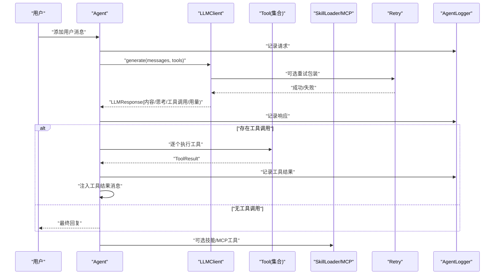
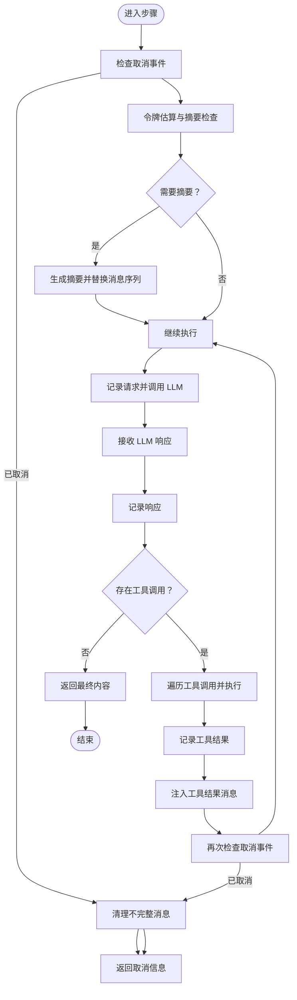
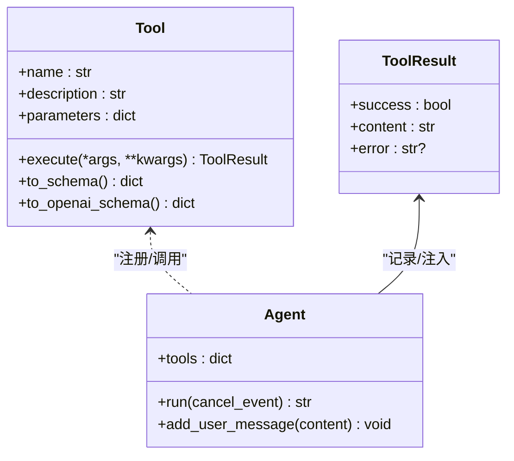
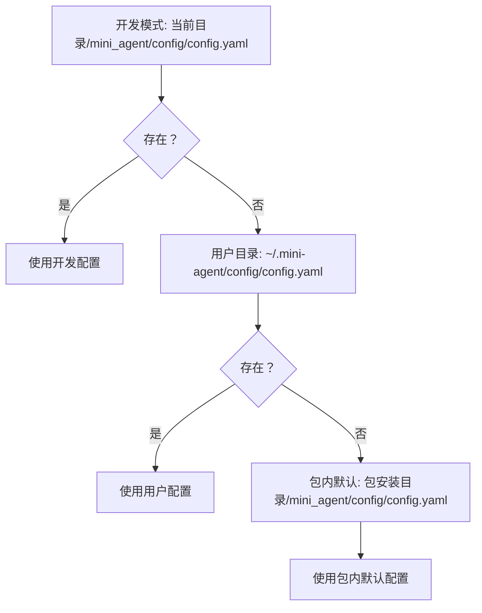
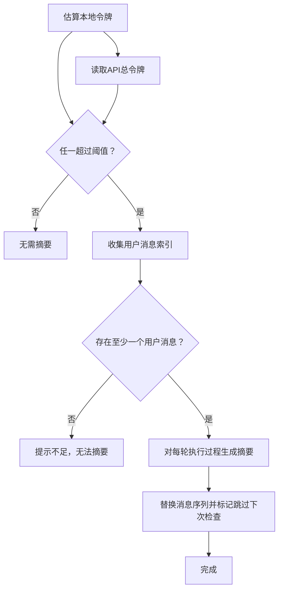
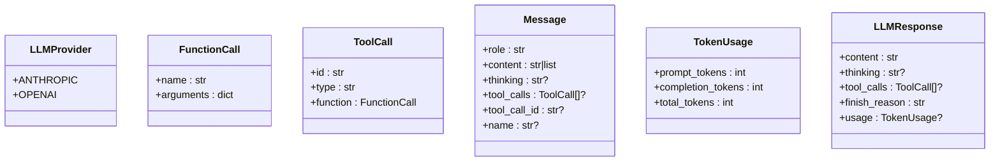
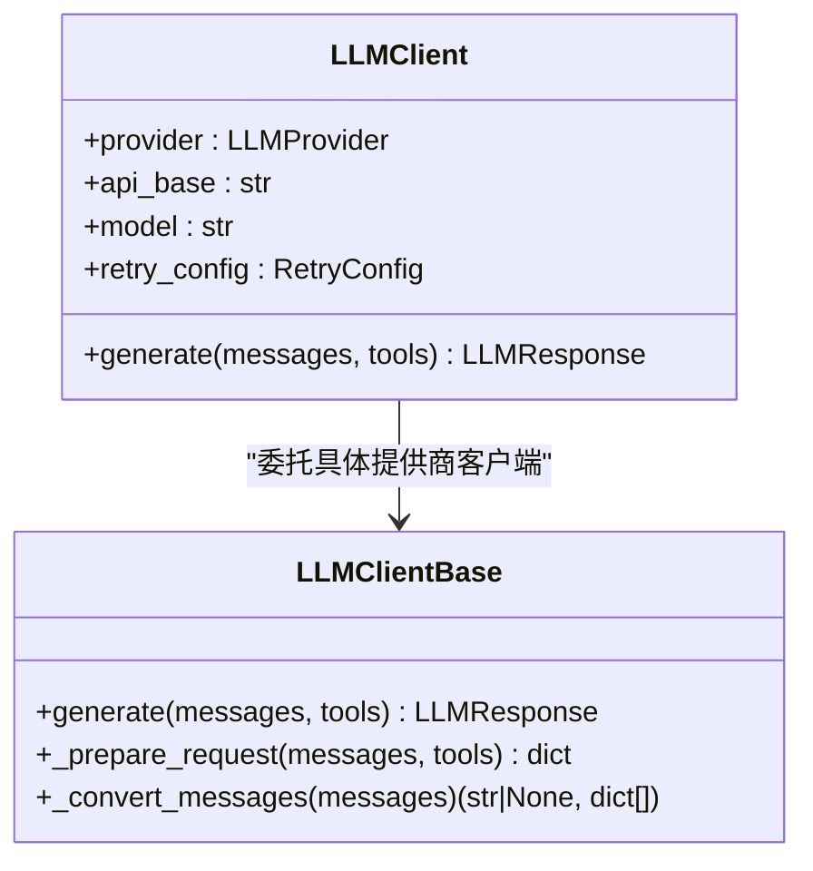
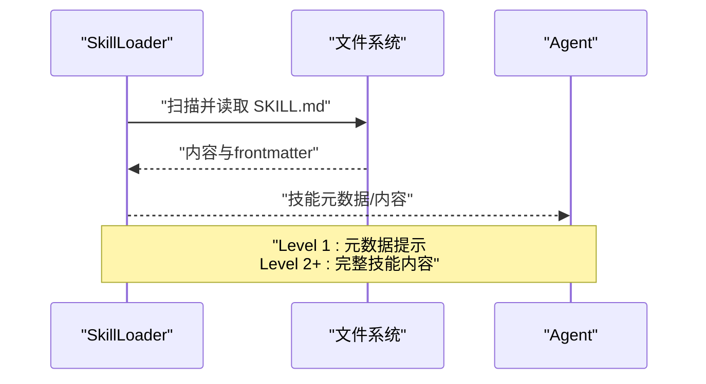
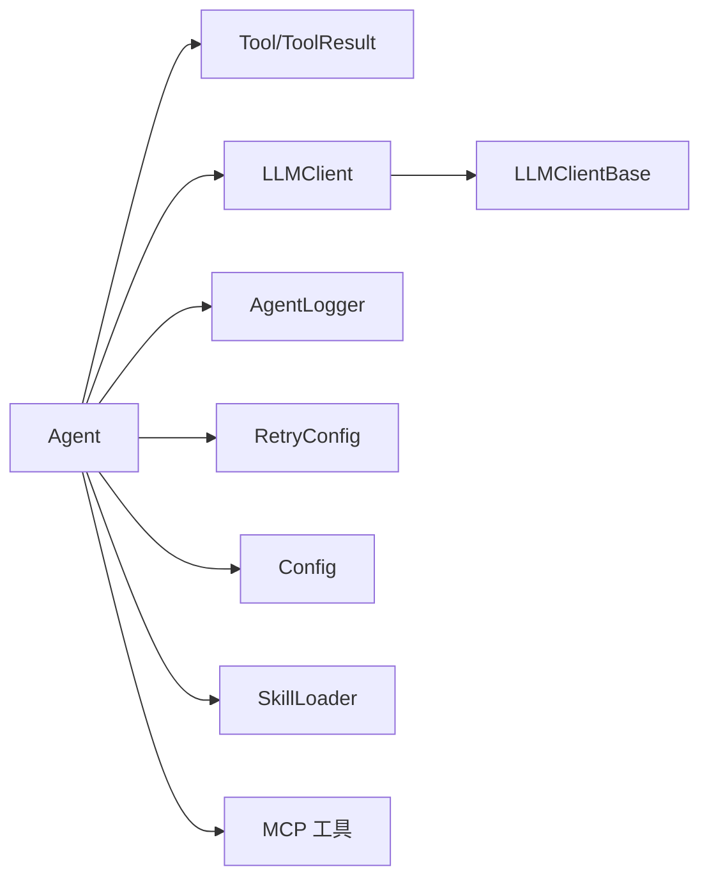

# 核心概念

<cite>
**本文引用的文件**
- [mini_agent/agent.py](file://mini_agent/agent.py)
- [mini_agent/tools/base.py](file://mini_agent/tools/base.py)
- [mini_agent/schema/schema.py](file://mini_agent/schema/schema.py)
- [mini_agent/config.py](file://mini_agent/config.py)
- [mini_agent/config/config-example.yaml](file://mini_agent/config/config-example.yaml)
- [mini_agent/config/system_prompt.md](file://mini_agent/config/system_prompt.md)
- [mini_agent/llm/base.py](file://mini_agent/llm/base.py)
- [mini_agent/llm/llm_wrapper.py](file://mini_agent/llm/llm_wrapper.py)
- [mini_agent/tools/skill_loader.py](file://mini_agent/tools/skill_loader.py)
- [mini_agent/tools/mcp_loader.py](file://mini_agent/tools/mcp_loader.py)
- [mini_agent/logger.py](file://mini_agent/logger.py)
- [mini_agent/retry.py](file://mini_agent/retry.py)
- [examples/02_simple_agent.py](file://examples/02_simple_agent.py)
- [examples/01_basic_tools.py](file://examples/01_basic_tools.py)
</cite>

## 目录
1. [引言](#引言)
2. [项目结构](#项目结构)
3. [核心组件](#核心组件)
4. [架构总览](#架构总览)
5. [详细组件分析](#详细组件分析)
6. [依赖分析](#依赖分析)
7. [性能考虑](#性能考虑)
8. [故障排查指南](#故障排查指南)
9. [结论](#结论)
10. [附录](#附录)

## 引言
本文件面向希望深入理解 MiniAgent 的开发者与使用者，系统性阐述以下核心主题：
- 智能体执行循环的工作原理与设计理念
- 工具系统基础架构：抽象类设计、工具注册与调用机制
- 配置管理系统多层级优先级规则（开发模式、用户配置、包内配置）
- 智能上下文管理机制：令牌估算、对话历史总结与内存管理策略
- 数据模型设计：消息结构、工具结果模型、配置模型
- 使用模式与示例路径，帮助快速上手并正确集成各组件

## 项目结构
MiniAgent 采用模块化分层组织，核心目录与职责概览：
- mini_agent/agent.py：Agent 类实现，包含执行循环、上下文压缩、日志记录等
- mini_agent/tools/base.py：工具抽象基类与工具结果模型
- mini_agent/tools/skill_loader.py：Claude Skills 加载器
- mini_agent/tools/mcp_loader.py：MCP 工具加载器与连接管理
- mini_agent/schema/schema.py：消息、工具调用、响应、令牌用量等数据模型
- mini_agent/config.py：统一配置模型与多层级配置查找逻辑
- mini_agent/llm/base.py 与 mini_agent/llm/llm_wrapper.py：LLM 客户端抽象与多提供商封装
- mini_agent/logger.py：运行日志记录
- mini_agent/retry.py：重试机制
- examples/*：示例脚本，演示工具与 Agent 的基本用法

**图表来源**
- [mini_agent/agent.py:1-524](file://mini_agent/agent.py#L1-L524)
- [mini_agent/tools/base.py:1-56](file://mini_agent/tools/base.py#L1-L56)
- [mini_agent/schema/schema.py:1-56](file://mini_agent/schema/schema.py#L1-L56)
- [mini_agent/config.py:1-221](file://mini_agent/config.py#L1-L221)
- [mini_agent/llm/base.py:1-85](file://mini_agent/llm/base.py#L1-L85)
- [mini_agent/llm/llm_wrapper.py:1-128](file://mini_agent/llm/llm_wrapper.py#L1-L128)
- [mini_agent/logger.py:1-179](file://mini_agent/logger.py#L1-L179)
- [mini_agent/retry.py:1-139](file://mini_agent/retry.py#L1-L139)
- [mini_agent/tools/skill_loader.py:1-257](file://mini_agent/tools/skill_loader.py#L1-L257)
- [mini_agent/tools/mcp_loader.py:1-434](file://mini_agent/tools/mcp_loader.py#L1-L434)

**章节来源**
- [mini_agent/agent.py:1-524](file://mini_agent/agent.py#L1-L524)
- [mini_agent/config.py:166-221](file://mini_agent/config.py#L166-L221)

## 核心组件
本节聚焦四大核心子系统：Agent 执行循环、工具系统、配置管理、数据模型。

- Agent 执行循环
  - 负责单轮对话与工具调用的完整生命周期，支持取消、日志、令牌估算与上下文压缩
  - 关键点：消息历史维护、工具调用解析、工具结果注入、最大步数限制、取消信号处理
  - 参考路径：[Agent.run:321-524](file://mini_agent/agent.py#L321-L524)，[Agent._summarize_messages:180-261](file://mini_agent/agent.py#L180-L261)，[Agent._estimate_tokens:123-178](file://mini_agent/agent.py#L123-L178)

- 工具系统
  - 抽象基类 Tool 定义名称、描述、参数模式与异步执行接口；ToolResult 统一返回结构
  - 工具注册：Agent 构造时以字典形式保存 {tool.name: tool}，按名称匹配 LLM 返回的工具调用
  - 参考路径：[Tool/ToolResult:16-56](file://mini_agent/tools/base.py#L16-L56)，[Agent 构造与工具注册:48-76](file://mini_agent/agent.py#L48-L76)

- 配置管理
  - 多层级查找顺序：当前目录开发模式 -> 用户目录 -> 包内默认配置
  - 配置模型：LLMConfig、AgentConfig、ToolsConfig、RetryConfig、MCPConfig
  - 参考路径：[Config.find_config_file:177-206](file://mini_agent/config.py#L177-L206)，[Config.from_yaml:82-164](file://mini_agent/config.py#L82-L164)

- 数据模型
  - LLMProvider、FunctionCall、ToolCall、Message、TokenUsage、LLMResponse
  - 用于统一消息格式、工具调用协议与 LLM 响应结构
  - 参考路径：[schema:1-56](file://mini_agent/schema/schema.py#L1-L56)

**章节来源**
- [mini_agent/agent.py:48-85](file://mini_agent/agent.py#L48-L85)
- [mini_agent/tools/base.py:16-56](file://mini_agent/tools/base.py#L16-L56)
- [mini_agent/config.py:66-164](file://mini_agent/config.py#L66-L164)
- [mini_agent/schema/schema.py:7-56](file://mini_agent/schema/schema.py#L7-L56)

## 架构总览
下图展示从用户输入到工具执行与结果回写的消息流，以及与配置、日志、重试、LLM 客户端的交互关系。

**图表来源**
- [mini_agent/agent.py:321-524](file://mini_agent/agent.py#L321-L524)
- [mini_agent/llm/llm_wrapper.py:113-128](file://mini_agent/llm/llm_wrapper.py#L113-L128)
- [mini_agent/retry.py:73-139](file://mini_agent/retry.py#L73-L139)
- [mini_agent/logger.py:43-157](file://mini_agent/logger.py#L43-L157)
- [mini_agent/tools/skill_loader.py:194-257](file://mini_agent/tools/skill_loader.py#L194-L257)
- [mini_agent/tools/mcp_loader.py:330-434](file://mini_agent/tools/mcp_loader.py#L330-L434)

## 详细组件分析

### Agent 执行循环与上下文管理
- 设计理念
  - 单智能体、最小可用：通过 LLM 与工具协作完成复杂任务
  - 安全中断：在每步安全点检查取消事件，清理不完整消息，保证历史一致性
  - 上下文压缩：当本地估算或 API 报告的令牌超限时，对用户回合之间的执行过程进行摘要，降低上下文长度
- 关键流程
  - 步骤头打印、工具列表准备、LLM 请求与响应记录、工具调用解析与执行、工具结果注入、取消检查、最大步数保护
- 令牌估算与摘要
  - 使用 cl100k_base 编码器精确估算；失败时回退字符计数法
  - 摘要策略：保留用户消息，对相邻用户消息间的执行过程进行摘要，避免连续触发
- 取消与清理
  - 在每步开始、工具执行后检查取消事件；清理最后一条助手消息及其后续工具结果，确保一致性

**图表来源**
- [mini_agent/agent.py:321-524](file://mini_agent/agent.py#L321-L524)
- [mini_agent/agent.py:180-261](file://mini_agent/agent.py#L180-L261)
- [mini_agent/agent.py:123-178](file://mini_agent/agent.py#L123-L178)

**章节来源**
- [mini_agent/agent.py:321-524](file://mini_agent/agent.py#L321-L524)
- [mini_agent/agent.py:180-261](file://mini_agent/agent.py#L180-L261)
- [mini_agent/agent.py:123-178](file://mini_agent/agent.py#L123-L178)

### 工具系统：抽象类与注册机制
- 抽象类设计
  - Tool：定义 name/description/parameters 属性与 execute 接口，并提供 Anthropic/OpenAI 兼容的 schema 导出
  - ToolResult：统一 success/content/error 字段，便于 Agent 解析与日志记录
- 注册与调用
  - Agent 构造时将工具列表转为字典 {tool.name: tool}
  - LLM 响应中包含 tool_calls，Agent 按名称查找并执行对应工具
  - 工具执行异常被捕获并转换为失败的 ToolResult，保证流程稳定
- 示例路径
  - 基础工具使用：[examples/01_basic_tools.py:1-138](file://examples/01_basic_tools.py#L1-L138)
  - 简单 Agent 场景：[examples/02_simple_agent.py:1-213](file://examples/02_simple_agent.py#L1-L213)

**图表来源**
- [mini_agent/tools/base.py:16-56](file://mini_agent/tools/base.py#L16-L56)
- [mini_agent/agent.py:48-76](file://mini_agent/agent.py#L48-L76)

**章节来源**
- [mini_agent/tools/base.py:16-56](file://mini_agent/tools/base.py#L16-L56)
- [mini_agent/agent.py:48-76](file://mini_agent/agent.py#L48-L76)

### 配置管理系统：多层级优先级
- 优先级规则
  - 开发模式：当前工作目录下的 mini_agent/config/config.yaml
  - 用户配置：~/.mini-agent/config/config.yaml
  - 包内默认：安装包内的 mini_agent/config/config.yaml
- 配置模型
  - LLMConfig：api_key、api_base、model、provider、retry
  - AgentConfig：max_steps、workspace_dir、system_prompt_path
  - ToolsConfig：基础工具开关、技能目录、MCP 开关与配置路径、MCP 超时
  - RetryConfig：启用、最大重试次数、初始延迟、最大延迟、指数基数
  - MCPConfig：连接超时、执行超时、SSE 读取超时
- 配置加载
  - Config.from_yaml 解析 YAML 并校验必填字段（如 api_key），构建嵌套配置对象
  - Config.find_config_file 实现上述优先级查找

**图表来源**
- [mini_agent/config.py:177-206](file://mini_agent/config.py#L177-L206)
- [mini_agent/config.py:82-164](file://mini_agent/config.py#L82-L164)

**章节来源**
- [mini_agent/config.py:177-206](file://mini_agent/config.py#L177-L206)
- [mini_agent/config.py:82-164](file://mini_agent/config.py#L82-L164)
- [mini_agent/config/config-example.yaml:1-61](file://mini_agent/config/config-example.yaml#L1-L61)
- [mini_agent/config/system_prompt.md:1-76](file://mini_agent/config/system_prompt.md#L1-L76)

### 智能上下文管理：令牌估算、摘要与内存策略
- 令牌估算
  - 使用 cl100k_base 编码器估算消息文本、思考内容、工具调用等；失败时回退字符计数法
- 上下文摘要
  - 当本地估算或 API 报告的总令牌超过阈值时，对相邻用户消息之间的执行过程进行摘要
  - 摘要后跳过下一次令牌检查，等待下一次 LLM 调用更新 API 总令牌
- 内存管理
  - 仅保留用户消息与摘要，减少上下文长度，避免超出模型上下文窗口
  - 支持取消后清理不完整消息，保持历史一致性

**图表来源**
- [mini_agent/agent.py:180-261](file://mini_agent/agent.py#L180-L261)
- [mini_agent/agent.py:123-178](file://mini_agent/agent.py#L123-L178)

**章节来源**
- [mini_agent/agent.py:180-261](file://mini_agent/agent.py#L180-L261)
- [mini_agent/agent.py:123-178](file://mini_agent/agent.py#L123-L178)

### 数据模型设计
- LLMProvider：枚举类型，支持 anthropic/openai
- FunctionCall：函数名与参数字典
- ToolCall：包含 id、type、FunctionCall
- Message：角色、内容（字符串或内容块列表）、思考、工具调用、工具调用 ID、名称
- TokenUsage：提示词、补全、总计令牌
- LLMResponse：内容、思考、工具调用、完成原因、用量

**图表来源**
- [mini_agent/schema/schema.py:7-56](file://mini_agent/schema/schema.py#L7-L56)

**章节来源**
- [mini_agent/schema/schema.py:7-56](file://mini_agent/schema/schema.py#L7-L56)

### LLM 客户端与提供商适配
- LLMClientBase：定义 generate 与请求准备、消息转换的抽象接口
- LLMClient：根据 provider 自动选择 AnthropicClient 或 OpenAIClient；对 MiniMax API 自动拼接端点后缀
- 重试机制：通过 RetryConfig 提供指数回退与可配置延迟，封装在 LLM 客户端层

**图表来源**
- [mini_agent/llm/base.py:10-85](file://mini_agent/llm/base.py#L10-L85)
- [mini_agent/llm/llm_wrapper.py:18-128](file://mini_agent/llm/llm_wrapper.py#L18-L128)
- [mini_agent/retry.py:23-71](file://mini_agent/retry.py#L23-L71)

**章节来源**
- [mini_agent/llm/base.py:10-85](file://mini_agent/llm/base.py#L10-L85)
- [mini_agent/llm/llm_wrapper.py:18-128](file://mini_agent/llm/llm_wrapper.py#L18-L128)
- [mini_agent/retry.py:23-71](file://mini_agent/retry.py#L23-L71)

### 工具系统：技能与 MCP 工具
- 技能加载（SkillLoader）
  - 从 SKILL.md 解析 YAML frontmatter，支持相对路径绝对化、文档链接与脚本路径处理
  - 提供元数据提示（Level 1）与完整技能内容加载（Level 2+）
- MCP 工具加载（MCP）
  - 支持 STDIO/SSE/HTTP/Streamable HTTP 连接，自动列出工具并封装为 Tool
  - 全局与服务器级超时配置，连接与执行均带超时保护
  - 提供全局设置与清理函数

**图表来源**
- [mini_agent/tools/skill_loader.py:47-257](file://mini_agent/tools/skill_loader.py#L47-L257)

**章节来源**
- [mini_agent/tools/skill_loader.py:47-257](file://mini_agent/tools/skill_loader.py#L47-L257)
- [mini_agent/tools/mcp_loader.py:60-434](file://mini_agent/tools/mcp_loader.py#L60-L434)

## 依赖分析
- 组件耦合与内聚
  - Agent 对工具、LLM、日志、重试、配置有直接依赖；通过抽象接口降低耦合
  - 工具系统与 LLM 客户端解耦，便于扩展新工具与新提供商
- 外部依赖与集成点
  - LLM 客户端依赖第三方提供商 SDK（Anthropic/OpenAI）
  - MCP 工具依赖 mcp 客户端库与传输协议（STDIO/SSE/HTTP）
  - tiktoken 用于令牌估算
- 循环依赖
  - 未发现直接循环依赖；Agent 通过工具接口间接使用工具，避免强耦合

**图表来源**
- [mini_agent/agent.py:1-524](file://mini_agent/agent.py#L1-L524)
- [mini_agent/tools/base.py:1-56](file://mini_agent/tools/base.py#L1-L56)
- [mini_agent/llm/llm_wrapper.py:1-128](file://mini_agent/llm/llm_wrapper.py#L1-L128)
- [mini_agent/logger.py:1-179](file://mini_agent/logger.py#L1-L179)
- [mini_agent/retry.py:1-139](file://mini_agent/retry.py#L1-L139)
- [mini_agent/config.py:1-221](file://mini_agent/config.py#L1-L221)
- [mini_agent/tools/skill_loader.py:1-257](file://mini_agent/tools/skill_loader.py#L1-L257)
- [mini_agent/tools/mcp_loader.py:1-434](file://mini_agent/tools/mcp_loader.py#L1-L434)

**章节来源**
- [mini_agent/agent.py:1-524](file://mini_agent/agent.py#L1-L524)
- [mini_agent/llm/llm_wrapper.py:1-128](file://mini_agent/llm/llm_wrapper.py#L1-L128)

## 性能考虑
- 令牌估算与摘要
  - 使用 cl100k_base 编码器估算更准确；在高负载场景建议合理设置 token_limit 与 max_steps
  - 摘要后跳过一次检查，避免频繁触发导致的性能抖动
- 工具执行
  - MCP 工具与 Bash 工具可能阻塞，建议配置合理的 execute_timeout 与 connect_timeout
  - 对长输出进行截断显示，避免终端渲染开销过大
- LLM 调用
  - 合理配置 RetryConfig 的初始延迟与最大延迟，避免频繁重试造成资源浪费
- 日志
  - 日志文件位于用户目录，注意磁盘空间与 IO 影响

[本节为通用指导，不直接分析具体文件]

## 故障排查指南
- LLM 调用失败
  - 检查 RetryExhaustedError：确认网络、API Key、模型可用性与重试配置
  - 参考路径：[RetryExhaustedError:64-71](file://mini_agent/retry.py#L64-L71)，[Agent.run 错误处理:371-383](file://mini_agent/agent.py#L371-L383)
- MCP 工具连接失败
  - 检查 mcp.json 配置、服务器可达性、超时设置；查看连接/执行超时日志
  - 参考路径：[MCPServerConnection.connect:171-232](file://mini_agent/tools/mcp_loader.py#L171-L232)
- 工具执行异常
  - Agent 将异常捕获并转换为 ToolResult(error)，可在日志中定位
  - 参考路径：[Agent 工具执行与异常处理:461-474](file://mini_agent/agent.py#L461-L474)
- 配置问题
  - 确认配置文件存在且 api_key 已填写；遵循优先级顺序
  - 参考路径：[Config.find_config_file:177-206](file://mini_agent/config.py#L177-L206)，[Config.from_yaml:82-164](file://mini_agent/config.py#L82-L164)

**章节来源**
- [mini_agent/retry.py:64-71](file://mini_agent/retry.py#L64-L71)
- [mini_agent/agent.py:371-383](file://mini_agent/agent.py#L371-L383)
- [mini_agent/tools/mcp_loader.py:171-232](file://mini_agent/tools/mcp_loader.py#L171-L232)
- [mini_agent/agent.py:461-474](file://mini_agent/agent.py#L461-L474)
- [mini_agent/config.py:177-206](file://mini_agent/config.py#L177-L206)
- [mini_agent/config.py:82-164](file://mini_agent/config.py#L82-L164)

## 结论
MiniAgent 通过清晰的分层架构与抽象设计，实现了“LLM + 工具 + 配置 + 日志 + 重试”的一体化智能体框架。其核心优势在于：
- 明确的执行循环与安全中断机制
- 可扩展的工具系统与多提供商 LLM 客户端
- 多层级配置优先级与易用的默认配置
- 智能上下文压缩与令牌估算，保障长对话稳定性
- 完整的日志记录与错误处理，便于调试与审计

## 附录
- 快速上手示例
  - 基础工具使用：[examples/01_basic_tools.py:1-138](file://examples/01_basic_tools.py#L1-L138)
  - 简单 Agent 场景：[examples/02_simple_agent.py:1-213](file://examples/02_simple_agent.py#L1-L213)
- 配置参考
  - 默认配置模板：[mini_agent/config/config-example.yaml:1-61](file://mini_agent/config/config-example.yaml#L1-L61)
  - 系统提示模板：[mini_agent/config/system_prompt.md:1-76](file://mini_agent/config/system_prompt.md#L1-L76)