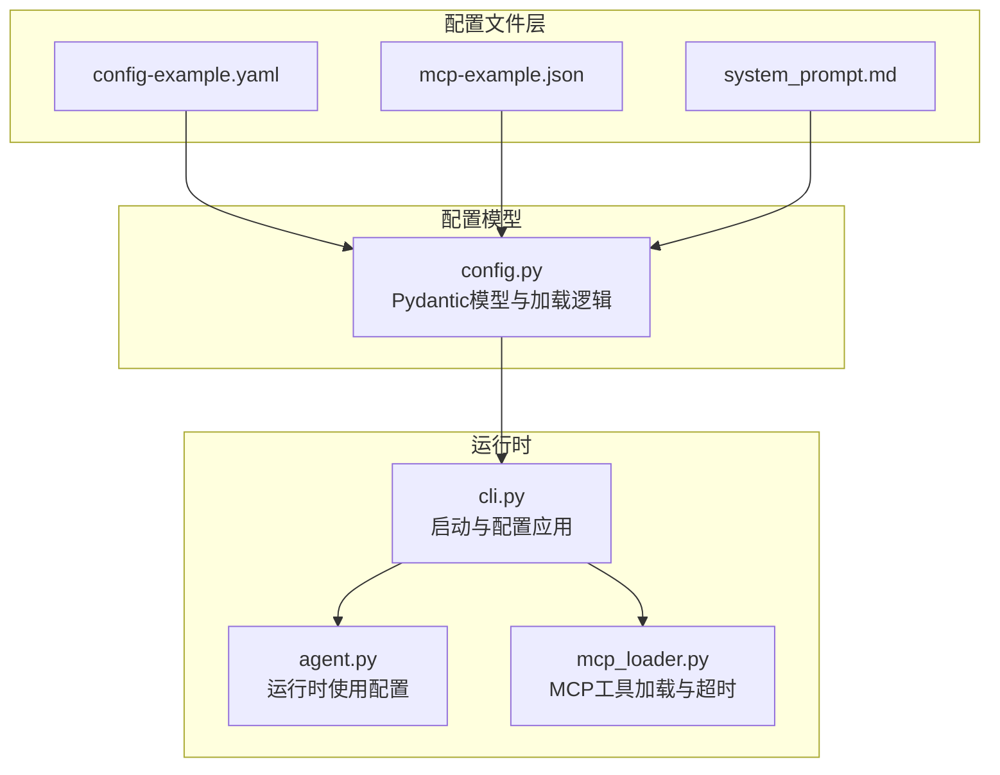
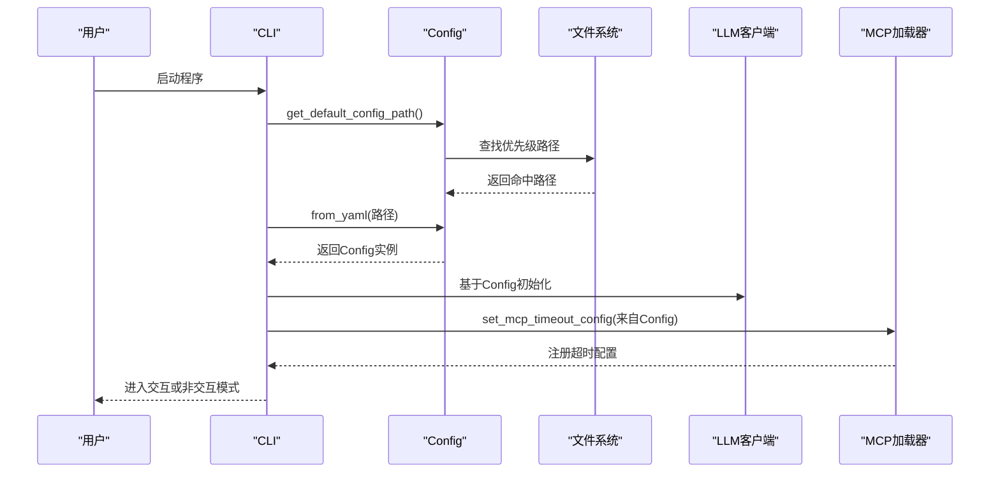
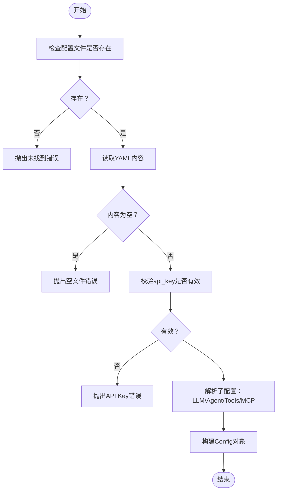
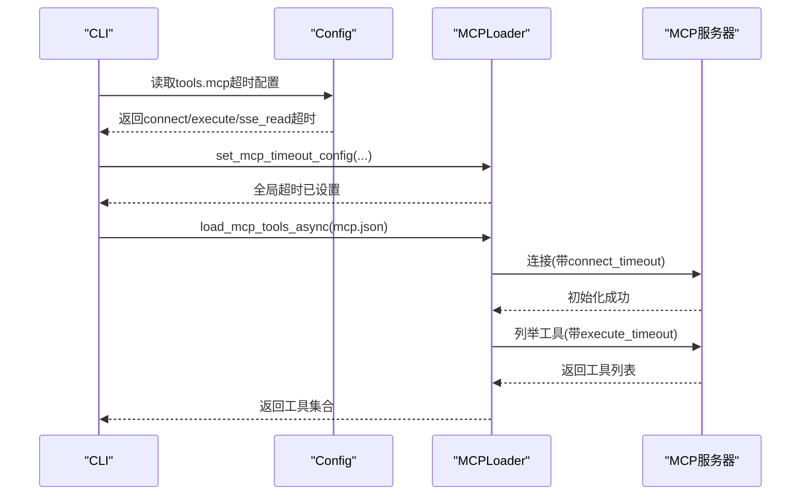
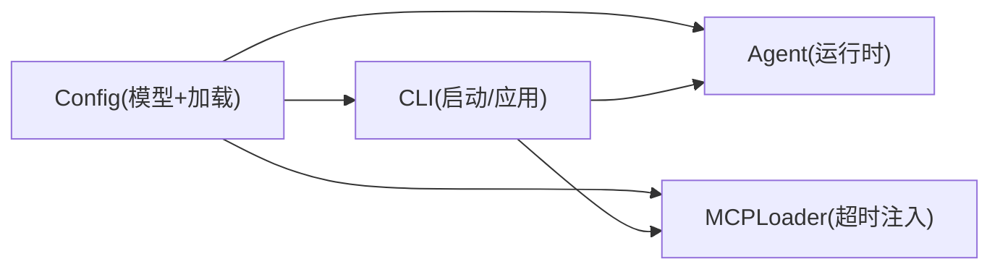

# 配置管理系统

<cite>
**本文档引用的文件**
- [config.py](file://mini_agent/config.py)
- [config-example.yaml](file://mini_agent/config/config-example.yaml)
- [mcp-example.json](file://mini_agent/config/mcp-example.json)
- [system_prompt.md](file://mini_agent/config/system_prompt.md)
- [cli.py](file://mini_agent/cli.py)
- [agent.py](file://mini_agent/agent.py)
- [mcp_loader.py](file://mini_agent/tools/mcp_loader.py)
- [setup-config.sh](file://scripts/setup-config.sh)
- [setup-config.ps1](file://scripts/setup-config.ps1)
- [test_agent.py](file://tests/test_agent.py)
- [test_llm.py](file://tests/test_llm.py)
</cite>

## 目录
1. [简介](#简介)
2. [项目结构](#项目结构)
3. [核心组件](#核心组件)
4. [架构总览](#架构总览)
5. [详细组件分析](#详细组件分析)
6. [依赖关系分析](#依赖关系分析)
7. [性能考量](#性能考量)
8. [故障排查指南](#故障排查指南)
9. [结论](#结论)
10. [附录](#附录)

## 简介
本文件系统性阐述 MiniAgent 的配置管理系统，重点覆盖：
- 多层级配置架构与优先级：开发模式、用户配置、包内配置
- 配置文件结构与字段语义：LLM 设置、工具配置、系统参数
- 验证机制与默认值策略
- 环境变量支持与动态配置更新
- 最佳实践与常见场景示例
- 扩展配置系统的路径与方法

## 项目结构
配置相关的核心位置与职责：
- 配置加载与模型定义：mini_agent/config.py
- 示例配置与模板：mini_agent/config/config-example.yaml、mini_agent/config/mcp-example.json、mini_agent/config/system_prompt.md
- CLI 启动流程与配置应用：mini_agent/cli.py
- Agent 运行时对配置的使用：mini_agent/agent.py
- MCP 工具加载与超时配置：mini_agent/tools/mcp_loader.py
- 初始化脚本（跨平台）：scripts/setup-config.sh、scripts/setup-config.ps1
- 测试用例（验证配置加载与使用）：tests/test_agent.py、tests/test_llm.py

图表来源
- [config.py:66-221](file://mini_agent/config.py#L66-L221)
- [cli.py:486-631](file://mini_agent/cli.py#L486-L631)
- [mcp_loader.py:330-434](file://mini_agent/tools/mcp_loader.py#L330-L434)

章节来源
- [config.py:1-221](file://mini_agent/config.py#L1-L221)
- [cli.py:486-631](file://mini_agent/cli.py#L486-L631)

## 核心组件
- 配置模型与验证
  - LLMConfig：api_key、api_base、model、provider、retry
  - RetryConfig：重试开关与退避参数
  - AgentConfig：max_steps、workspace_dir、system_prompt_path
  - ToolsConfig：基础工具开关、技能目录、MCP 开关与配置路径、MCP 超时
  - Config：顶层聚合，提供从 YAML 加载、默认路径解析、优先级查找等
- CLI 应用流程
  - 通过 Config.get_default_config_path() 按优先级定位配置
  - 读取并实例化 LLM 客户端、工具、系统提示词
  - 将 MCP 超时配置注入到 MCP 工具加载器
- MCP 工具加载
  - 支持 STDIO/SSE/HTTP/Streamable HTTP 四种连接类型
  - 全局与服务器级超时配置，带连接/执行/读取超时保护

章节来源
- [config.py:12-164](file://mini_agent/config.py#L12-L164)
- [cli.py:486-631](file://mini_agent/cli.py#L486-L631)
- [mcp_loader.py:21-57](file://mini_agent/tools/mcp_loader.py#L21-L57)

## 架构总览
配置系统采用“多层级优先级 + 显式验证 + 运行时注入”的设计：
- 优先级顺序：开发模式（当前目录 mini_agent/config/）> 用户配置（~/.mini-agent/config/）> 包内安装目录（site-packages/mini_agent/config/）
- 验证策略：必需字段校验、API Key 合法性检查、空文件保护
- 动态应用：CLI 在启动阶段一次性加载配置，运行期直接使用；MCP 超时在加载前注入全局配置

图表来源
- [config.py:176-221](file://mini_agent/config.py#L176-L221)
- [cli.py:495-573](file://mini_agent/cli.py#L495-L573)
- [mcp_loader.py:34-57](file://mini_agent/tools/mcp_loader.py#L34-L57)

## 详细组件分析

### 配置模型与验证机制
- 字段与默认值
  - LLM：api_key 必填；api_base 默认为特定平台地址；model 默认模型名；provider 默认提供方；retry 默认启用且包含退避参数
  - Agent：max_steps 默认步数；workspace_dir 默认工作区；system_prompt_path 默认提示词文件名
  - Tools：基础工具开关默认开启；skills_dir 默认目录；enable_mcp 默认开启；mcp_config_path 默认文件名；MCP 超时有默认值
- 加载与验证
  - 必需字段缺失或为空将抛出异常
  - API Key 若为占位符或空值将拒绝加载
  - 空文件将被识别并报错
- 优先级查找
  - Config.find_config_file() 按开发 > 用户 > 包内顺序查找指定文件
  - Config.get_default_config_path() 返回默认配置文件路径

图表来源
- [config.py:82-164](file://mini_agent/config.py#L82-L164)

章节来源
- [config.py:12-164](file://mini_agent/config.py#L12-L164)

### 配置文件结构与字段含义
- LLM 设置
  - api_key：必填，用于认证
  - api_base：服务端点基址，默认指向特定平台
  - model：模型名称
  - provider：提供方选择（如 anthropic/openai），影响路径后缀拼接
  - retry：重试策略（enabled/max_retries/initial_delay/max_delay/exponential_base）
- Agent 参数
  - max_steps：最大执行步数
  - workspace_dir：工作区目录
  - system_prompt_path：系统提示词文件名（可被优先级查找替换）
- 工具配置
  - enable_file_tools/enable_bash/enable_note：基础工具开关
  - enable_skills/skills_dir：技能开关与目录
  - enable_mcp/mcp_config_path：MCP 开关与配置文件名
  - tools.mcp：MCP 超时（connect_timeout/execute_timeout/sse_read_timeout）

章节来源
- [config-example.yaml:13-61](file://mini_agent/config/config-example.yaml#L13-L61)
- [config.py:22-72](file://mini_agent/config.py#L22-L72)

### 系统提示词与技能元数据注入
- system_prompt.md 提供通用行为规范与工作指南
- CLI 在加载系统提示词后，会将技能元数据注入到提示词中（渐进披露：Level 1 元数据）
- 若未找到提示词文件，使用默认提示

章节来源
- [system_prompt.md:1-76](file://mini_agent/config/system_prompt.md#L1-L76)
- [cli.py:580-602](file://mini_agent/cli.py#L580-L602)

### MCP 工具加载与超时配置
- CLI 在加载 MCP 工具前，调用 set_mcp_timeout_config 将配置中的超时参数注入全局
- MCPLoader 支持四种连接类型，并提供连接/执行/读取超时保护
- 单个服务器可在 mcp.json 中覆盖全局超时

图表来源
- [cli.py:400-431](file://mini_agent/cli.py#L400-L431)
- [mcp_loader.py:34-57](file://mini_agent/tools/mcp_loader.py#L34-L57)
- [mcp_loader.py:330-434](file://mini_agent/tools/mcp_loader.py#L330-L434)

章节来源
- [cli.py:400-431](file://mini_agent/cli.py#L400-L431)
- [mcp-loader.py:21-57](file://mini_agent/tools/mcp_loader.py#L21-L57)

### 环境变量支持与动态更新
- 环境变量支持
  - MCP 配置文件中可通过 env 字段为 STDIO 服务器注入环境变量（参见 mcp-example.json）
  - CLI 与 Agent 运行时未显式读取环境变量键值，但可通过 MCP 配置间接传递
- 动态配置更新
  - 当前实现为一次性加载：CLI 启动时读取配置并初始化运行时组件
  - 如需热更新，建议在上层框架中增加监听与重新加载逻辑（例如文件变更事件 + 重启/重建组件）

章节来源
- [mcp-example.json:12-16](file://mini_agent/config/mcp-example.json#L12-L16)
- [cli.py:495-573](file://mini_agent/cli.py#L495-L573)

### 配置优先级与搜索路径
- 优先级顺序
  1) 开发模式：当前目录下的 mini_agent/config/（便于本地调试）
  2) 用户配置：~/.mini-agent/config/（用户级覆盖）
  3) 包内配置：site-packages/mini_agent/config/（默认模板）
- 适用范围
  - config.yaml、mcp.json、system_prompt.md 均遵循同一优先级规则
- 错误提示
  - 若未找到配置文件，CLI 会打印搜索路径与快速设置指引

章节来源
- [config.py:176-221](file://mini_agent/config.py#L176-L221)
- [cli.py:495-524](file://mini_agent/cli.py#L495-L524)

### 验证与默认值策略
- 验证
  - 必填字段：api_key
  - 合法性：禁止使用占位符值
  - 容错：空文件、缺失子配置均触发明确错误
- 默认值
  - LLM：provider 默认 anthropic；api_base/model 默认值
  - Agent：max_steps/workspace_dir 默认值
  - Tools：基础工具默认开启；MCP 超时默认值
  - Retry：默认启用且提供指数退避参数

章节来源
- [config.py:106-164](file://mini_agent/config.py#L106-L164)

### 运行时集成与使用示例
- Agent 初始化
  - 使用 Config.llm 与 Config.agent 的字段构造 LLM 客户端与 Agent 实例
  - 使用 Config.tools 控制工具集（文件、bash、笔记、技能、MCP）
- 测试用例
  - tests/test_agent.py 与 tests/test_llm.py 展示了从 config.yaml 读取配置并驱动 LLM/Agent 的典型流程

章节来源
- [agent.py:48-84](file://mini_agent/agent.py#L48-L84)
- [test_agent.py:20-57](file://tests/test_agent.py#L20-L57)
- [test_llm.py:18-30](file://tests/test_llm.py#L18-L30)

## 依赖关系分析
- 组件耦合
  - Config 作为单一事实源，被 CLI、Agent、MCPLoader 依赖
  - CLI 对 Config 的依赖贯穿启动流程（加载、注入、应用）
  - MCPLoader 仅消费全局超时配置，不反向依赖 Config
- 外部依赖
  - YAML 解析：pyyaml
  - 类型与验证：pydantic
  - MCP 客户端：mcp（多种传输协议）
- 循环依赖
  - 未发现循环导入；Config 位于独立模块，其他模块单向依赖

图表来源
- [config.py:66-164](file://mini_agent/config.py#L66-L164)
- [cli.py:486-631](file://mini_agent/cli.py#L486-L631)
- [mcp_loader.py:330-434](file://mini_agent/tools/mcp_loader.py#L330-L434)

章节来源
- [config.py:66-164](file://mini_agent/config.py#L66-L164)
- [cli.py:486-631](file://mini_agent/cli.py#L486-L631)
- [mcp_loader.py:330-434](file://mini_agent/tools/mcp_loader.py#L330-L434)

## 性能考量
- 配置加载成本低：一次性 YAML 解析与 Pydantic 校验，开销可忽略
- 运行期无额外 IO：配置在启动时加载，运行期直接使用内存对象
- MCP 超时控制：通过 connect/execute/sse_read 超时避免阻塞，提升稳定性
- 日志与统计：Agent 内置消息历史压缩与令牌估算，有助于控制上下文长度

## 故障排查指南
- 配置文件未找到
  - 现象：启动时报错，显示搜索路径
  - 处理：使用初始化脚本或手动复制模板至用户配置目录
  - 参考：CLI 错误输出与快速设置指引
- API Key 无效
  - 现象：加载配置时报错，提示请配置有效密钥
  - 处理：替换为真实密钥或从模板中移除占位符
- 空配置文件
  - 现象：加载时报空文件错误
  - 处理：确保 YAML 文件包含有效内容
- MCP 连接失败或超时
  - 现象：MCP 服务器连接/工具列举超时
  - 处理：调整 tools.mcp 或服务器级超时；检查网络与服务器状态
- 系统提示词缺失
  - 现象：使用默认提示词
  - 处理：将 system_prompt.md 放置在优先级可找到的位置

章节来源
- [config.py:95-105](file://mini_agent/config.py#L95-L105)
- [cli.py:495-536](file://mini_agent/cli.py#L495-L536)
- [mcp_loader.py:217-232](file://mini_agent/tools/mcp_loader.py#L217-L232)

## 结论
MiniAgent 的配置系统以清晰的优先级、严格的验证与简洁的模型为核心，实现了“一次加载、全生命周期使用”的稳定架构。通过 CLI 的统一入口与 MCP 超时控制，系统在易用性与可靠性之间取得良好平衡。若需扩展新配置项，建议遵循现有模型风格与验证策略，保持一致的加载与应用流程。

## 附录

### 配置文件示例与模板
- LLM 与工具配置示例：参考 config-example.yaml
- MCP 服务器模板：参考 mcp-example.json
- 系统提示词模板：参考 system_prompt.md

章节来源
- [config-example.yaml:1-61](file://mini_agent/config/config-example.yaml#L1-L61)
- [mcp-example.json:1-29](file://mini_agent/config/mcp-example.json#L1-L29)
- [system_prompt.md:1-76](file://mini_agent/config/system_prompt.md#L1-L76)

### 初始化脚本与快速设置
- Linux/macOS：setup-config.sh
- Windows：setup-config.ps1
- 功能：自动创建用户配置目录、下载模板文件、引导配置 API Key

章节来源
- [setup-config.sh:1-98](file://scripts/setup-config.sh#L1-L98)
- [setup-config.ps1:1-125](file://scripts/setup-config.ps1#L1-L125)

### 常见配置场景与最佳实践
- 开发调试
  - 将 config.yaml 放置在项目根目录的 mini_agent/config/ 下，优先级最高
  - 使用较小的 max_steps 与本地工具开关，缩短反馈周期
- 生产部署
  - 将配置放置在 ~/.mini-agent/config/，避免代码仓库污染
  - 严格限制工作区目录权限，仅允许 Agent 访问必要路径
- MCP 工具
  - 在 mcp.json 中按需启用服务器，合理设置超时
  - 通过 env 为 STDIO 服务器注入运行时所需的环境变量

章节来源
- [config.py:176-221](file://mini_agent/config.py#L176-L221)
- [mcp-example.json:1-29](file://mini_agent/config/mcp-example.json#L1-L29)
- [PRODUCTION_GUIDE.md:148-163](file://docs/PRODUCTION_GUIDE.md#L148-L163)

### 扩展配置系统的步骤
- 新增字段
  - 在对应 Pydantic 模型中添加字段与默认值
  - 在 Config.from_yaml() 中解析并赋值
- 新增配置文件
  - 在 Config.find_config_file() 的搜索范围内放置文件
  - 在 CLI 或相应模块中读取并应用
- 新增验证规则
  - 在 Config.from_yaml() 中添加校验分支
  - 明确错误信息与边界条件
- 动态更新
  - 在上层框架中引入文件监控与重新加载逻辑
  - 注意运行期组件的重建与资源释放（如 MCP 连接）

章节来源
- [config.py:82-164](file://mini_agent/config.py#L82-L164)
- [cli.py:486-631](file://mini_agent/cli.py#L486-L631)
- [mcp_loader.py:428-434](file://mini_agent/tools/mcp_loader.py#L428-L434)