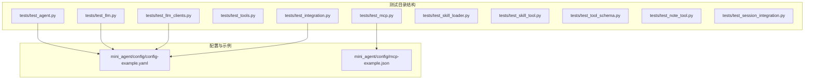
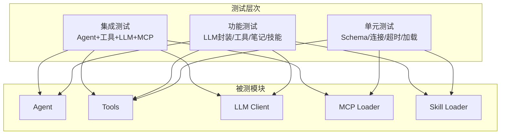
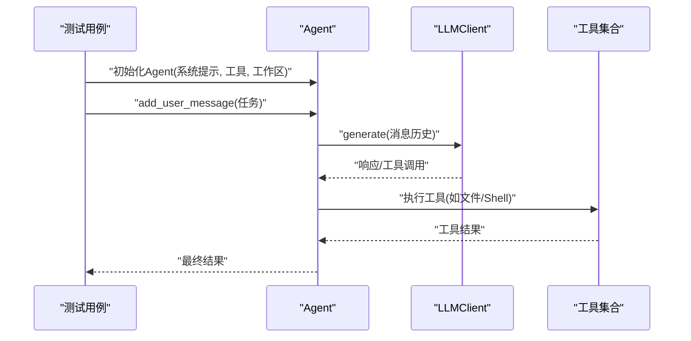
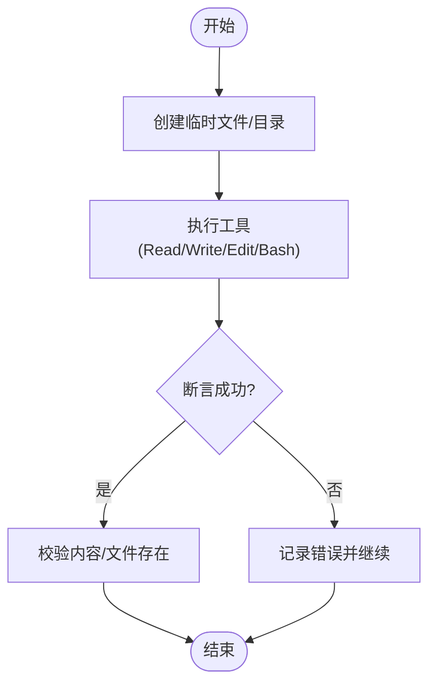
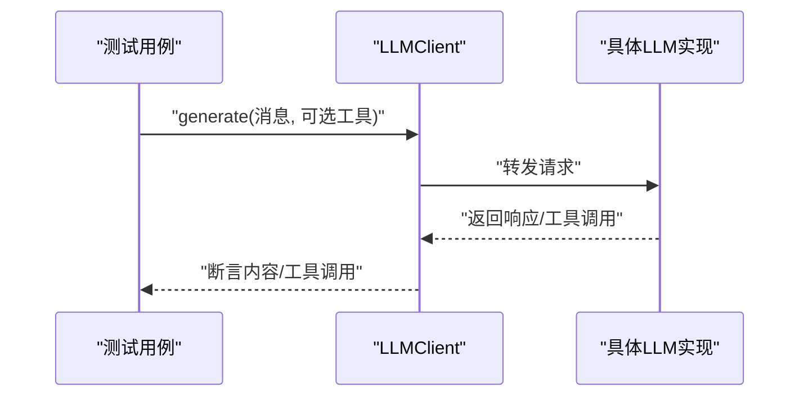
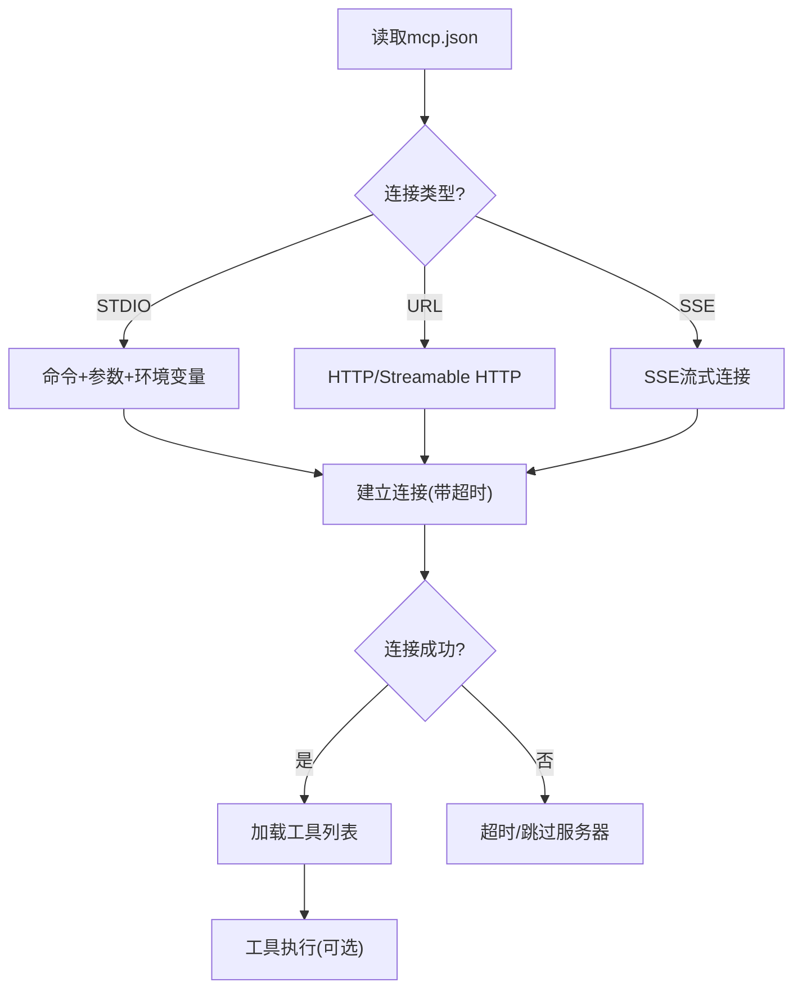
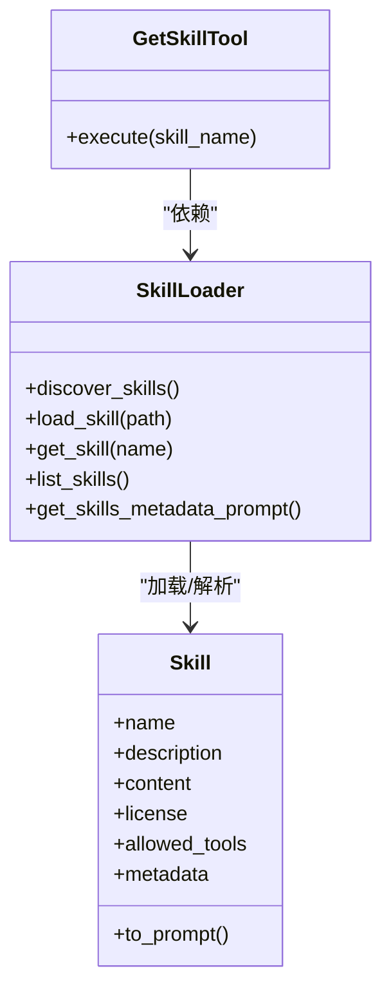
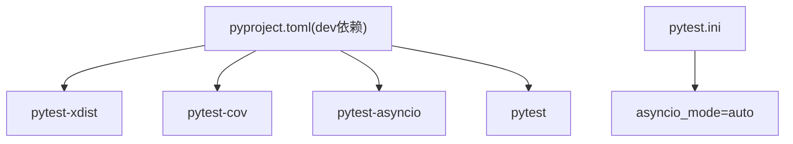

# 测试指南

<cite>
**本文档引用的文件**
- [pyproject.toml](file://pyproject.toml)
- [tests/__init__.py](file://tests/__init__.py)
- [tests/test_agent.py](file://tests/test_agent.py)
- [tests/test_llm.py](file://tests/test_llm.py)
- [tests/test_llm_clients.py](file://tests/test_llm_clients.py)
- [tests/test_tools.py](file://tests/test_tools.py)
- [tests/test_integration.py](file://tests/test_integration.py)
- [tests/test_mcp.py](file://tests/test_mcp.py)
- [tests/test_skill_loader.py](file://tests/test_skill_loader.py)
- [tests/test_skill_tool.py](file://tests/test_skill_tool.py)
- [tests/test_tool_schema.py](file://tests/test_tool_schema.py)
- [tests/test_note_tool.py](file://tests/test_note_tool.py)
- [tests/test_session_integration.py](file://tests/test_session_integration.py)
- [mini_agent/config/config-example.yaml](file://mini_agent/config/config-example.yaml)
- [mini_agent/config/mcp-example.json](file://mini_agent/config/mcp-example.json)
</cite>

## 目录
1. [简介](#简介)
2. [项目结构](#项目结构)
3. [核心组件](#核心组件)
4. [架构总览](#架构总览)
5. [详细组件分析](#详细组件分析)
6. [依赖分析](#依赖分析)
7. [性能考虑](#性能考虑)
8. [故障排除指南](#故障排除指南)
9. [结论](#结论)
10. [附录](#附录)

## 简介
本测试指南面向开发者与贡献者，系统性阐述 MiniAgent 项目的测试架构与策略，覆盖单元测试、功能测试与集成测试的组织方式与边界。文档重点解释以下模块的测试范围与实现要点：智能体核心功能、工具系统（文件工具、Shell 工具、笔记工具、技能工具）、LLM 客户端（封装器与直连实现）、MCP 集成（连接类型检测、超时配置、Git/MCP 服务器加载与执行）。同时提供测试运行指南、覆盖率与并行执行选项、测试数据准备与管理、最佳实践、新测试用例编写方法以及调试与故障排除流程。

## 项目结构
测试代码位于 tests/ 目录，按功能域划分文件，采用 pytest 框架与 asyncio 异步测试模式。核心测试文件包括：
- 单元测试：工具 Schema、LLM 封装器、LLM 客户端直连、技能加载与工具、笔记工具、会话集成
- 功能测试：智能体基础能力、多轮对话与会话记忆
- 集成测试：完整 Agent 示例、MCP 工具加载与执行

**图表来源**
- [tests/test_agent.py:1-188](file://tests/test_agent.py#L1-L188)
- [tests/test_llm.py:1-231](file://tests/test_llm.py#L1-L231)
- [tests/test_llm_clients.py:1-337](file://tests/test_llm_clients.py#L1-L337)
- [tests/test_integration.py:1-269](file://tests/test_integration.py#L1-L269)
- [tests/test_mcp.py:1-580](file://tests/test_mcp.py#L1-L580)
- [tests/test_skill_loader.py:1-275](file://tests/test_skill_loader.py#L1-L275)
- [tests/test_skill_tool.py:1-112](file://tests/test_skill_tool.py#L1-L112)
- [tests/test_tool_schema.py:1-258](file://tests/test_tool_schema.py#L1-L258)
- [tests/test_note_tool.py:1-135](file://tests/test_note_tool.py#L1-L135)
- [tests/test_session_integration.py:1-172](file://tests/test_session_integration.py#L1-L172)
- [mini_agent/config/config-example.yaml:1-61](file://mini_agent/config/config-example.yaml#L1-L61)
- [mini_agent/config/mcp-example.json:1-29](file://mini_agent/config/mcp-example.json#L1-L29)

**章节来源**
- [pyproject.toml:53-56](file://pyproject.toml#L53-L56)
- [tests/__init__.py:1-2](file://tests/__init__.py#L1-L2)

## 核心组件
- 智能体（Agent）：负责消息历史管理、工具调度与多轮对话控制。测试覆盖简单任务、Shell 命令执行与会话记忆。
- 工具系统：文件读写编辑、Shell 执行、笔记记录与检索、技能获取与加载。
- LLM 客户端：封装器（统一接口）与直连客户端（Anthropic/OpenAI），支持工具调用与多轮对话。
- MCP 集成：连接类型检测、超时配置、STDIO/HTTP/SSE 连接、Git 仓库 MCP 服务器加载与工具执行。
- 技能系统：技能发现、元数据提示生成、脚本路径处理与根目录提示。

**章节来源**
- [tests/test_agent.py:15-188](file://tests/test_agent.py#L15-L188)
- [tests/test_tools.py:12-112](file://tests/test_tools.py#L12-L112)
- [tests/test_llm.py:13-231](file://tests/test_llm.py#L13-L231)
- [tests/test_llm_clients.py:25-337](file://tests/test_llm_clients.py#L25-L337)
- [tests/test_mcp.py:34-580](file://tests/test_mcp.py#L34-L580)
- [tests/test_skill_loader.py:26-275](file://tests/test_skill_loader.py#L26-L275)
- [tests/test_skill_tool.py:51-112](file://tests/test_skill_tool.py#L51-L112)

## 架构总览
测试架构围绕“分层测试”展开：
- 单元测试：验证最小可测单元（类、方法、函数），如工具 Schema 转换、连接类型判定、超时配置。
- 功能测试：在隔离环境中验证模块行为（LLM 封装器、工具执行、笔记工具）。
- 集成测试：组合多个模块进行端到端验证（Agent + 工具 + LLM + MCP）。

**图表来源**
- [tests/test_tool_schema.py:137-244](file://tests/test_tool_schema.py#L137-L244)
- [tests/test_mcp.py:34-220](file://tests/test_mcp.py#L34-L220)
- [tests/test_llm.py:13-231](file://tests/test_llm.py#L13-L231)
- [tests/test_agent.py:15-188](file://tests/test_agent.py#L15-L188)
- [tests/test_integration.py:18-120](file://tests/test_integration.py#L18-L120)

## 详细组件分析

### 智能体核心功能测试
- 目标：验证 Agent 的消息历史、工具调度、多轮对话与工作区隔离。
- 关键点：
  - 使用临时工作区确保测试隔离与可重复性。
  - 通过 LLMClient 初始化与工具集合注入 Agent。
  - 断言文件创建/内容正确性或 Shell 命令执行成功。
  - 多轮会话与记忆工具（SessionNoteTool/RecallNoteTool）验证跨实例持久化。

**图表来源**
- [tests/test_agent.py:16-94](file://tests/test_agent.py#L16-L94)
- [tests/test_integration.py:18-120](file://tests/test_integration.py#L18-L120)

**章节来源**
- [tests/test_agent.py:15-188](file://tests/test_agent.py#L15-L188)
- [tests/test_integration.py:18-120](file://tests/test_integration.py#L18-L120)
- [tests/test_session_integration.py:33-172](file://tests/test_session_integration.py#L33-L172)

### 工具系统测试
- 文件工具：ReadTool/WriteTool/EditTool，验证内容读取、写入与替换。
- Shell 工具：BashTool，验证成功输出与错误码处理。
- 笔记工具：SessionNoteTool/RecallNoteTool，验证记录、过滤、跨实例持久化与空状态处理。
- 技能工具：GetSkillTool，验证单工具模式下的技能获取与错误处理。

**图表来源**
- [tests/test_tools.py:12-112](file://tests/test_tools.py#L12-L112)
- [tests/test_note_tool.py:11-135](file://tests/test_note_tool.py#L11-L135)
- [tests/test_skill_tool.py:51-112](file://tests/test_skill_tool.py#L51-L112)

**章节来源**
- [tests/test_tools.py:12-112](file://tests/test_tools.py#L12-L112)
- [tests/test_note_tool.py:11-135](file://tests/test_note_tool.py#L11-L135)
- [tests/test_skill_tool.py:51-112](file://tests/test_skill_tool.py#L51-L112)

### LLM 客户端测试
- 封装器测试：LLMClient 对 Anthropic/OpenAI 提供商的支持、默认提供商、工具调用。
- 直连客户端测试：AnthropicClient/OpenAIClient 的直接调用、工具调用、多轮对话。
- 共同点：均通过配置文件加载 API Key、Base URL、模型；断言响应内容非空、工具调用存在。

**图表来源**
- [tests/test_llm.py:13-231](file://tests/test_llm.py#L13-L231)
- [tests/test_llm_clients.py:25-337](file://tests/test_llm_clients.py#L25-L337)

**章节来源**
- [tests/test_llm.py:13-231](file://tests/test_llm.py#L13-L231)
- [tests/test_llm_clients.py:25-337](file://tests/test_llm_clients.py#L25-L337)

### MCP 集成测试
- 连接类型检测：STDIO/URL/SSE 的自动识别与大小写不敏感处理。
- 连接初始化：命令行参数、URL、头信息、环境变量、超时参数。
- 超时配置：全局与单服务器级超时设置、恢复原值。
- 配置校验：缺失字段（如 URL 或 command）时跳过服务器。
- Git/MCP 服务器：从 Git 克隆安装、工具可用性验证、工具执行。
- 不可达服务器：连接超时快速失败与时间窗口验证。

**图表来源**
- [tests/test_mcp.py:34-580](file://tests/test_mcp.py#L34-L580)
- [mini_agent/config/mcp-example.json:1-29](file://mini_agent/config/mcp-example.json#L1-L29)

**章节来源**
- [tests/test_mcp.py:34-580](file://tests/test_mcp.py#L34-L580)
- [mini_agent/config/mcp-example.json:1-29](file://mini_agent/config/mcp-example.json#L1-L29)

### 技能系统测试
- 技能加载：解析 SKILL.md 前言元数据、内容提取、许可证与允许工具列表。
- 发现与查询：批量发现、按名称获取、元数据提示生成（仅元数据，不含全文）。
- 文档与脚本路径处理：相对路径转绝对路径、嵌套文档引用、脚本路径转换。
- 工具整合：创建技能工具（优化后仅 GetSkillTool），断言工具数量与类型。

**图表来源**
- [tests/test_skill_loader.py:26-275](file://tests/test_skill_loader.py#L26-L275)
- [tests/test_skill_tool.py:51-112](file://tests/test_skill_tool.py#L51-L112)

**章节来源**
- [tests/test_skill_loader.py:26-275](file://tests/test_skill_loader.py#L26-L275)
- [tests/test_skill_tool.py:51-112](file://tests/test_skill_tool.py#L51-L112)

### 工具 Schema 测试
- 验证 Tool.to_schema() 与 Tool.to_openai_schema() 的一致性与完整性。
- 支持复杂参数（对象、枚举、整数范围、默认值）。
- 多工具 Schema 转换与执行结果断言。

**章节来源**
- [tests/test_tool_schema.py:137-244](file://tests/test_tool_schema.py#L137-L244)

## 依赖分析
- 测试框架：pytest + pytest-asyncio
- 并行与覆盖率：pytest-xdist（并行）、pytest-cov（覆盖率）
- 异步模式：pytest.ini 中启用 asyncio_mode = auto
- 包含策略：tests 目录不被打包，技能目录作为包数据包含

**图表来源**
- [pyproject.toml:31-71](file://pyproject.toml#L31-L71)
- [pyproject.toml:53-56](file://pyproject.toml#L53-L56)

**章节来源**
- [pyproject.toml:31-71](file://pyproject.toml#L31-L71)
- [pyproject.toml:53-56](file://pyproject.toml#L53-L56)

## 性能考虑
- 异步测试：所有涉及 LLM/MCP 的测试均使用 asyncio 模式，避免阻塞。
- 超时控制：MCP 连接与执行超时可配置，防止网络异常导致测试长时间挂起。
- 临时资源：使用临时目录与文件，减少磁盘 IO 干扰与状态污染。
- 跳过条件：当配置缺失（如 API Key）或 MCP 不可用时，测试优雅跳过而非失败。

[本节为通用指导，无需特定文件来源]

## 故障排除指南
- API Key 缺失：测试中对 config.yaml 的 api_key 进行检查，未配置则跳过相关测试。
- MCP 不可用：mcp.json 为空或 MCP 服务器不可达时，测试跳过或快速超时。
- LLM 响应为空：断言响应内容非空，若失败需检查模型/提示词/工具调用格式。
- 工具执行失败：BashTool 在非零退出码时标记失败，检查命令与权限。
- 会话记忆问题：确认记忆文件路径一致且有读写权限。

**章节来源**
- [tests/test_integration.py:36-38](file://tests/test_integration.py#L36-L38)
- [tests/test_mcp.py:492-559](file://tests/test_mcp.py#L492-L559)
- [tests/test_llm.py:45-48](file://tests/test_llm.py#L45-L48)
- [tests/test_tools.py:88-91](file://tests/test_tools.py#L88-L91)
- [tests/test_note_tool.py:61-78](file://tests/test_note_tool.py#L61-L78)

## 结论
本测试体系以分层测试为核心，结合单元、功能与集成测试，覆盖智能体、工具、LLM 与 MCP 的关键路径。通过异步测试、超时控制与临时资源管理，保证测试稳定性与可重复性。建议在新增功能时遵循现有测试模式，优先补充单元与功能测试，再进行集成测试验证。

[本节为总结，无需特定文件来源]

## 附录

### 测试运行指南
- 基本运行
  - 使用 pytest 运行全部测试：pytest
  - 指定测试目录：pytest tests/
- 并行执行
  - 使用 pytest-xdist：pytest -n auto
  - 指定进程数：pytest -n 4
- 覆盖率报告
  - 使用 pytest-cov：pytest --cov=mini_agent --cov-report=html
- 异步模式
  - pytest.ini 已启用 asyncio_mode = auto，无需额外配置

**章节来源**
- [pyproject.toml:53-56](file://pyproject.toml#L53-L56)
- [pyproject.toml:65-71](file://pyproject.toml#L65-L71)

### 测试数据准备与管理
- 配置文件
  - 复制 config-example.yaml 为 config.yaml，并填写 api_key、api_base、model。
  - MCP 配置参考 mcp-example.json，按需启用服务器并设置环境变量。
- 临时资源
  - 使用 tempfile 创建临时目录/文件，测试结束后清理。
- 跳过条件
  - 未找到配置文件或 API Key 未配置时，使用 pytest.skip 跳过测试。

**章节来源**
- [mini_agent/config/config-example.yaml:1-61](file://mini_agent/config/config-example.yaml#L1-L61)
- [mini_agent/config/mcp-example.json:1-29](file://mini_agent/config/mcp-example.json#L1-L29)
- [tests/test_integration.py:31-38](file://tests/test_integration.py#L31-L38)

### 测试最佳实践
- 断言策略
  - 对响应内容进行非空与关键字断言；对工具调用断言存在性与参数合理性。
- 测试隔离
  - 使用临时目录/文件；每个测试独立初始化 Agent/工具。
- 命名规范
  - 测试函数以 test_ 开头，描述清晰；模块文件以 test_ 前缀区分功能域。
- 异步测试
  - 使用 @pytest.mark.asyncio；必要时使用 asyncio.run(main()) 作为入口。

**章节来源**
- [tests/test_llm.py:45-48](file://tests/test_llm.py#L45-L48)
- [tests/test_tools.py:26-29](file://tests/test_tools.py#L26-L29)
- [tests/test_mcp.py:336-357](file://tests/test_mcp.py#L336-L357)

### 新测试用例编写指南
- 选择测试类型
  - 单元测试：针对类/函数（如工具 Schema、连接类型、超时配置）。
  - 功能测试：针对模块行为（LLM 封装器、工具执行、笔记工具）。
  - 集成测试：组合 Agent + 工具 + LLM + MCP。
- 框架使用
  - 导入 pytest 与 asyncio；使用 @pytest.mark.asyncio 标注异步测试。
  - 使用临时资源与断言；必要时使用 pytest.skip 处理外部依赖。
- 辅助工具
  - 使用 tempfile 创建隔离环境；使用 Path 管理文件路径。
  - 对 MCP 服务器使用示例配置文件进行最小化验证。

**章节来源**
- [tests/test_tool_schema.py:137-244](file://tests/test_tool_schema.py#L137-L244)
- [tests/test_mcp.py:336-357](file://tests/test_mcp.py#L336-L357)
- [tests/test_llm.py:13-231](file://tests/test_llm.py#L13-L231)