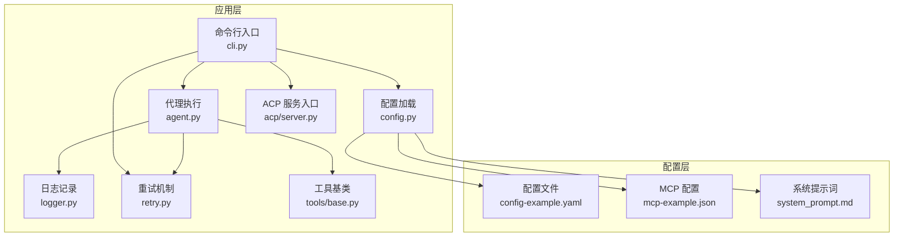
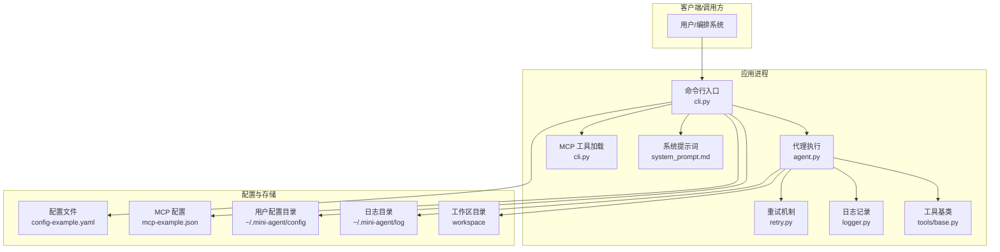
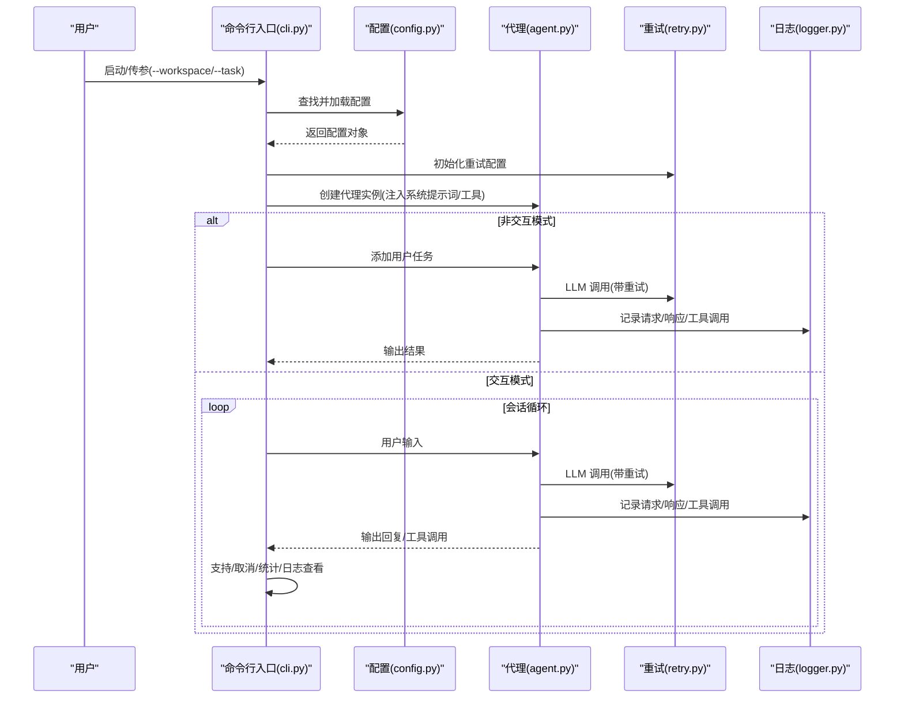
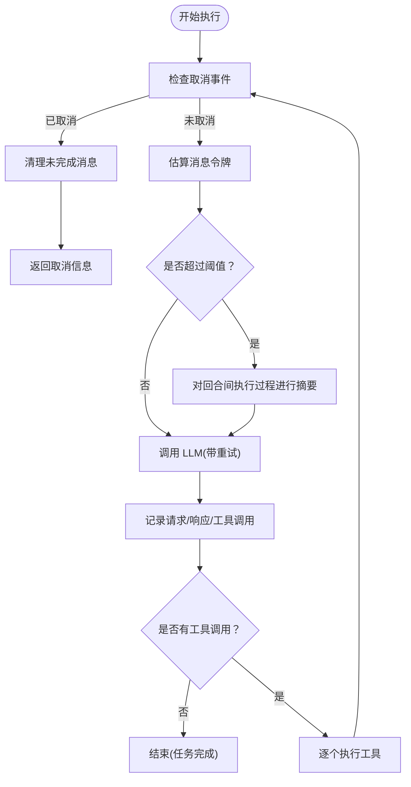
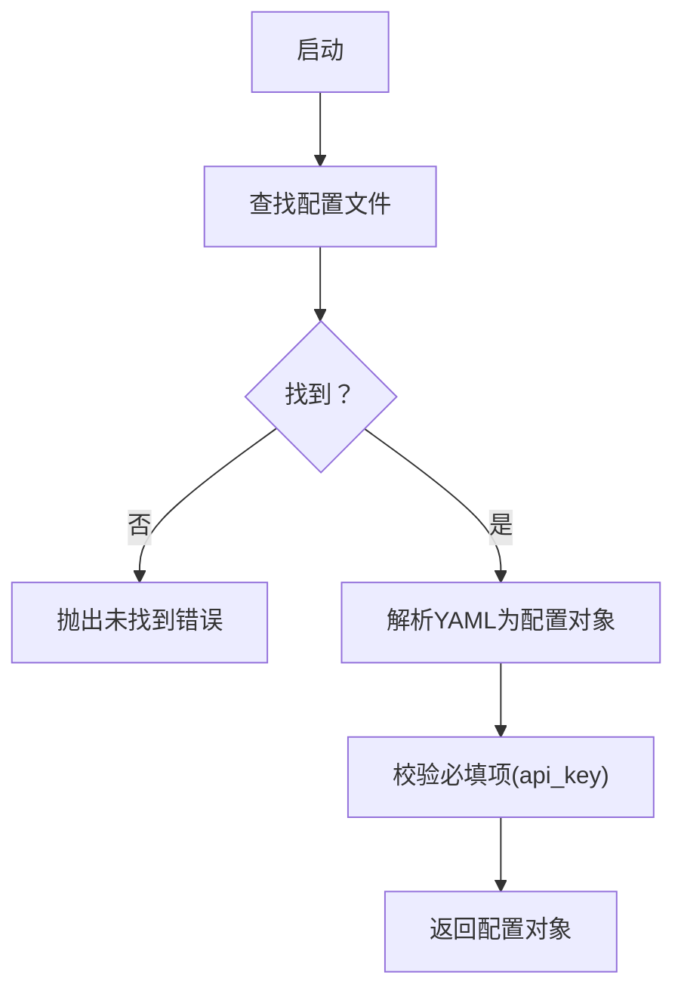
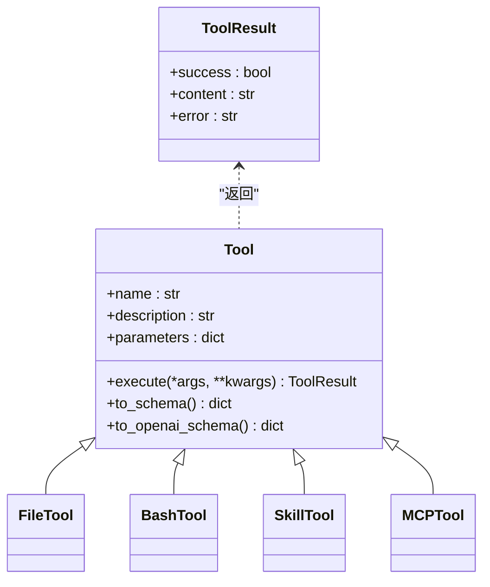
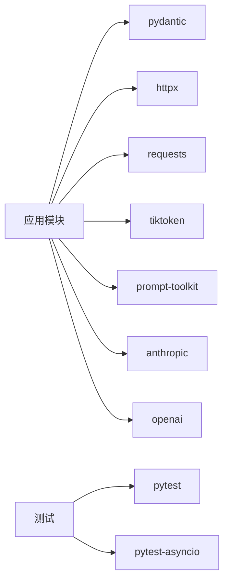

# 生产部署

<cite>
**本文引用的文件**   
- [PRODUCTION_GUIDE_CN.md](file://docs/PRODUCTION_GUIDE_CN.md)
- [README.md](file://README.md)
- [config-example.yaml](file://mini_agent/config/config-example.yaml)
- [mcp-example.json](file://mini_agent/config/mcp-example.json)
- [system_prompt.md](file://mini_agent/config/system_prompt.md)
- [pyproject.toml](file://pyproject.toml)
- [cli.py](file://mini_agent/cli.py)
- [agent.py](file://mini_agent/agent.py)
- [config.py](file://mini_agent/config.py)
- [logger.py](file://mini_agent/logger.py)
- [retry.py](file://mini_agent/retry.py)
- [base.py](file://mini_agent/tools/base.py)
- [server.py](file://mini_agent/acp/server.py)
</cite>

## 目录
1. [简介](#简介)
2. [项目结构](#项目结构)
3. [核心组件](#核心组件)
4. [架构总览](#架构总览)
5. [详细组件分析](#详细组件分析)
6. [依赖关系分析](#依赖关系分析)
7. [性能考虑](#性能考虑)
8. [监控与告警](#监控与告警)
9. [安全配置与防护](#安全配置与防护)
10. [高可用与灾备](#高可用与灾备)
11. [运维管理](#运维管理)
12. [部署示例与配置模板](#部署示例与配置模板)
13. [结论](#结论)

## 简介
本指南面向生产环境的部署与运维，基于仓库中的配置与代码实现，给出容器化、云服务与本地服务器的部署建议，覆盖性能优化、监控告警、安全防护、高可用与灾备、以及更新回滚与应急响应流程。文档同时提供可直接参考的配置模板与部署步骤，帮助团队快速落地。

## 项目结构
该项目采用模块化设计，核心入口为命令行工具，围绕配置、代理执行、日志与重试机制组织。关键目录与文件如下：
- 配置：config-example.yaml、mcp-example.json、system_prompt.md
- 应用入口：cli.py（命令行交互与非交互模式）、agent.py（代理执行循环）
- 配置加载：config.py（优先搜索路径、YAML解析、默认值）
- 日志与重试：logger.py（按会话记录请求/响应/工具调用）、retry.py（指数退避重试）
- 工具基类：tools/base.py（工具抽象与Schema）
- ACP 服务：acp/server.py（编辑器集成入口）

**图表来源**
- [cli.py:1-874](file://mini_agent/cli.py#L1-L874)
- [agent.py:1-524](file://mini_agent/agent.py#L1-L524)
- [config.py:1-221](file://mini_agent/config.py#L1-L221)
- [logger.py:1-179](file://mini_agent/logger.py#L1-L179)
- [retry.py:1-139](file://mini_agent/retry.py#L1-L139)
- [base.py:1-56](file://mini_agent/tools/base.py#L1-L56)
- [server.py:1-7](file://mini_agent/acp/server.py#L1-L7)
- [config-example.yaml:1-61](file://mini_agent/config/config-example.yaml#L1-L61)
- [mcp-example.json:1-29](file://mini_agent/config/mcp-example.json#L1-L29)
- [system_prompt.md:1-76](file://mini_agent/config/system_prompt.md#L1-L76)

**章节来源**
- [README.md:1-345](file://README.md#L1-L345)
- [pyproject.toml:1-71](file://pyproject.toml#L1-L71)

## 核心组件
- 命令行入口与运行模式
  - 支持交互式与非交互式两种模式，提供日志查看、统计信息、任务执行等功能。
  - 关键实现位置：[cli.py:285-874](file://mini_agent/cli.py#L285-L874)
- 代理执行循环
  - 包含消息历史管理、令牌估算与摘要、工具调用、日志记录与取消支持。
  - 关键实现位置：[agent.py:45-524](file://mini_agent/agent.py#L45-L524)
- 配置管理
  - 统一加载与解析 YAML 配置，支持多优先级搜索路径，提供默认值与校验。
  - 关键实现位置：[config.py:66-221](file://mini_agent/config.py#L66-L221)
- 日志记录
  - 按会话生成日志文件，记录请求、响应与工具调用，便于审计与排障。
  - 关键实现位置：[logger.py:11-179](file://mini_agent/logger.py#L11-L179)
- 重试机制
  - 指数退避重试，可配置最大重试次数、初始延迟与最大延迟。
  - 关键实现位置：[retry.py:23-139](file://mini_agent/retry.py#L23-L139)
- 工具基类
  - 抽象工具接口与 Schema 转换，支撑文件、Bash、技能与 MCP 工具。
  - 关键实现位置：[base.py:16-56](file://mini_agent/tools/base.py#L16-L56)
- ACP 服务
  - 编辑器集成入口，支持外部编辑器与 Agent 通信协议。
  - 关键实现位置：[server.py:1-7](file://mini_agent/acp/server.py#L1-L7)

**章节来源**
- [cli.py:285-874](file://mini_agent/cli.py#L285-L874)
- [agent.py:45-524](file://mini_agent/agent.py#L45-L524)
- [config.py:66-221](file://mini_agent/config.py#L66-L221)
- [logger.py:11-179](file://mini_agent/logger.py#L11-L179)
- [retry.py:23-139](file://mini_agent/retry.py#L23-L139)
- [base.py:16-56](file://mini_agent/tools/base.py#L16-L56)
- [server.py:1-7](file://mini_agent/acp/server.py#L1-L7)

## 架构总览
下图展示生产部署的关键组件与交互关系，涵盖配置、代理执行、日志、重试、工具与 MCP/Acp 集成。

**图表来源**
- [cli.py:486-630](file://mini_agent/cli.py#L486-L630)
- [agent.py:321-524](file://mini_agent/agent.py#L321-L524)
- [config.py:176-221](file://mini_agent/config.py#L176-L221)
- [logger.py:19-42](file://mini_agent/logger.py#L19-L42)
- [config-example.yaml:1-61](file://mini_agent/config/config-example.yaml#L1-L61)
- [mcp-example.json:1-29](file://mini_agent/config/mcp-example.json#L1-L29)
- [system_prompt.md:1-76](file://mini_agent/config/system_prompt.md#L1-L76)

## 详细组件分析

### 命令行与运行模式
- 交互模式：提供命令补全、历史、统计、日志查看等能力，支持 Esc 取消。
- 非交互模式：传入任务字符串后执行并退出。
- 关键点：配置查找优先级、MCP 超时配置注入、技能元数据注入系统提示词。

**图表来源**
- [cli.py:486-630](file://mini_agent/cli.py#L486-L630)
- [agent.py:321-524](file://mini_agent/agent.py#L321-L524)
- [config.py:176-221](file://mini_agent/config.py#L176-L221)
- [logger.py:30-179](file://mini_agent/logger.py#L30-L179)
- [retry.py:73-139](file://mini_agent/retry.py#L73-L139)

**章节来源**
- [cli.py:285-874](file://mini_agent/cli.py#L285-L874)
- [config.py:176-221](file://mini_agent/config.py#L176-L221)

### 代理执行与上下文管理
- 令牌估算与摘要：基于编码器估算消息总令牌，超过阈值时对回合间执行过程进行摘要，降低上下文长度。
- 取消与清理：支持在安全点取消，清理未完成消息，保持会话一致性。
- 日志记录：完整记录请求、响应与工具调用，便于审计与排障。

**图表来源**
- [agent.py:180-524](file://mini_agent/agent.py#L180-L524)
- [logger.py:43-179](file://mini_agent/logger.py#L43-L179)
- [retry.py:73-139](file://mini_agent/retry.py#L73-L139)

**章节来源**
- [agent.py:180-524](file://mini_agent/agent.py#L180-L524)
- [logger.py:43-179](file://mini_agent/logger.py#L43-L179)

### 配置加载与优先级
- 配置文件优先级：当前目录 -> 用户目录 -> 包内目录。
- 关键字段：LLM API Key/Base/Model/Provider、重试策略、代理最大步数、工作区目录、系统提示词路径、工具开关与 MCP 超时。
- MCP 配置：支持连接超时、执行超时、SSE 读取超时。

**图表来源**
- [config.py:176-221](file://mini_agent/config.py#L176-L221)
- [config-example.yaml:1-61](file://mini_agent/config/config-example.yaml#L1-L61)
- [mcp-example.json:1-29](file://mini_agent/config/mcp-example.json#L1-L29)

**章节来源**
- [config.py:176-221](file://mini_agent/config.py#L176-L221)
- [config-example.yaml:1-61](file://mini_agent/config/config-example.yaml#L1-L61)
- [mcp-example.json:1-29](file://mini_agent/config/mcp-example.json#L1-L29)

### 工具体系与 MCP 集成
- 工具基类：定义名称、描述、参数 Schema 与异步执行接口。
- MCP 工具：通过配置文件加载，支持超时配置，避免网络阻塞导致进程卡死。
- 技能工具：动态加载，系统提示词注入技能元数据，实现“渐进披露”。

**图表来源**
- [base.py:16-56](file://mini_agent/tools/base.py#L16-L56)

**章节来源**
- [base.py:16-56](file://mini_agent/tools/base.py#L16-L56)
- [cli.py:400-431](file://mini_agent/cli.py#L400-L431)

## 依赖关系分析
- 应用依赖：Pydantic（配置模型）、HTTPX/Requests（LLM/MCP 请求）、tiktoken（令牌估算）、prompt-toolkit（交互界面）。
- 可选依赖：pytest、pytest-asyncio（测试）。
- 包脚本：提供命令行入口与 ACP 服务入口。

**图表来源**
- [pyproject.toml:11-25](file://pyproject.toml#L11-L25)
- [pyproject.toml:32-71](file://pyproject.toml#L32-L71)

**章节来源**
- [pyproject.toml:11-25](file://pyproject.toml#L11-L25)
- [pyproject.toml:32-71](file://pyproject.toml#L32-L71)

## 性能考虑
- 并发与资源
  - 使用异步 LLM 调用与工具执行，减少阻塞等待。
  - 建议在容器/集群中按需扩缩容，结合 CPU/内存/磁盘限额与亲和性调度。
- 上下文与令牌
  - 启用消息摘要机制，避免上下文溢出导致的性能与成本问题。
  - 通过系统提示词与技能元数据控制提示词长度。
- 重试与超时
  - 指数退避重试，避免雪崩效应；合理设置 MCP 超时，防止挂起。
- I/O 与缓存
  - 将临时文件与日志落盘至独立卷，避免共享存储抖动。
  - 对频繁读取的静态资源（如技能包）采用本地缓存或镜像层缓存。

[本节为通用指导，无需特定文件引用]

## 监控与告警
- 应用监控
  - 指标采集：请求成功率、P95/P99 延迟、令牌用量、工具调用耗时、会话数、队列长度。
  - 告警规则：重试耗尽、工具执行失败率上升、日志写入异常、磁盘使用率超阈。
- 日志聚合
  - 结构化日志：将请求/响应/工具调用序列化为 JSON，便于检索与分析。
  - 日志轮转：按大小/时间轮转，保留必要周期以便审计。
- 性能指标
  - 令牌估算与摘要触发次数、摘要前后令牌变化、取消率、平均会话时长。

[本节为通用指导，无需特定文件引用]

## 安全配置与防护
- API 密钥管理
  - 使用受控密钥存储（如 KMS/Secrets Manager），避免明文写入配置文件。
  - 严格最小权限：仅授予必要平台与模型访问权限。
- 网络访问控制
  - 限制 LLM/MCP 服务出口白名单，启用 egress 控制与 TLS 校验。
  - 在容器/集群中启用网络策略，隔离不同租户或环境。
- 数据加密
  - 传输加密：强制 HTTPS/TLS；存储加密：对敏感日志/配置进行加密存储。
- 运行时安全
  - 非 root 用户运行，限制文件系统权限，仅开放必要目录。
  - 容器只读根文件系统、禁用不必要的 capability。

**章节来源**
- [PRODUCTION_GUIDE_CN.md:105-161](file://docs/PRODUCTION_GUIDE_CN.md#L105-L161)

## 高可用与灾备
- 负载均衡与扩缩容
  - 多副本部署，结合健康检查与自动扩缩容策略。
- 故障转移
  - 多区域部署与跨区域备份，主备切换与故障自愈。
- 备份策略
  - 配置与日志定期备份，工作区重要文件异地备份，支持快速恢复。

**章节来源**
- [PRODUCTION_GUIDE_CN.md:51-59](file://docs/PRODUCTION_GUIDE_CN.md#L51-L59)

## 运维管理
- 更新与回滚
  - 蓝绿/金丝雀发布，回滚到上一个稳定版本。
- 紧急响应
  - 快速定位日志与指标异常，隔离问题实例，临时降级非关键功能。
- 变更管理
  - 配置变更走审批流程，先预生产后生产，记录变更影响面。

**章节来源**
- [PRODUCTION_GUIDE_CN.md:51-59](file://docs/PRODUCTION_GUIDE_CN.md#L51-L59)

## 部署示例与配置模板

### 容器化部署（Docker Compose）
- 资源限制
  - CPU/内存/磁盘限额与预留，避免资源争抢。
- 权限与卷
  - tmpfs 用于临时文件，独立卷承载工作区与日志。
- 示例片段路径
  - [CPU/内存/磁盘限制示例:66-102](file://docs/PRODUCTION_GUIDE_CN.md#L66-L102)
  - [Dockerfile 最佳实践（非 root 用户）:111-146](file://docs/PRODUCTION_GUIDE_CN.md#L111-L146)

**章节来源**
- [PRODUCTION_GUIDE_CN.md:66-146](file://docs/PRODUCTION_GUIDE_CN.md#L66-L146)

### Kubernetes 部署（建议）
- 资源配额与 PodDisruptionBudget
  - 保障 SLA 与可用性。
- 存储
  - PersistentVolume 与 StorageClass，确保日志与工作区持久化。
- 网络
  - NetworkPolicy 限制出站访问，TLS 证书管理。
- 部署策略
  - RollingUpdate 与就绪/存活探针，健康检查与自动重启。

[本节为通用指导，无需特定文件引用]

### 本地服务器部署
- 用户与权限
  - 创建专用服务账户，限制 SSH 登录与 sudo 权限。
- 目录权限
  - 仅授权工作区与配置目录，严格文件权限。
- 示例片段路径
  - [Linux 账户权限限制:105-161](file://docs/PRODUCTION_GUIDE_CN.md#L105-L161)

**章节来源**
- [PRODUCTION_GUIDE_CN.md:105-161](file://docs/PRODUCTION_GUIDE_CN.md#L105-L161)

### 配置模板与要点
- LLM 配置
  - API Key/Base/Model/Provider、重试策略、最大步数、工作区目录、系统提示词路径。
  - 参考：[配置示例:1-61](file://mini_agent/config/config-example.yaml#L1-L61)
- MCP 配置
  - 启用/禁用、超时设置、环境变量（如第三方 API Key）。
  - 参考：[MCP 示例:1-29](file://mini_agent/config/mcp-example.json#L1-L29)
- 系统提示词
  - 注入技能元数据，约束 Python 环境与工作区上下文。
  - 参考：[系统提示词:1-76](file://mini_agent/config/system_prompt.md#L1-L76)
- 命令行与脚本
  - 安装与运行方式、版本管理、卸载与升级。
  - 参考：[README 快速开始:83-133](file://README.md#L83-L133)

**章节来源**
- [config-example.yaml:1-61](file://mini_agent/config/config-example.yaml#L1-L61)
- [mcp-example.json:1-29](file://mini_agent/config/mcp-example.json#L1-L29)
- [system_prompt.md:1-76](file://mini_agent/config/system_prompt.md#L1-L76)
- [README.md:83-133](file://README.md#L83-L133)

## 结论
本指南基于仓库现有配置与代码，给出了生产部署的总体思路与实施要点。建议在实际落地时结合自身基础设施与合规要求，完善容器编排、监控告警、安全加固与灾备演练，并持续迭代配置模板与部署脚本，确保稳定性与可维护性。