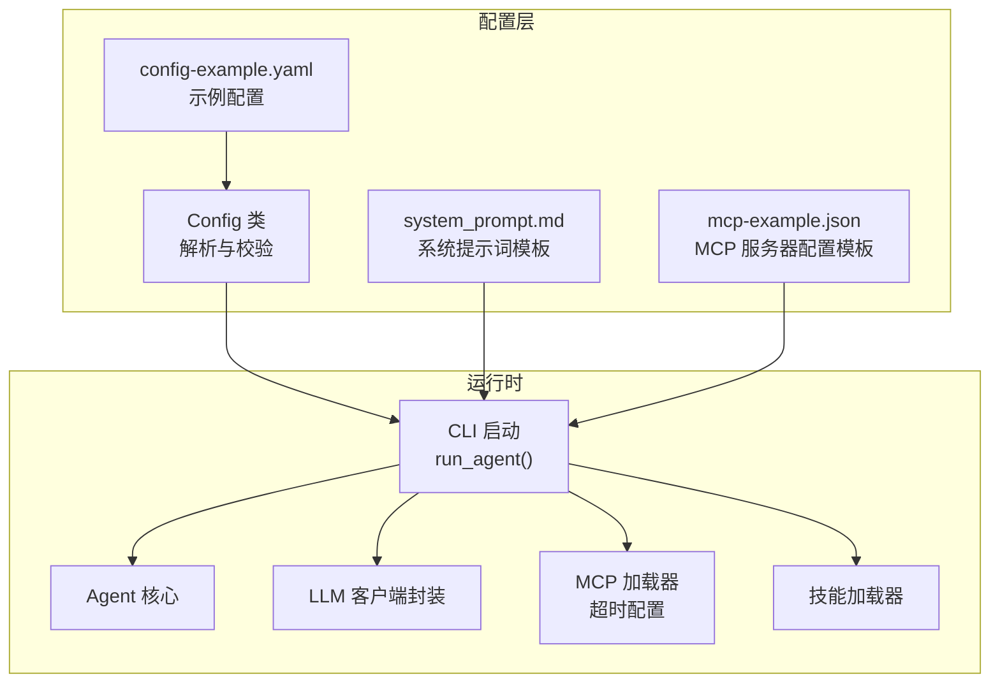
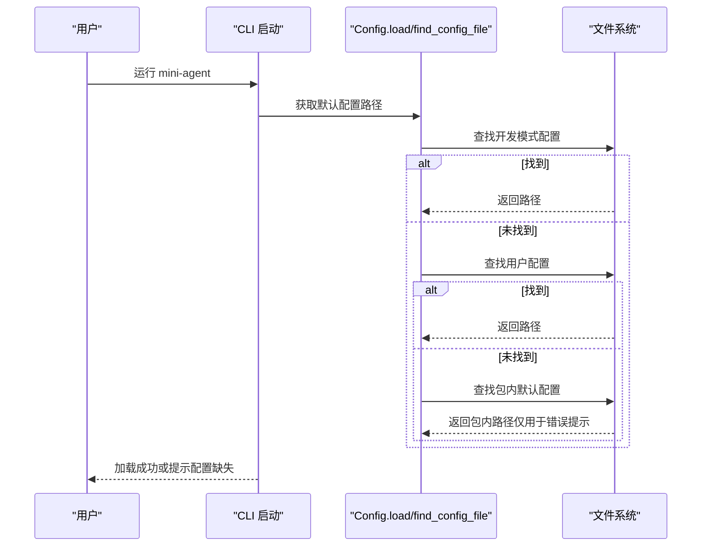
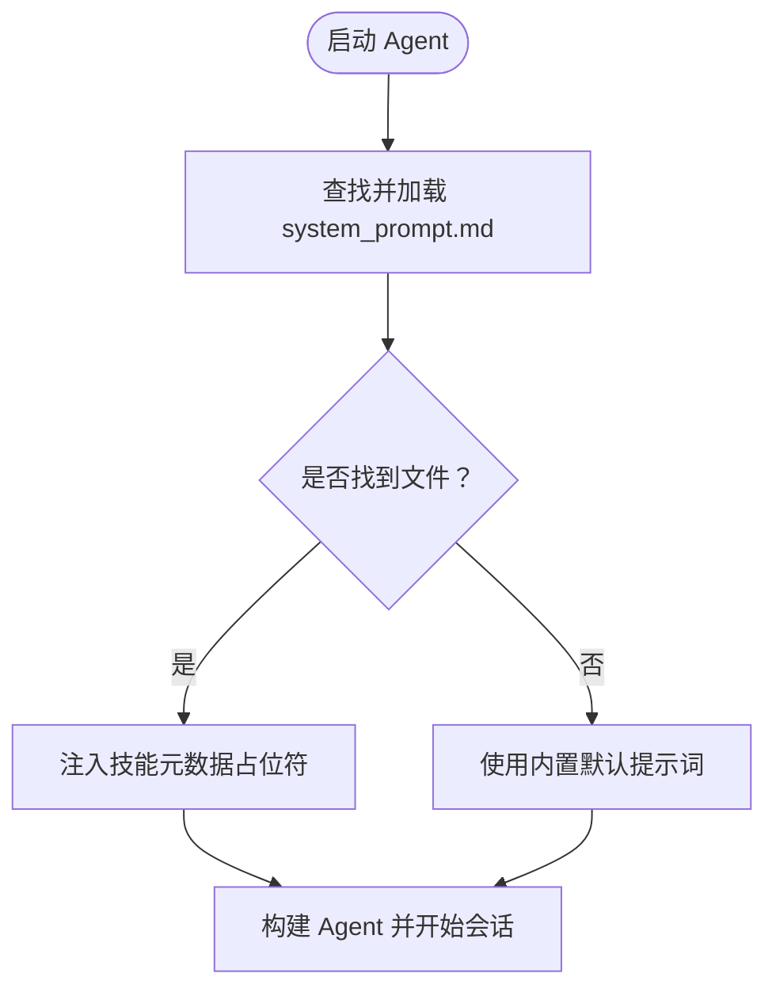
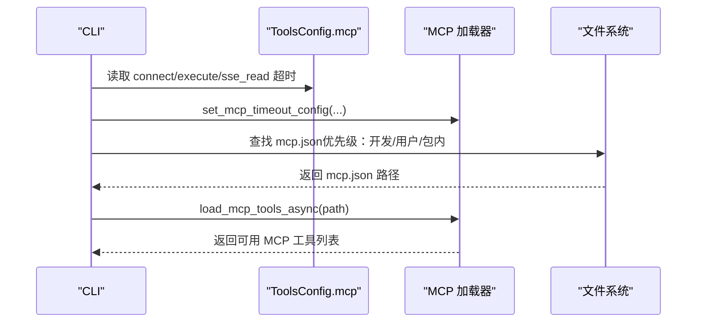
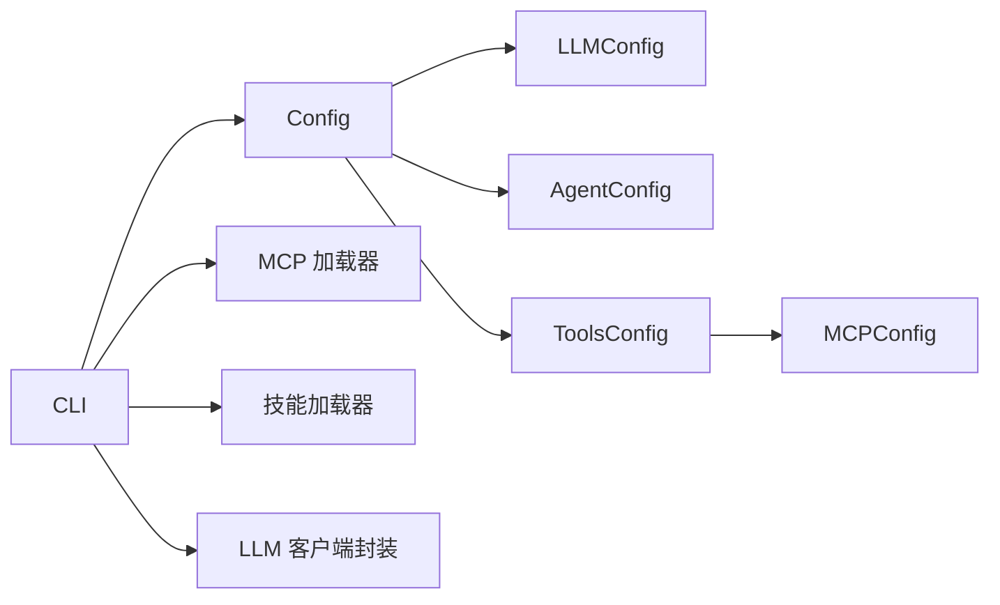

# 配置管理

<cite>
**本文引用的文件**
- [mini_agent/config.py](file://mini_agent/config.py)
- [mini_agent/config/config-example.yaml](file://mini_agent/config/config-example.yaml)
- [mini_agent/config/system_prompt.md](file://mini_agent/config/system_prompt.md)
- [mini_agent/config/mcp-example.json](file://mini_agent/config/mcp-example.json)
- [mini_agent/cli.py](file://mini_agent/cli.py)
- [mini_agent/tools/mcp_loader.py](file://mini_agent/tools/mcp_loader.py)
- [mini_agent/tools/skill_loader.py](file://mini_agent/tools/skill_loader.py)
- [mini_agent/llm/llm_wrapper.py](file://mini_agent/llm/llm_wrapper.py)
- [scripts/setup-config.sh](file://scripts/setup-config.sh)
- [scripts/setup-config.ps1](file://scripts/setup-config.ps1)
- [README.md](file://README.md)
- [docs/PRODUCTION_GUIDE.md](file://docs/PRODUCTION_GUIDE.md)
</cite>

## 目录
1. [简介](#简介)
2. [项目结构](#项目结构)
3. [核心组件](#核心组件)
4. [架构总览](#架构总览)
5. [详细组件分析](#详细组件分析)
6. [依赖关系分析](#依赖关系分析)
7. [性能考量](#性能考量)
8. [故障排查指南](#故障排查指南)
9. [结论](#结论)
10. [附录](#附录)

## 简介
本文件系统化阐述 Mini Agent 的配置管理体系，覆盖多层级配置架构（开发模式配置、用户配置、包内默认配置）的优先级与加载流程；解释配置文件结构与字段语义（API 设置、模型参数、工作空间配置、工具开关与 MCP 超时等）；说明系统提示词的注入与定制方法；给出配置验证机制、最佳实践与安全注意事项，并提供配置迁移与版本兼容建议及典型场景的配置方案。

## 项目结构
配置相关的核心文件与职责如下：
- 配置定义与加载：mini_agent/config.py
- 示例配置与模板：mini_agent/config/config-example.yaml、mini_agent/config/system_prompt.md、mini_agent/config/mcp-example.json
- CLI 启动与配置使用：mini_agent/cli.py
- MCP 工具加载与超时控制：mini_agent/tools/mcp_loader.py
- 技能加载与系统提示词注入：mini_agent/tools/skill_loader.py
- LLM 客户端封装与 API 基址处理：mini_agent/llm/llm_wrapper.py
- 配置初始化脚本：scripts/setup-config.sh、scripts/setup-config.ps1
- 文档与生产指南：README.md、docs/PRODUCTION_GUIDE.md

**图表来源**
- [mini_agent/config.py:66-221](file://mini_agent/config.py#L66-L221)
- [mini_agent/cli.py:486-631](file://mini_agent/cli.py#L486-L631)
- [mini_agent/tools/mcp_loader.py:34-57](file://mini_agent/tools/mcp_loader.py#L34-L57)
- [mini_agent/tools/skill_loader.py:47-200](file://mini_agent/tools/skill_loader.py#L47-L200)
- [mini_agent/llm/llm_wrapper.py:46-78](file://mini_agent/llm/llm_wrapper.py#L46-L78)

**章节来源**
- [mini_agent/config.py:66-221](file://mini_agent/config.py#L66-L221)
- [mini_agent/cli.py:486-631](file://mini_agent/cli.py#L486-L631)

## 核心组件
- Config 主配置类：统一解析 YAML 并进行基础校验（必填字段、API Key 合法性），生成 LLM、Agent、Tools 三类子配置对象。
- LLMConfig：API Key、API Base、模型名、提供商、重试策略。
- AgentConfig：最大步数、工作空间目录、系统提示词路径。
- ToolsConfig：基础工具开关（文件、Bash、会话笔记）、技能开关与目录、MCP 开关、MCP 配置文件路径、MCP 超时配置。
- MCPConfig：连接超时、执行超时、SSE 读取超时。
- RetryConfig：重试开关、最大重试次数、初始延迟、最大延迟、指数回退底数。
- CLI 初始化流程：按优先级查找配置文件，加载系统提示词，注入技能元数据，构建 Agent。

**章节来源**
- [mini_agent/config.py:12-72](file://mini_agent/config.py#L12-L72)
- [mini_agent/config.py:66-164](file://mini_agent/config.py#L66-L164)
- [mini_agent/cli.py:525-602](file://mini_agent/cli.py#L525-L602)

## 架构总览
配置加载采用“多层级优先级”策略，确保开发便捷与用户隔离并存：
- 开发模式优先：当前工作目录下的 mini_agent/config/config.yaml
- 用户级优先：用户主目录下的 ~/.mini-agent/config/config.yaml
- 包内默认：安装包内的 mini_agent/config/config.yaml（用于错误提示与模板）

系统提示词与 MCP 配置同样遵循相同优先级查找策略，确保可被用户覆盖。

**图表来源**
- [mini_agent/config.py:176-221](file://mini_agent/config.py#L176-L221)
- [mini_agent/cli.py:496-523](file://mini_agent/cli.py#L496-L523)

**章节来源**
- [mini_agent/config.py:176-221](file://mini_agent/config.py#L176-L221)
- [mini_agent/cli.py:496-523](file://mini_agent/cli.py#L496-L523)

## 详细组件分析

### 配置文件结构与字段说明
- LLM 配置
  - api_key：必填，且不可为占位符字符串，否则抛出校验错误
  - api_base：API 基地址，默认指向 MiniMax 全球平台；支持 China 平台地址
  - model：模型名称，默认 MiniMax-M2.5
  - provider：提供商，支持 anthropic/openai；MiniMax 模式下根据提供商自动拼接后缀
  - retry：重试策略，见下节
- Agent 配置
  - max_steps：最大执行步数
  - workspace_dir：工作空间目录
  - system_prompt_path：系统提示词文件路径（同配置目录）
- Tools 配置
  - enable_file_tools / enable_bash / enable_note：基础工具开关
  - enable_skills / skills_dir：技能开关与目录
  - enable_mcp / mcp_config_path：MCP 开关与配置文件路径
  - mcp：MCP 超时配置（连接、执行、SSE 读取）

系统提示词模板支持占位符注入技能元数据，便于在不加载完整技能内容的前提下展示可用技能列表。

**章节来源**
- [mini_agent/config/config-example.yaml:13-61](file://mini_agent/config/config-example.yaml#L13-L61)
- [mini_agent/config.py:106-164](file://mini_agent/config.py#L106-L164)
- [mini_agent/config/system_prompt.md:1-76](file://mini_agent/config/system_prompt.md#L1-L76)

### 配置验证机制
- 必填字段校验：若缺少 api_key 或其值为占位符，抛出明确错误
- 空文件校验：空 YAML 文件触发格式错误
- 类型与默认值：通过 Pydantic 字段默认值与类型约束保证基本一致性
- CLI 层二次校验：加载失败时输出优先级搜索路径与快速设置指引

**章节来源**
- [mini_agent/config.py:95-105](file://mini_agent/config.py#L95-L105)
- [mini_agent/config.py:106-112](file://mini_agent/config.py#L106-L112)
- [mini_agent/cli.py:525-536](file://mini_agent/cli.py#L525-L536)

### 系统提示词的配置与定制
- 提示词来源：优先从用户配置目录或开发目录加载；若不存在则使用内置默认提示
- 元数据注入：当启用技能时，系统会将技能元数据注入到提示词中的占位符位置
- 自定义方式：编辑 system_prompt.md，替换占位符或调整工作规范与最佳实践部分

**图表来源**
- [mini_agent/cli.py:580-602](file://mini_agent/cli.py#L580-L602)
- [mini_agent/config/system_prompt.md:1-76](file://mini_agent/config/system_prompt.md#L1-L76)

**章节来源**
- [mini_agent/cli.py:580-602](file://mini_agent/cli.py#L580-L602)
- [mini_agent/config/system_prompt.md:1-76](file://mini_agent/config/system_prompt.md#L1-L76)

### MCP 配置与超时控制
- MCP 配置文件：mcp.json 支持多服务器定义，每台服务器可指定传输类型（stdio/sse/http/streamable_http）、命令参数、环境变量、禁用状态等
- 超时配置：全局超时由 ToolsConfig.mcp 控制；也可在单个服务器连接中覆盖
- 加载流程：CLI 在初始化阶段应用全局超时配置，随后按优先级查找 mcp.json 并加载可用工具

**图表来源**
- [mini_agent/cli.py:400-431](file://mini_agent/cli.py#L400-L431)
- [mini_agent/tools/mcp_loader.py:34-57](file://mini_agent/tools/mcp_loader.py#L34-L57)
- [mini_agent/config.py:141-158](file://mini_agent/config.py#L141-L158)

**章节来源**
- [mini_agent/tools/mcp_loader.py:34-57](file://mini_agent/tools/mcp_loader.py#L34-L57)
- [mini_agent/cli.py:400-431](file://mini_agent/cli.py#L400-L431)
- [mini_agent/config.py:141-158](file://mini_agent/config.py#L141-L158)

### LLM 客户端与 API 基址处理
- Provider 与 API Base：根据 provider 决定 MiniMax API 的后缀（/anthropic 或 /v1），第三方 API 则直接使用 api_base
- 重试回调：CLI 将 Config 中的 RetryConfig 转换为运行时重试策略，并在终端显示重试信息

**章节来源**
- [mini_agent/llm/llm_wrapper.py:46-78](file://mini_agent/llm/llm_wrapper.py#L46-L78)
- [mini_agent/cli.py:538-573](file://mini_agent/cli.py#L538-L573)

## 依赖关系分析
- Config 依赖 YAML 解析与 Pydantic 数据模型
- CLI 依赖 Config 进行配置加载，依赖 MCP 加载器与技能加载器扩展能力
- MCP 加载器依赖 mcp 客户端库，受 ToolsConfig.mcp 控制超时
- 系统提示词与技能元数据共同影响 Agent 的行为边界

**图表来源**
- [mini_agent/config.py:66-164](file://mini_agent/config.py#L66-L164)
- [mini_agent/cli.py:486-631](file://mini_agent/cli.py#L486-L631)
- [mini_agent/tools/mcp_loader.py:34-57](file://mini_agent/tools/mcp_loader.py#L34-L57)
- [mini_agent/tools/skill_loader.py:47-200](file://mini_agent/tools/skill_loader.py#L47-L200)

**章节来源**
- [mini_agent/config.py:66-164](file://mini_agent/config.py#L66-L164)
- [mini_agent/cli.py:486-631](file://mini_agent/cli.py#L486-L631)

## 性能考量
- 重试策略：合理设置最大重试次数与指数回退底数，避免对上游服务造成雪崩
- MCP 超时：为不同网络环境设置合适的连接、执行与 SSE 读取超时，防止长时间挂起
- 工作空间与文件操作：限制不必要的文件扫描与大文件读写，减少 Token 估算与消息历史开销

[本节为通用指导，无需特定文件引用]

## 故障排查指南
- 配置文件未找到
  - 现象：启动时报错并列出优先级搜索路径
  - 处理：使用一键脚本创建 ~/.mini-agent/config/ 并下载模板，或手动复制包内示例
- API Key 无效或为空
  - 现象：加载配置时抛出必填字段或占位符错误
  - 处理：在 config.yaml 中填写有效 API Key
- MCP 工具未加载
  - 现象：日志提示未找到 MCP 配置或无可用工具
  - 处理：检查 mcp.json 路径与权限，确认服务器可访问且未禁用
- 权限与安全
  - 建议：限制配置目录与工作空间权限，避免敏感信息泄露

**章节来源**
- [mini_agent/cli.py:496-523](file://mini_agent/cli.py#L496-L523)
- [mini_agent/config.py:106-112](file://mini_agent/config.py#L106-L112)
- [docs/PRODUCTION_GUIDE.md:148-161](file://docs/PRODUCTION_GUIDE.md#L148-L161)

## 结论
本配置体系以“多层级优先级 + 明确校验 + 可插拔扩展”为核心设计，既满足开发调试的灵活性，又保障用户级隔离与生产安全。通过系统提示词与技能元数据的注入，Agent 能在最小暴露面下提供丰富的专业能力。建议在生产环境中严格管理 API Key 与配置文件权限，并结合重试与超时策略提升稳定性。

[本节为总结，无需特定文件引用]

## 附录

### 配置选项参考（字段、默认值与建议）
- LLM
  - api_key：必填，不可为占位符
  - api_base：默认全球平台地址；中国用户改为对应平台地址
  - model：默认 MiniMax-M2.5
  - provider：默认 anthropic；第三方 API 使用实际后缀
  - retry.enabled：默认开启
  - retry.max_retries：默认 3
  - retry.initial_delay：默认 1.0 秒
  - retry.max_delay：默认 60.0 秒
  - retry.exponential_base：默认 2.0
- Agent
  - max_steps：默认 50
  - workspace_dir：默认 ./workspace
  - system_prompt_path：默认 system_prompt.md
- Tools
  - enable_file_tools：默认开启
  - enable_bash：默认开启
  - enable_note：默认开启
  - enable_skills：默认开启
  - skills_dir：默认 ./skills
  - enable_mcp：默认开启
  - mcp_config_path：默认 mcp.json
  - mcp.connect_timeout：默认 10.0 秒
  - mcp.execute_timeout：默认 60.0 秒
  - mcp.sse_read_timeout：默认 120.0 秒

**章节来源**
- [mini_agent/config/config-example.yaml:13-61](file://mini_agent/config/config-example.yaml#L13-L61)
- [mini_agent/config.py:12-72](file://mini_agent/config.py#L12-L72)

### 环境变量支持与敏感信息管理
- MCP 服务器环境变量：在 mcp.json 的 env 字段中声明所需密钥，避免硬编码
- 生产安全：限制 ~/.mini-agent/config/ 目录权限，仅允许所有者读写；工作空间目录同样应严格权限控制
- 最佳实践：使用一次性密钥与短期令牌，定期轮换；不在日志中打印敏感信息

**章节来源**
- [mini_agent/config/mcp-example.json:12-16](file://mini_agent/config/mcp-example.json#L12-L16)
- [docs/PRODUCTION_GUIDE.md:148-161](file://docs/PRODUCTION_GUIDE.md#L148-L161)

### 配置迁移与版本兼容
- 迁移步骤
  - 使用一键脚本创建用户配置目录并下载模板
  - 将旧配置逐项映射到新字段，特别关注 api_base 与 provider 的组合
  - 验证 MCP 配置文件路径与环境变量是否仍适用
- 兼容性注意
  - provider 与 api_base 的组合会影响 MiniMax API 后缀；第三方 API 直接使用 api_base
  - MCP 超时配置可按需微调；保持与网络环境匹配

**章节来源**
- [scripts/setup-config.sh:1-98](file://scripts/setup-config.sh#L1-L98)
- [scripts/setup-config.ps1:1-125](file://scripts/setup-config.ps1#L1-L125)
- [README.md:54-111](file://README.md#L54-L111)
- [mini_agent/llm/llm_wrapper.py:63-78](file://mini_agent/llm/llm_wrapper.py#L63-L78)

### 典型配置场景与示例
- 快速起步（新手）
  - 使用一键脚本自动创建 ~/.mini-agent/config/ 并下载模板
  - 在 config.yaml 中填入 API Key，即可运行
- 企业内网（MCP 专用）
  - 在 mcp.json 中配置内网 stdio/sse 服务器，设置 connect/execute/sse_read 超时
  - 将 MCP 环境变量集中管理于 CI/CD 或密钥系统
- 多工作空间协作
  - 为不同项目准备独立的 workspace_dir，避免文件冲突
  - 使用 skills_dir 指向团队共享技能仓库

**章节来源**
- [scripts/setup-config.sh:76-98](file://scripts/setup-config.sh#L76-L98)
- [scripts/setup-config.ps1:100-125](file://scripts/setup-config.ps1#L100-L125)
- [mini_agent/config/config-example.yaml:41-61](file://mini_agent/config/config-example.yaml#L41-L61)