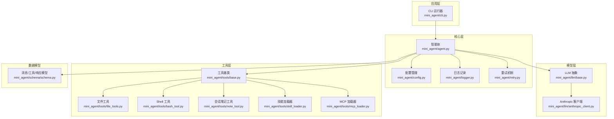
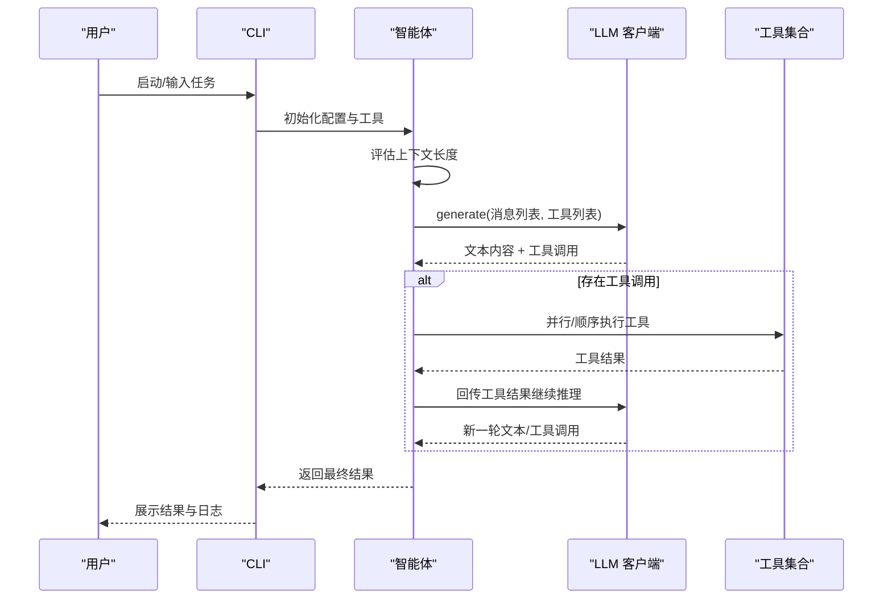
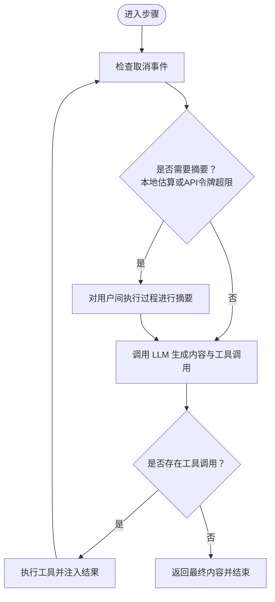
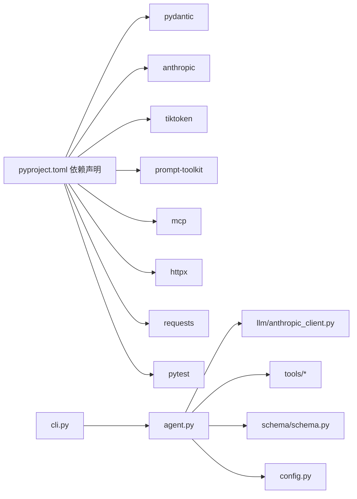

# 项目概述

<cite>
**本文档引用的文件**
- [README.md](file://README.md)
- [pyproject.toml](file://pyproject.toml)
- [mini_agent/__init__.py](file://mini_agent/__init__.py)
- [mini_agent/agent.py](file://mini_agent/agent.py)
- [mini_agent/config.py](file://mini_agent/config.py)
- [mini_agent/llm/base.py](file://mini_agent/llm/base.py)
- [mini_agent/llm/anthropic_client.py](file://mini_agent/llm/anthropic_client.py)
- [mini_agent/tools/base.py](file://mini_agent/tools/base.py)
- [mini_agent/tools/note_tool.py](file://mini_agent/tools/note_tool.py)
- [mini_agent/tools/mcp_loader.py](file://mini_agent/tools/mcp_loader.py)
- [mini_agent/tools/skill_loader.py](file://mini_agent/tools/skill_loader.py)
- [mini_agent/schema/schema.py](file://mini_agent/schema/schema.py)
- [mini_agent/cli.py](file://mini_agent/cli.py)
- [examples/README.md](file://examples/README.md)
</cite>

## 目录
1. [简介](#简介)
2. [项目结构](#项目结构)
3. [核心组件](#核心组件)
4. [架构总览](#架构总览)
5. [详细组件分析](#详细组件分析)
6. [依赖关系分析](#依赖关系分析)
7. [性能考虑](#性能考虑)
8. [故障排查指南](#故障排查指南)
9. [结论](#结论)
10. [附录](#附录)

## 简介
MiniAgent 是一个面向 MiniMax M2.5 模型的极简专业演示项目，采用与 Anthropic 兼容的 API，完整支持交错式思考（interleaved thinking），充分释放 M2 的强大推理能力以完成长而复杂的任务。项目提供完整的智能体执行循环、会话级持久化记忆、智能上下文管理、Claude Skills 集成以及 MCP 工具集成，具备完善的日志记录与简洁优雅的设计，是构建高级智能体的起点。

- 核心价值主张
  - 最小但专业的智能体框架：以最少代码实现最丰富的功能
  - 可靠的执行循环：内置工具集（文件系统与 Shell 操作）
  - 跨会话记忆：通过会话笔记工具保持关键信息连贯性
  - 智能上下文压缩：自动摘要对话历史，支持超长任务
  - 丰富生态集成：Claude Skills 与 MCP 工具无缝接入
  - 清晰可观测性：每轮请求、响应与工具执行均有详细日志

- 主要特性
  - ✅ 完整智能体执行循环与基础工具集
  - ✅ 会话笔记持久化记忆
  - ✅ 基于令牌限制的智能上下文管理
  - ✅ Claude Skills 文档、设计、测试等 15+ 专业技能
  - ✅ MCP 工具（知识图谱、网络搜索等）原生支持
  - ✅ 详尽日志与调试支持
  - ✅ 简洁 CLI 与易理解的代码库

- 适用场景与目标用户
  - 快速验证智能体想法与工作流原型
  - 需要跨会话记忆与复杂任务分解的开发者
  - 希望在本地或生产环境中稳定运行的工程团队
  - 对可解释性与可控性有要求的 AI 应用集成者

- 许可证与社区
  - 项目采用 MIT 许可证，便于学习与商用
  - 提供开发与生产部署指南、示例与测试用例
  - 社区资源与参考文档见项目根目录 README

**章节来源**
- [README.md:1-41](file://README.md#L1-L41)
- [README.md:43-211](file://README.md#L43-L211)

## 项目结构
项目采用模块化与分层架构，围绕“配置-模型-工具-智能体-CLI”的层次组织，配合示例与测试形成闭环：

- 核心包结构
  - mini_agent/
    - config.py：统一配置加载与管理（YAML 解析、默认路径搜索）
    - agent.py：智能体执行循环、消息历史、令牌估算与摘要
    - llm/：LLM 抽象与 Anthropic 客户端实现
    - tools/：工具基类、文件工具、Shell 工具、会话笔记、MCP 加载器、技能加载器
    - schema/：消息、工具调用、响应与令牌用量的数据模型
    - cli.py：交互式 CLI、命令解析、工具初始化与运行
    - logger.py、retry.py：日志与重试机制
    - acp/server.py：ACM 协议服务端（编辑器集成）

- 示例与文档
  - examples/：从基础工具到完整系统的渐进式示例
  - docs/：开发与生产部署指南（中英文）

- 根目录
  - pyproject.toml：项目元数据、依赖与脚本入口
  - README.md：快速开始、使用示例与故障排查

**图表来源**
- [mini_agent/cli.py:1-120](file://mini_agent/cli.py#L1-L120)
- [mini_agent/agent.py:45-120](file://mini_agent/agent.py#L45-L120)
- [mini_agent/llm/base.py:10-85](file://mini_agent/llm/base.py#L10-L85)
- [mini_agent/llm/anthropic_client.py:15-120](file://mini_agent/llm/anthropic_client.py#L15-L120)
- [mini_agent/tools/base.py:16-56](file://mini_agent/tools/base.py#L16-L56)
- [mini_agent/tools/note_tool.py:17-120](file://mini_agent/tools/note_tool.py#L17-L120)
- [mini_agent/tools/mcp_loader.py:60-220](file://mini_agent/tools/mcp_loader.py#L60-L220)
- [mini_agent/tools/skill_loader.py:47-120](file://mini_agent/tools/skill_loader.py#L47-L120)
- [mini_agent/schema/schema.py:29-56](file://mini_agent/schema/schema.py#L29-L56)

**章节来源**
- [pyproject.toml:1-71](file://pyproject.toml#L1-L71)
- [mini_agent/__init__.py:1-18](file://mini_agent/__init__.py#L1-L18)
- [examples/README.md:1-220](file://examples/README.md#L1-L220)

## 核心组件
- 配置管理（Config）
  - 支持多优先级配置文件查找（开发模式、用户目录、安装包内）
  - 统一解析 LLM、Agent、Tools 三类配置，含重试策略与 MCP 超时设置
  - 提供默认配置路径与错误提示

- 智能体（Agent）
  - 执行循环：消息历史维护、令牌估算与摘要、工具调用与结果注入
  - 支持取消事件（Esc 键中断）、最大步数控制与统计输出
  - 日志记录：请求、响应、工具执行全过程留痕

- LLM 客户端（Anthropic 兼容）
  - 抽象基类定义统一接口；Anthropic 实现支持扩展思考与工具调用
  - 内置重试装饰器与回调，支持指数退避与异常处理

- 工具体系（Tool）
  - 工具基类定义名称、描述、参数模式与异步执行接口
  - 文件工具、Shell 工具、会话笔记工具、MCP 包装工具、技能工具

- 数据模型（Schema）
  - Message、ToolCall、FunctionCall、LLMResponse、TokenUsage 等
  - 与 Anthropic 协议字段映射一致，便于扩展其他提供商

**章节来源**
- [mini_agent/config.py:66-221](file://mini_agent/config.py#L66-L221)
- [mini_agent/agent.py:45-524](file://mini_agent/agent.py#L45-L524)
- [mini_agent/llm/base.py:10-85](file://mini_agent/llm/base.py#L10-L85)
- [mini_agent/llm/anthropic_client.py:15-294](file://mini_agent/llm/anthropic_client.py#L15-L294)
- [mini_agent/tools/base.py:16-56](file://mini_agent/tools/base.py#L16-L56)
- [mini_agent/schema/schema.py:29-56](file://mini_agent/schema/schema.py#L29-L56)

## 架构总览
项目采用分层与插件化架构：
- 分层架构
  - 表现层：CLI 与交互式会话
  - 核心层：Agent、配置、日志、重试
  - 模型层：LLM 抽象与具体客户端
  - 工具层：通用工具基类与各类工具实现
  - 数据层：统一的消息与响应模型

- 插件化设计
  - 工具按需加载：文件工具、Shell 工具、会话笔记、Skills、MCP
  - LLM 提供商可替换：抽象基类 + 具体实现（Anthropic/OpenAI）
  - 配置驱动：通过 YAML 控制开关与超时参数

- 关键流程
  - CLI 初始化配置与工具，构建 Agent
  - Agent 在每步中评估上下文长度并按需摘要
  - 调用 LLM 生成文本与工具调用，执行工具并将结果回写消息历史
  - 循环直至完成或达到最大步数

**图表来源**
- [mini_agent/cli.py:486-631](file://mini_agent/cli.py#L486-L631)
- [mini_agent/agent.py:321-520](file://mini_agent/agent.py#L321-L520)
- [mini_agent/llm/anthropic_client.py:257-294](file://mini_agent/llm/anthropic_client.py#L257-L294)

**章节来源**
- [mini_agent/cli.py:338-432](file://mini_agent/cli.py#L338-L432)
- [mini_agent/agent.py:180-320](file://mini_agent/agent.py#L180-L320)

## 详细组件分析

### 智能体执行循环与上下文管理
- 执行循环
  - 步骤计数与最大步数限制
  - 每步前检查取消事件与上下文摘要触发条件
  - 调用 LLM 生成内容与工具调用，注入工具结果后继续推理
  - 统计耗时与令牌使用，支持非交互式任务执行

- 上下文管理
  - 令牌估算：基于 cl100k_base 编码器精确计算，失败时回退字符估算
  - 自动摘要：在用户消息之间对执行过程进行摘要，保留系统提示与用户意图
  - 触发阈值：本地估算或 API 报告的总令牌超过阈值时触发

**图表来源**
- [mini_agent/agent.py:180-320](file://mini_agent/agent.py#L180-L320)
- [mini_agent/agent.py:321-520](file://mini_agent/agent.py#L321-L520)

**章节来源**
- [mini_agent/agent.py:123-179](file://mini_agent/agent.py#L123-L179)
- [mini_agent/agent.py:180-320](file://mini_agent/agent.py#L180-L320)
- [mini_agent/agent.py:321-520](file://mini_agent/agent.py#L321-L520)

### 会话笔记与持久化记忆
- 功能要点
  - 记录：带时间戳与分类的笔记存储，首次使用时懒创建文件
  - 回溯：按分类过滤与格式化展示，支持跨会话共享
  - 集成：作为工具被智能体调用，用于长期记忆与上下文增强

- 使用场景
  - 用户偏好、项目约定、决策依据等关键信息的跨轮次保存
  - 与系统提示结合，提升任务一致性与个性化

**章节来源**
- [mini_agent/tools/note_tool.py:17-214](file://mini_agent/tools/note_tool.py#L17-L214)

### Claude Skills 集成
- 技能发现与加载
  - 递归扫描 skills 目录下的 SKILL.md，解析 YAML 前言与正文
  - 将相对路径转换为绝对路径，确保脚本与资源可被正确访问
  - 生成技能元数据提示（分级披露 Level 1），在系统提示中注入可用技能清单

- 工具化暴露
  - 通过 create_skill_tools 创建技能工具，供智能体选择性调用
  - 支持多种技能类型：文档处理、设计、测试、开发等

**章节来源**
- [mini_agent/tools/skill_loader.py:47-257](file://mini_agent/tools/skill_loader.py#L47-L257)
- [mini_agent/cli.py:366-431](file://mini_agent/cli.py#L366-L431)

### MCP 工具集成
- 连接与加载
  - 支持 STDIO、SSE、HTTP、Streamable HTTP 多种连接方式
  - 读取 mcp.json（支持回退到模板），逐个服务器建立会话并列出可用工具
  - 为每个工具封装 MCPTool，统一执行接口与超时控制

- 超时与稳定性
  - 全局与服务器级超时配置（连接、执行、SSE 读取）
  - 异常捕获与错误返回，避免阻塞主流程

**章节来源**
- [mini_agent/tools/mcp_loader.py:60-434](file://mini_agent/tools/mcp_loader.py#L60-L434)
- [mini_agent/config.py:40-64](file://mini_agent/config.py#L40-L64)

### LLM 客户端与模型适配
- 抽象与实现
  - LLMClientBase 定义 generate、_prepare_request、_convert_messages 接口
  - AnthropicClient 实现扩展思考与工具调用，使用官方 SDK 异步调用
  - 支持重试装饰器与回调，指数退避策略

- 数据模型映射
  - Message/ToolCall/FunctionCall/LLMResponse 与 Anthropic 字段一一对应
  - TokenUsage 统计输入、输出与总令牌

**章节来源**
- [mini_agent/llm/base.py:10-85](file://mini_agent/llm/base.py#L10-L85)
- [mini_agent/llm/anthropic_client.py:15-294](file://mini_agent/llm/anthropic_client.py#L15-L294)
- [mini_agent/schema/schema.py:29-56](file://mini_agent/schema/schema.py#L29-L56)

### CLI 与交互体验
- 命令行与子命令
  - 支持工作空间指定、非交互式任务执行、日志查看等
  - 内置帮助、清屏、统计、历史等命令

- 交互式会话
  - prompt_toolkit 会话，支持历史、自动补全、自动建议与快捷键
  - Esc 取消当前执行，Ctrl+C 退出程序
  - 日志目录与文件管理，便于问题定位

**章节来源**
- [mini_agent/cli.py:285-336](file://mini_agent/cli.py#L285-L336)
- [mini_agent/cli.py:678-800](file://mini_agent/cli.py#L678-L800)

## 依赖关系分析
- 技术栈概览
  - Python 3.10+：运行时环境
  - Pydantic：配置与数据模型校验
  - Anthropic SDK：与 MiniMax M2.5 兼容的 LLM 调用
  - tiktoken：上下文令牌估算
  - prompt-toolkit：交互式 CLI
  - mcp：MCP 工具协议客户端
  - pytest：测试框架
  - httpx/requests：HTTP 客户端

- 依赖关系图

**图表来源**
- [pyproject.toml:11-25](file://pyproject.toml#L11-L25)
- [mini_agent/cli.py:30-41](file://mini_agent/cli.py#L30-L41)
- [mini_agent/agent.py:11-16](file://mini_agent/agent.py#L11-L16)

**章节来源**
- [pyproject.toml:1-71](file://pyproject.toml#L1-L71)

## 性能考虑
- 令牌估算与摘要
  - 使用 cl100k_base 编码器进行精确估算，失败时回退字符估算，平衡准确性与性能
  - 摘要在用户消息之间进行，减少上下文长度，避免超出模型上下文窗口

- 工具执行与并发
  - 工具执行为串行顺序执行，保证消息一致性；如需更高吞吐可扩展为并行执行并增加锁机制
  - MCP 工具执行带有超时保护，避免慢依赖拖垮整体性能

- LLM 调用优化
  - 重试机制启用时，采用指数退避，降低突发错误对用户体验的影响
  - 可根据实际网络环境调整重试次数与最大延迟

- I/O 与日志
  - 日志文件按会话生成，便于离线分析；生产环境建议配置合适的日志轮转策略

[本节为通用指导，无需特定文件引用]

## 故障排查指南
- SSL 证书错误
  - 临时方案：在 LLM 客户端中关闭证书校验（仅测试环境）
  - 生产方案：升级证书或配置代理与证书链

- 模块导入错误
  - 确保在项目根目录下运行，使用模块方式启动 CLI

- 配置文件缺失
  - 使用安装脚本自动生成配置文件，或手动复制模板并填写 API Key

- MCP 工具加载失败
  - MCP 工具为可选功能，不影响基础功能；检查 mcp.json 配置与网络连通性

**章节来源**
- [README.md:284-311](file://README.md#L284-L311)
- [mini_agent/llm/anthropic_client.py:48-82](file://mini_agent/llm/anthropic_client.py#L48-L82)

## 结论
MiniAgent 以最小实现承载了现代智能体的关键能力：可靠的执行循环、跨会话记忆、智能上下文管理、生态工具集成与可观测性。其模块化与插件化设计使其易于扩展与定制，适合从原型验证到生产部署的多种场景。借助 Claude Skills 与 MCP 工具，用户可以快速构建具备专业能力的智能体应用。

[本节为总结性内容，无需特定文件引用]

## 附录
- 快速开始
  - 获取 API Key 并选择平台（全球/中国）
  - 安装 uv 并使用一键安装或开发模式
  - 运行示例与交互式 CLI

- 示例与测试
  - examples/ 提供从基础工具到完整系统的渐进式示例
  - tests/ 覆盖单元、功能与集成测试

- 相关文档与社区
  - 开发与生产部署指南
  - 社区与贡献指南
  - 参考链接与许可证

**章节来源**
- [README.md:43-345](file://README.md#L43-L345)
- [examples/README.md:1-220](file://examples/README.md#L1-L220)